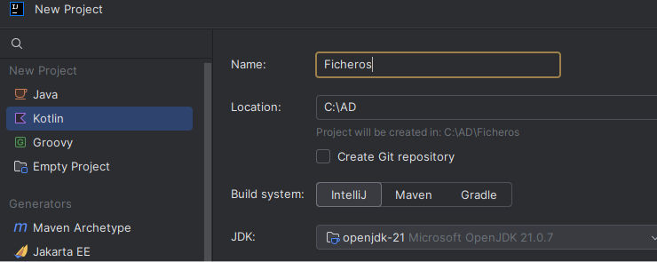
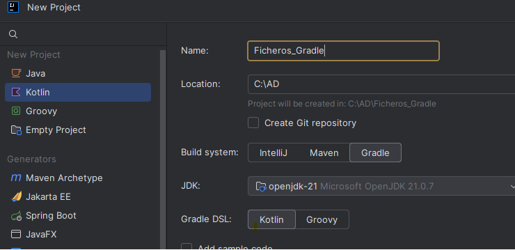
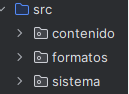
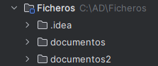

---
hide:
  - toc
---

# 🧰 Entorno y proyecto base

> **Ubicación rápida de los ejemplos de código**
>
> | Tema | Proyecto IntelliJ | Paquete (`src/main/kotlin/...`) |
> |---|---|---|
> | **Tema 1** | `Ficheros` | `sistema` |
> | **Tema 2** | `Ficheros` | `contenido` |
> | **Tema 3** (sin librerías extras) | `Ficheros` | `formatos` |
> | **Tema 3** (con dependencias) | `Ficheros_Gradle` | (raíz o paquete a tu elección) |

Esta página centraliza todas las instrucciones operativas de preparación del entorno.

## SETUP_IDE — IDE y proyecto base

<!--Se recomienda descargar la última versión de **IntelliJ IDEA** y acceder con la cuenta educativa de GVA, ya que permite activar la licencia educativa y disponer de las funcionalidades avanzadas del entorno.

Aunque durante los primeros temas del curso no utilizaremos estas características, sí serán necesarias en unidades posteriores. Trabajar desde el principio con la misma versión y configuración nos permitirá familiarizarnos con el entorno de desarrollo y evitar cambios innecesarios más adelante.-->

Utilizaremos  **IntelliJ IDEA** con  **Kotlin**.

Para realizar las prácticas del módulo crearemos **dos proyectos independientes**:

* **Proyecto 1: Ficheros**, se utilizará para desarrollar los ejercicios correspondientes a los **temas 1 y 2**.

* **Proyecto 2: Ficheros_Gradle**, se reservará exclusivamente para el **tema 3**.

Esta separación se debe a que el **tema 3 requiere incorporar dependencias mediante Gradle**, mientras que los proyectos de los **temas 1 y 2 no necesitan ninguna dependencia adicional**. De este modo, mantendremos un proyecto más sencillo para los primeros temas y evitaremos añadir configuraciones innecesarias, dejando el segundo proyecto preparado específicamente para trabajar con Gradle cuando sea necesario.

## SETUP_PAQUETES — Organización de paquetes

En el proyecto **Ficheros**, crea estos **paquetes**, dentro de la carpeta `src`:

- `sistema`: contendrá los ejemplos del tema 1.
- `contenido`: contendrá los ejemplos del tema 2.
- `formatos`: contendrá los ejemplos del tema 3.

## SETUP_CARPETAS — Carpetas de trabajo

En la raiz del proyecto **Ficheros**, crea estas **carpetas** de apoyo, para los ejemplos del tema 1 y 2:

- `documentos`
- `documentos2`

Se usan para generar y manipular archivos durante las prácticas.

<!--
## SETUP_RECURSOS_T3 — Recursos para Ejercicio 3

En el proyecto de la Parte 3 prepara los recursos así:

1. Copia [config.json](T3_Formatos_diferentes/config.json) en la raíz del proyecto (junto a `build.gradle.kts`).
2. Descomprime `carpeta_prueba.zip` y copia `carpeta_prueba` en `src/main/resources`.

Estructura esperada:

    Proyecto
    │
    ├── build.gradle.kts
    ├── settings.gradle.kts
    ├── config.json
    │
    └── src
        └── main
            ├── kotlin
            └── resources
                └── carpeta_prueba
                    ├── notas.md
                    ├── imagen.jpg
                    ├── factura.pdf
                    ├── documento.txt
                    ├── datos.csv
                    ├── .oculto.txt
                    └── exportar

-->
