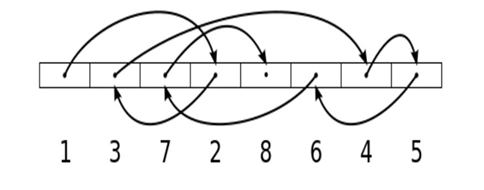

# 🔹 Formas de acceso a un fichero

El acceso a ficheros es una tarea fundamental en la programación, ya que permite leer y escribir datos persistentes. En Kotlin, utilizando las bibliotecas de Java (java.io y java.nio), se pueden manejar diferentes tipos de ficheros (texto, binarios, imágenes...), según sus características y necesidades, y según su forma de acceder a ellos.

Existen dos formas principales de acceder a un fichero:

**Acceso secuencial**{.azul}

- Los datos se procesan en orden, desde el principio hasta el final del fichero.
- Es el más común y sencillo.
- Se usa cuando se desea leer todo el contenido o recorrer registro por registro.

Ejemplos: lectura de un archivo de texto línea por línea, o de un fichero binario estructurado registro a registro. 

**Acceso aleatorio**{.azul}

- Permite saltar a una posición concreta del fichero sin necesidad de leer lo anterior.
- Es útil cuando los registros tienen un tamaño fijo y se necesita eficiencia (por ejemplo, ir directamente al registro 100).
- Requiere técnicas más avanzadas como el uso de FileChannel, SeekableByteChannel o RandomAccessFile.

