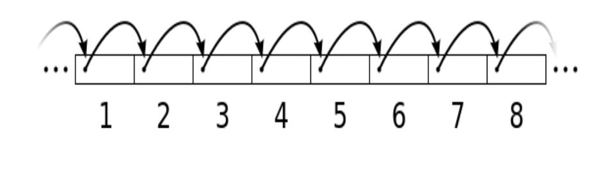
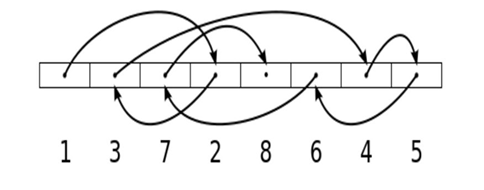

# Introducción

El acceso a ficheros es una tarea fundamental en la programación, ya que permite leer y escribir datos persistentes. En Kotlin, utilizando las bibliotecas de Java (java.io y java.nio), se pueden manejar diferentes tipos de ficheros (texto, binarios, imágenes...), según sus características y necesidades, y según su forma de acceder a ellos.

## 🔹 Formas de acceso a un fichero

Existen dos formas principales de acceder a un fichero:

**Acceso secuencial**{.azul}

- Los datos se procesan en orden, desde el principio hasta el final del fichero.
- Es el más común y sencillo.
- Se usa cuando se desea leer todo el contenido o recorrer registro por registro.

Ejemplos: lectura de un archivo de texto línea por línea, o de un fichero binario estructurado registro a registro. 

**Acceso aleatorio**{.azul}

- Permite saltar a una posición concreta del fichero sin necesidad de leer lo anterior.
- Es útil cuando los registros tienen un tamaño fijo y se necesita eficiencia (por ejemplo, ir directamente al registro 100).
- Requiere técnicas más avanzadas como el uso de FileChannel, SeekableByteChannel o RandomAccessFile.

## 🔹 Clases y métodos para la lectura y escritura de ficheros

En el desarrollo de aplicaciones es común tener que leer y escribir datos almacenados en archivos. Según el tipo de contenido del fichero (texto, binario, imagen, estructurado...), se utilizan clases y métodos distintos para acceder a ellos de forma eficiente y segura.

Kotlin se apoya en las bibliotecas de Java (java.io y java.nio.file) para realizar estas operaciones, permitiendo un control detallado tanto para acceso secuencial como aleatorio.

La siguiente tabla resume las clases más utilizadas para trabajar con los distintos tipos de ficheros, indicando las opciones recomendadas para lectura y escritura, y proporcionando notas aclaratorias sobre su uso típico.

| Tipo de fichero           | Lectura                             | Escritura                            | Comentario                                               |
|---------------------------|--------------------------------------|---------------------------------------|----------------------------------------------------------|
| Texto (líneas)         | `Files.readAllLines(Path)`          | `Files.write(Path, List<String>)`     | Carga todo en memoria                                    |
|                           | `Files.newBufferedReader(Path)`     | `Files.newBufferedWriter(Path)`       | Más eficiente para archivos grandes                      |
|                           | `Files.readString(Path)` (Java 11+) | `Files.writeString(Path, String)`     | Lectura/escritura completa como bloque                  |
| Binario | `Files.readAllBytes(Path)`          | `Files.write(Path, ByteArray)`        | Lee y escribe bytes puros                               |
|                           | `Files.newInputStream(Path)`        | `Files.newOutputStream(Path)`         | Flujo de bytes directo                                  |
| Binario estructurado   | `FileChannel.read(ByteBuffer)`      | `FileChannel.write(ByteBuffer)`       | Usa `FileChannel` para secuencial o aleatorio           |
|                           | `SeekableByteChannel.read(...)`     | `SeekableByteChannel.write(...)`      | Canal flexible con `.position()`                        |
|                           | `ByteBuffer.get*()`                 | `ByteBuffer.put*()`                   | Tipos primitivos (`int`, `double`, etc.)                |
| Imagen                 | `ImageIO.read(Path/File)`           | `ImageIO.write(BufferedImage, ...)`   | Usa `javax.imageio.ImageIO`                             |
| Acceso aleatorio       | `FileChannel.position(offset)`      | `FileChannel.position(offset)`        | Permite saltar a cualquier posición del fichero         |

