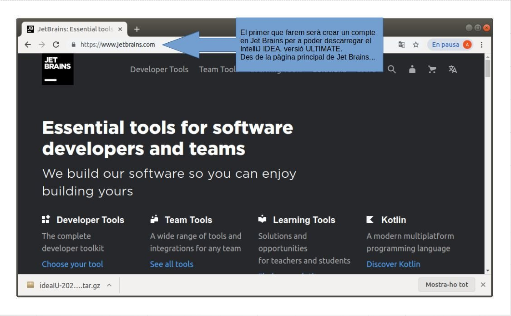
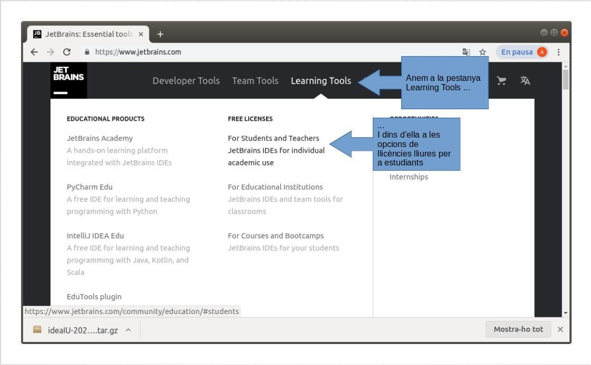

## IntelliJ Idea Ultimate

Todos nuestros programas estarán realizados en **KOTLIN**, que es un lenguaje que está por encima de Java, por lo que todos los programas, clases... , realizados en Java, los podremos utilizar sin problemas, y además nos permitirá una programación mucho más cómoda. Además, es el lenguaje que utilizará tanto en el módulo de PMDM como en el de DI.

Como paso previo e inicial instalaremos el entorno de trabajo desde el que programaremos, un IDE. Este año instalaremos **IntelliJ IDEA**, la versión **Ultimate**, que es la que nos proporcionará todas las herramientas para poder trabajar sin problemas.

En el momento de realizar estos apuntes la última versión es la **2025.1.3.**

En el siguiente **[enlace](https://www.jetbrains.com/help/idea/getting-started.html)**{.azul} encontrarás todo lo necesario para instalar y configurar el IDE IntelliJ IDEA Ultimate.

En esta UD vamos a trabajar con dos configuraciones diferentes de proyectos en Kotlin según las necesidades de cada tema, de esta forma, podremos aprovechar lo mejor de cada enfoque: la simplicidad de trabajar sin Gradle cuando no es necesario y la potencia que ofrece Gradle para proyectos que requieren un entorno más complejo.
:

**Proyectos sin Gradle**

- Los utilizaremos para ejercicios relacionados con el sistema de ficheros (navegación por directorios, lectura/escritura básica de archivos, permisos, etc.).
- En este caso, el código es sencillo y no necesitamos dependencias externas ni configuraciones adicionales.
- Crear el proyecto sin Gradle nos permite centrarnos únicamente en la lógica del ejercicio y simplifica el entorno de trabajo.

**Proyectos con Gradle**

- Los emplearemos para el manejo avanzado de ficheros e intercambio de formatos (CSV, JSON, XML, binarios estructurados…).
- Estos ejercicios requieren librerías adicionales y configuraciones específicas, como la integración de OpenCSV, kotlinx.serialization o Jackson.
- Gradle facilita enormemente esta tarea, ya que se encarga de gestionar automáticamente las dependencias y mantenerlas actualizadas, además de simplificar la configuración del proyecto.

<!--El siguiente vídeo muestra todo el proceso de instalación y creación del primer proyecto. Corresponde a una versión anterior, pero totalmente similar a la actual.-->

<!--
# Galería de imágenes

## Idea 1

## Idea 2

-->

_________

<!--
<iframe src="https://slides.com/aliciasalvador/2021-2022-tema1_instal_intellij/embed" width="576" height="420" title="Copy of 2021-2022 Tema1_Instal_IntelliJ" scrolling="no" frameborder="0" webkitallowfullscreen mozallowfullscreen allowfullscreen></iframe>
-->

