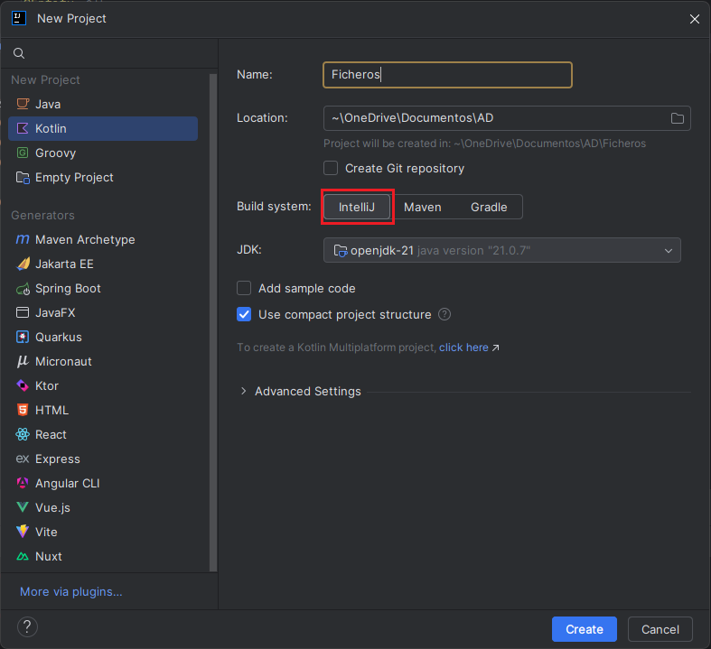
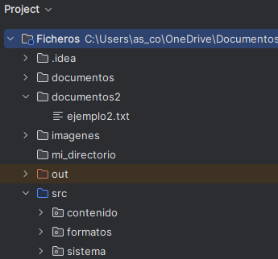

# 🔹 Acceso al sistema de ficheros. Java.nio 

!!!warning "Proyecto Ficheros"
    1) Para probar y organizar los ejemplos propuestos en esta parte del temario, crearemos en **IntelliJ** un proyecto **Kotlin** llamado **Ficheros**.

    {: .img-pequena .img-izquierda }

    2) Dentro de este proyecto crearemos tres paquetes (**sistema**, **contenido** y **formatos**) para organizar los diferentes ejemplos, que en cada ocasión se indicará en que paquete deben ubicarse.

    {: .img-muy-pequena .img-izquierda }

Durante muchos años se ha utilizado la librería **java.io** para trabajar con ficheros en el mundo Java. Se trata de un **API** muy potente y flexible que nos permite realizar casi cualquier tipo de operación. Sin embargo es una API complicada de entender. **Java.nio** (New IO) es una nueva API disponible desde Java7 que nos permite mejorar el rendimiento, así como simplificar el manejo de muchas operaciones. 

**Java.nio** define interfaces y clases para que la máquina virtual Java tenga acceso a archivos, atributos de archivos y sistemas de archivos. Aunque dicho API comprende numerosas clases, solo existen unas pocas de ellas que sirven de puntos de entrada al API, lo que simplifica considerablemente su manejo.

La interfaz **java.nio.file.Path** representa un path, y las clases que implementen esta interfaz puede utilizarse para localizar ficheros en el sistema de ficheros. Nos permite manejar rutas al estilo GNU/Linux y rutas al estilo Windows dependiendo del SO en el que estemos trabajando.

La clase **java.nio.file.Files** es el otro punto de entrada a la librería de ficheros de Java. Es la que nos permite manejar ficheros reales del disco desde Java.

!!!Tip "Clases para la gesitón de ficheros"
    - **Paths**: Crea objetos Path desde cadenas de texto
    - **Path**: Representa rutas a archivos o directorios
    - **Files**: Permite operaciones sobre archivos usando Path

    
!!!Warning "Ejemplos"
    Los siguientes ejemplos se incluirán en el paquete **sistema** dentro del proyecto **Ficheros**.  

## 🔹 Paths

La clase **Paths** es una clase de utilidad que proporciona métodos estáticos para crear objetos **Path**, que luego puedes usar con métodos de **Files**.

??? info "Métodos principales de Paths"
    |Método     |Descripción|
    |-----------|-----------|
    | **get(String first, String... )**|	Crea un objeto Path a partir de una o más cadenas.|
    | **get(URI uri)**|	Crea un Path desde un URI que debe ser del esquema file:///.  |      

!!!Note ""
    El uso de **Paths.get(...)** en Java (o Kotlin) no implica que el archivo o directorio exista. Este método simplemente crea una instancia de Path que representa una ruta en el sistema de archivos, pero no accede al disco ni verifica su existencia.

🖥️ **Ejemplo_get.kt**

Este ejemplo muestra cómo construir rutas con `Paths.get(...)` a partir de uno o varios segmentos de texto.

- Primero se crea una ruta relativa (`documentos/archivo.txt`).
- Después se crea una ruta con más segmentos que simula una ruta más completa.
- Finalmente, se imprimen ambas rutas para ver cómo Java/Kotlin las representa según el sistema operativo.

La finalidad del ejercicio es entender que `Paths.get(...)` solo construye la ruta en memoria y no comprueba si el archivo existe realmente.

        import java.nio.file.Path
        import java.nio.file.Paths

        fun main() {
            val path1: Path = Paths.get("documentos", "archivo.txt")
            val path2: Path = Paths.get("C:", "usuarios", "nombre", "archivo.txt")

            println("Ruta 1: $path1")
            println("Ruta 2: $path2")
        }

!!!note "📤 Salida esperada"
        Ruta 1: documentos\archivo.txt
        Ruta 2: C:\usuarios\nombre\archivo.txt

🖥️ **Ejemplo_uri.kt**

Este ejemplo muestra cómo crear un `Path` a partir de una URI de tipo `file:///`.

- Primero se define una URI con formato de archivo local.
- Después se transforma esa URI en un objeto `Path` con `Paths.get(uri)`.
- Finalmente, se imprime la ruta generada.

La finalidad del ejercicio es ver otra forma válida de construir rutas, útil cuando la fuente de datos ya viene en formato URI.

        import java.net.URI
        import java.nio.file.Path
        import java.nio.file.Paths

        fun main() {
            val uri = URI("file:///C:/usuarios/nombre/archivo.txt")
            val path: Path = Paths.get(uri)

            println("Ruta a partir de URI: $path")
        }

!!!note "📤 Salida esperada"
        Ruta a partir de URI: C:\usuarios\nombre\archivo.txt

## 🔹 Path

La clase **Path** Se utiliza junto con la clase **Files** para realizar operaciones como lectura, escritura, copia, o eliminación de archivos.  
La forma mas sencilla de construir un objeto que cumpla la interfaz **Path** es a partir de la clase **java.nio.file.Paths**, que tiene métodos estáticos que retornan objetos Path a partir de una representación tipo String del path deseado.  
Por supuesto, no es necesario que los ficheros existan de verdad en el disco duro para que se puedan crear los objetos Path correspondientes.

Un objeto Path puede representarse de dos formas:

- **Ruta absoluta**   

        val path = Paths.get("/home/usuario/archivo.txt")   

- **Ruta relativa**   
     
        val path = Paths.get("documentos/ejemplo.txt")
        println(path.toAbsolutePath())

 
Las **operaciones** y **métodos** principales que se pueden hacer con Path son:

??? info "Operaciones y métodos principales de Path"
    | **Método**                | **Qué devuelve**          | **Descripción**                                                                 |
    |-------------------------- |---------------------------|---------------------------------------------------------------------------------|
    | .startsWith(Path other)   | `Boolean`                 | Devuelve `true` si el path empieza por el path dado.                           |
    | .endsWith(Path other)     | `Boolean`                 | Devuelve `true` si el path termina con el path dado.                           |
    | .getParent()              | `Path?`                   | Devuelve el path padre (superior) o `null` si no tiene.                        |
    | .getRoot()                | `Path?`                   | Devuelve el componente raíz (`/`, `C:\`, etc.) o `null` si no existe.          |
    | .iterator()               | `Iterator<Path>`          | Permite iterar sobre cada parte del path (carpetas y nombre final).            |
    | .toString()               | `String`                  | Devuelve el path como texto.                                                   |
    | .toAbsolutePath()         | `Path`                    | Devuelve el path completo desde la raíz del sistema.                           |
    | .resolve(Path/String)     | `Path`                    | Une dos partes de un path de forma correcta, manejando barras automáticamente. |
    | .toFile()                 | `java.io.File`            | Convierte el `Path` en un `File` de la API tradicional de Java (`java.io`).    |

🖥️ **Ejemplo_Path.kt**

Este ejemplo recorre los métodos más usados de `Path` para inspeccionar y transformar rutas.

- Primero se crea un `Path` base y se muestran sus propiedades principales (`fileName`, `parent`, `root`, etc.).
- Después se combinan rutas con `resolve(...)` y se calcula una ruta relativa con `relativize(...)`.
- También se normaliza una ruta con `normalize()` para eliminar segmentos redundantes.
- Finalmente, se comprueba si una ruta empieza o termina con determinados valores.

La finalidad del ejercicio es dominar las operaciones de manipulación de rutas antes de realizar operaciones reales de lectura o escritura con `Files`.

        import java.nio.file.Path
        import java.nio.file.Paths

        fun main() {
            val path: Path = Paths.get("documentos/ejemplo.txt")

            println("toString(): ${path}")
            println("toAbsolutePath(): ${path.toAbsolutePath()}")
            println("getFileName(): ${path.fileName}")
            println("getParent(): ${path.parent}")
            println("getRoot(): ${path.root}")

            val otroPath: Path = Paths.get("imagenes/foto.png")
            println("resolve(): ${path.resolve(otroPath)}")

            val relativo: Path = path.relativize(Paths.get("documentos/otroArchivo.txt"))
            println("relativize(): $relativo")

            val rutaNormalizada: Path = Paths.get("carpeta/../archivo.txt").normalize()
            println("normalize(): $rutaNormalizada")

            println("startsWith(\"documentos\"): ${path.startsWith("documentos")}")
            println("endsWith(\"ejemplo.txt\"): ${path.endsWith("ejemplo.txt")}")
        }

!!!note "📤 Salida esperada"
        toString(): documentos\ejemplo.txt
        toAbsolutePath(): C:\Ruta\Al\Proyecto\documentos\ejemplo.txt
        getFileName(): ejemplo.txt
        getParent(): documentos
        getRoot(): null
        resolve(): documentos\ejemplo.txt\imagenes\foto.png
        relativize(): ..\otroArchivo.txt
        normalize(): archivo.txt
        startsWith("documentos"): true
        endsWith("ejemplo.txt"): true
        

## 🔹 Files

La clase **Files** es el otro punto de entrada a la librería de ficheros de Java. Es la que nos permite manejar ficheros reales del disco desde Java.  
Esta clase tiene métodos estáticos para el manejo de ficheros, los métodos de la clase **Files** trabajan sobre objetos **Path**. Muchos de estos métodos devuelven **streams**, lo que permite procesar archivos y directorios de forma eficiente y elegante. 

En Java (y también en Kotlin), un **Stream** es una secuencia de elementos que permite realizar operaciones funcionales (como map, filter, forEach, etc.) sobre datos de forma eficiente y fluida, sin necesidad de estructuras intermedias ni bucles explícitos. Algunos método de **Files** utilizan o devuelven **Streams**.

Las **operaciones** y **métodos** principales a realizar con Files son:

??? info "Operaciones y métodos principales de Files"
    | Método                            | Qué devuelve           | Descripción                                            |
    |-----------------------------------|------------------------|--------------------------------------------------------|
    | list(Path)                        | `Stream<Path>`         | Lista contenido directo (no recursivo) del directorio. |
    | .walk(Path)                       | `Stream<Path>`         | Recorre directorios de forma recursiva.                |
    | .find(...  )                      | `Stream<Path>`         | Busca elementos que cumplan una condición.             |
    | .lines(Path)                      | `Stream<String>`       | Devuelve las líneas de un archivo de texto.            |
    | .exists(Path)                     | `Boolean`              | Verifica si el archivo existe.                         |
    | .isDirectory(Path)                | `Boolean`              | Verifica si es un directorio.                          |
    | .isRegularFile(Path)              | `Boolean`              | Verifica si es un archivo normal.                      |
    | .isReadable(Path)                 | `Boolean`              | Verifica si se puede leer.                             |
    | .createFile(Path)                 | `Path`                 | Crea un archivo vacío.                                 |
    | .createDirectory(Path)            | `Path`                 | Crea un directorio.                                    |
    | .createDirectories(Path)          | `Path`                 | Crea directorios y subdirectorios necesarios.          |
    | .delete(Path)                     | `void`                 | Elimina un archivo o directorio.                       |
    | .deleteIfExists(Path)             | `Boolean`              | Elimina si existe.                                     |
    | .move(Path, Path)                 | `Path`                 | Mueve un archivo o directorio.                         |
    | .copy(Path, Path)                 | `Path`                 | Copia un archivo o directorio.                         |
    | .size(Path)                       | `Long`                 | Tamaño del archivo.                                    |
    | .getLastModifiedTime(Path)        | `FileTime`             | Última modificación.                                   |
    | .getOwner(Path)                   | `UserPrincipal`        | Devuelve el propietario.                               |
    | .getAttribute(Path, String)       | `Object`               | Devuelve un atributo específico.                       |

🖥️ **Ejemplo_permisos.kt**: existencia y comprobación de permisos

Este ejemplo verifica si una ruta existe y qué permisos básicos tiene asociados.

- Primero se crea un `Path` al archivo que se quiere comprobar.
- Después se consulta su existencia con `Files.exists(...)`.
- A continuación se revisan permisos de lectura, escritura y ejecución.

La finalidad del ejercicio es realizar una validación previa antes de operar sobre un fichero, evitando errores por acceso no permitido.

        import java.nio.file.Path
        import java.nio.file.Paths
        import java.nio.file.Files

        fun main() {
            val path: Path = Paths.get("documentos/ejemplo.txt")

            println("path = $path")
            println("exists = ${Files.exists(path)}")
            println("readable = ${Files.isReadable(path)}")
            println("writable = ${Files.isWritable(path)}")
            println("executable = ${Files.isExecutable(path)}")
        }

!!!note "📤 Salida esperada"
        path = documentos\ejemplo.txt
        exists = true
        readable = true
        writable = true
        executable = true

  
🖥️ **Ejemplo_creardirectorio.kt**: crear un directorio

Este ejemplo muestra cómo crear un directorio con NIO y gestionar los errores habituales.

- Primero se define la ruta del directorio a crear.
- Después se intenta crear con `Files.createDirectory(...)`.
- Si ya existe, se captura `FileAlreadyExistsException`.
- Si ocurre otro problema de entrada/salida, se captura `IOException`.

La finalidad del ejercicio es aprender a combinar operaciones de creación con manejo explícito de excepciones.

        import java.nio.file.Path
        import java.nio.file.Paths
        import java.nio.file.Files
        import java.nio.file.FileAlreadyExistsException
        import java.io.IOException

        fun main() {
            val path: Path = Paths.get("documentos")

            try {
                val newDir = Files.createDirectory(path)
                println("Directorio creado en: $newDir")
            } catch (e: FileAlreadyExistsException) {
                println("El directorio ya existe: $path")
            } catch (e: IOException) {
                println("Error de entrada/salida: ${e.message}")
                e.printStackTrace()
            }
        }

!!!note "📤 Salida esperada"
        Directorio creado en: documentos

🖥️ **Ejemplo_borrardirectorio.kt**: elimina un directorio

Este ejemplo elimina un directorio solo si existe previamente.

- Primero se construye la ruta al directorio.
- Después se comprueba su existencia con `Files.exists(...)`.
- Si existe, se elimina con `Files.delete(...)`.

La finalidad del ejercicio es introducir un patrón seguro de borrado, evitando llamar a `delete` sobre rutas inexistentes.

        import java.nio.file.Files
        import java.nio.file.Path
        import java.nio.file.Paths

        fun main() {
            val directorio: Path = Paths.get("c:/mi_directorio")

            // Si ya existe, lo eliminamos
            if (Files.exists(directorio)) {
                println("El directorio ya existe. Borrándolo...")
                Files.delete(directorio)
            }

        }

**Gestión de errores y validaciones**{.azul}

El método  **delete(Path)** borra el fichero o directorio o lanza una excepción si el borrado falla. El siguiente ejemplo muestra como capturar y gestionar las excepciones que pueden producirse en el borrado. Si el fichero o directorio no existe, la excepción que se produce es  **NoSuchFileException**. Los sucesivos **cath** permiten determinar por  que ha fallado el borrado:

        import java.nio.file.*
        import java.io.IOException

            fun main() {
                val path = Paths.get("c:/mi_directorio")
                try {
                    Files.delete(path)
                } catch (e: NoSuchFileException) {
                    System.err.printf("%s: no such file or directory%n", path)
                } catch (e: DirectoryNotEmptyException) {
                    System.err.printf("%s not empty%n", path)
                } catch (e: IOException) {
                    // Problemas de permisos u otros errores de E/S
                    System.err.println("Error: ${e.message}")
                }
            }

!!!Warning ""
    El metodo **deleteIfExists(Path)** tambien borra el fichero o directorio, pero no lanza ningun error en caso de que el fichero o directorio no exista.

🖥️ **Ejemplo_copiardirectorio.kt**: copiar directorios

Este ejemplo muestra cómo copiar un directorio usando `Files.copy(...)`.

- Primero se definen ruta origen y ruta destino.
- Después se intenta copiar el directorio.
- Si el destino ya existe, se captura la excepción correspondiente.
- También se indica la opción `REPLACE_EXISTING` para sobrescribir si se necesita.

La finalidad del ejercicio es entender que, al copiar directorios, se crea la carpeta destino pero no se copian automáticamente sus contenidos internos.

Se puede copiar un archivo o directorio usando el método copy(Path, Path, CopyOption...). La copia falla si el archivo de destino existe, a menos que se especifique la opción REPLACE_EXISTING. 

Se puede copiar directorios aunque, los archivos dentro del directorio no se copian, por lo que el nuevo directorio está vacío incluso cuando el directorio original contiene archivos.

       import java.io.IOException
        import java.nio.file.FileAlreadyExistsException
        import java.nio.file.Files
        import java.nio.file.Path
        import java.nio.file.Paths
        // import java.nio.file.StandardCopyOption  // si se desea sobrescribir

        fun main() {
            val sourcePath: Path = Paths.get("documentos")
            val destinationPath: Path = Paths.get("documentos/destino")

            try {
                Files.copy(sourcePath, destinationPath)
                // Para sobrescribir si ya existe, descomenta la siguiente línea:
                // Files.copy(sourcePath, destinationPath, StandardCopyOption.REPLACE_EXISTING)

                println("Copia realizada con éxito.")
            } catch (e: FileAlreadyExistsException) {
                println("El fichero o directorio ya existe en el destino.")
            } catch (e: IOException) {
                println("Error al copiar: ${e.message}")
                e.printStackTrace()
            }
        }

🖥️ **Ejemplo_copiarficheros.kt**: copiar ficheros

Este ejemplo copia un fichero concreto y permite sobrescribir el destino si ya existe.

- Primero se definen el archivo origen y el archivo destino.
- Después se ejecuta la copia con `StandardCopyOption.REPLACE_EXISTING`.
- Si hay conflictos o errores de E/S, se gestionan mediante excepciones.

La finalidad del ejercicio es practicar la copia de archivos con control de colisiones en el destino.

        import java.io.IOException
        import java.nio.file.FileAlreadyExistsException
        import java.nio.file.Files
        import java.nio.file.Path
        import java.nio.file.Paths
        import java.nio.file.StandardCopyOption

        fun main() {
            val sourcePath: Path = Paths.get("documentos/ejemplo.txt")
            val destinationPath: Path = Paths.get("documentos/ejemplo_copia.txt")

            try {
                Files.copy(sourcePath, destinationPath, StandardCopyOption.REPLACE_EXISTING)
                println("Archivo copiado correctamente a: $destinationPath")
            } catch (e: FileAlreadyExistsException) {
                println("El archivo destino ya existe.")
            } catch (e: IOException) {
                println(" Error al copiar el archivo: ${e.message}")
                e.printStackTrace()
            }
        }

!!!note "📤 Salida esperada"
        Archivo copiado correctamente a: documentos\ejemplo_copia.txt

🖥️ **Ejemplo_moverficheros.kt**: mover ficheros y directorios cambiando el nombre.

Este ejemplo mueve un archivo de ubicación y, al mismo tiempo, cambia su nombre.

- Primero se define la ruta de origen y la de destino final.
- Después se usa `Files.move(...)` para realizar el traslado.
- La opción `REPLACE_EXISTING` permite reemplazar si el destino ya existe.
- Se gestionan excepciones para informar de posibles errores.

La finalidad del ejercicio es mostrar que mover y renombrar son una misma operación cuando cambia la ruta de destino.

        import java.io.IOException
        import java.nio.file.FileAlreadyExistsException
        import java.nio.file.Files
        import java.nio.file.Path
        import java.nio.file.Paths
        import java.nio.file.StandardCopyOption

        fun main() {
            val sourcePath: Path = Paths.get("documentos/ejemplo.txt")
            val destinationPath: Path = Paths.get("documentos2/ejemplo2.txt")

            try {
                Files.move(sourcePath, destinationPath, StandardCopyOption.REPLACE_EXISTING)
                println("Archivo movido/renombrado correctamente a: $destinationPath")
            } catch (e: FileAlreadyExistsException) {
                println("El archivo destino ya existe.")
            } catch (e: IOException) {
                println("Error al mover el archivo: ${e.message}")
                e.printStackTrace()
            }
        }

!!!note "📤 Salida esperada"
        Archivo movido/renombrado correctamente a: documentos2\ejemplo2.txt

El siguiente ejemplo recorre la estructura home en tu sistema, indicando los permisos de cada archivo y directorio: 

🖥️ **Ejemplo_SistemaFicheros.kt**

Este ejemplo implementa un explorador de ficheros en consola para navegar por directorios y ver atributos básicos.

- Primero establece como punto inicial el directorio personal del usuario.
- Después lista los elementos del directorio actual y muestra tipo, permisos y tamaño.
- Permite navegar a subdirectorios por índice, subir con `..` o salir con `salir`.
- Controla entradas inválidas y errores de acceso con manejo de excepciones.

La finalidad del ejercicio es integrar en un único programa varias operaciones de NIO: listado, atributos, permisos y navegación por rutas.

        import java.nio.file.*
        import java.nio.file.attribute.BasicFileAttributes
        import java.util.Scanner

        fun main() {
            val scanner = Scanner(System.`in`)
            var currentPath: Path = Paths.get(System.getProperty("user.home"))

            while (true) {
                println("\n Directorio actual: $currentPath")
                try {
                    val paths = Files.list(currentPath).toList()
                    paths.forEachIndexed { index, path ->
                        val attrs = Files.readAttributes(path, BasicFileAttributes::class.java)
                        val tipo = when {
                            attrs.isDirectory -> "[DIR]"
                            attrs.isRegularFile -> "[FILE]"
                            else -> "[OTRO]"
                        }

                        val permisos = listOfNotNull(
                            if (Files.isReadable(path)) "r" else null,
                            if (Files.isWritable(path)) "w" else null,
                            if (Files.isExecutable(path)) "x" else null
                        ).joinToString("")

                        val size = if (attrs.isRegularFile) "${attrs.size()} bytes" else ""

                        println("$index. $tipo ${path.fileName} [$permisos] $size")
                    }

                    println("\nOpciones:")
                    println(" - Número: acceder a subdirectorio")
                    println(" - `..`: subir al directorio padre")
                    println(" - `salir`: finalizar el programa")
                    print("Opción: ")

                    when (val input = scanner.nextLine()) {
                        "salir" -> {
                            println("Saliendo del explorador.")
                            return
                        }
                        ".." -> {
                            currentPath = currentPath.parent ?: currentPath
                        }
                        else -> {
                            val index = input.toIntOrNull()
                            if (index != null && index in paths.indices) {
                                val selected = paths[index]
                                if (Files.isDirectory(selected)) {
                                    currentPath = selected
                                } else {
                                    println("No es un directorio.")
                                }
                            } else {
                                println("Entrada no válida.")
                            }
                        }
                    }

                } catch (e: Exception) {
                    println("Error al acceder al directorio: ${e.message}")
                }
            }
        }

## 🔹 FileSystem

En la biblioteca **java.nio** podemos encontrar otras clases que complementan y amplían lo que se puede hacer con **java.nio.file.Path**.

El concepto de **FileSystem** define un **sistema de ficheros completo**. Mientras que por otro lado el concepto de **Path** hace referencia a un **directorio, fichero o link** que tengamos dentro de nuestro sistema de ficheros. 

??? info "Métodos principales de FileSystem"
    | Método                  | Qué devuelve          | Descripción                                                                 |
    |-------------------------|-----------------------|------------------------------------------------------------------------------|
    | .getDefault()           | `FileSystem`          | Devuelve el sistema de ficheros por defecto del entorno en ejecución.       |
    | .getSeparator()         | `String`              | Devuelve el separador de nombres de ruta (por ejemplo, `/` o `\`).          |
    | .getRootDirectories()   | `Iterable<Path>`      | Devuelve los directorios raíz del sistema (ej: `/`, `C:\`).                 |
    | .getFileStores()        | `Iterable<FileStore>` | Devuelve las particiones o volúmenes montados en el sistema.                |
    | .getPath(...)           | `Path`                | Crea una instancia de `Path` a partir de cadenas de texto.                  |
    | .provider()             | `FileSystemProvider`  | Devuelve el proveedor del sistema de archivos (ej. `UnixFileSystemProvider`).|

---

Esto:

    val fileSystem = FileSystems.getDefault()
    val path = fileSystem.getPath("C:\\Users\\alumno\\documento.txt")

Es equivalente a usar:

    val path = Paths.get("C:\\Users\\alumno\\documento.txt")

Pero usando FileSystems.getDefault() puedes:

- Cambiar de sistema de ficheros si lo necesitas (por ejemplo, ZIP o virtuales).

- Obtener características del sistema.

🖥️ **Ejemplo_FileSystem.kt**: obtener el nombre de un fichero así como la carpeta padre en la que se encuentra ubicado.

Este ejemplo muestra el uso de `FileSystems.getDefault()` para construir rutas y recorrer sus segmentos.

- Primero se obtiene el sistema de archivos por defecto.
- Después se crea una ruta de fichero y se muestran su nombre y el de su carpeta padre.
- A continuación se crea una ruta de directorio y se recorre parte por parte con su iterador.

La finalidad del ejercicio es comprender la relación entre `FileSystem` y `Path`, y cuándo puede interesar trabajar desde el sistema de archivos explícitamente.

        import java.nio.file.FileSystems
        import java.nio.file.Path

        fun main() {
            val sistemaFicheros = FileSystems.getDefault()
            val rutaFichero: Path = sistemaFicheros.getPath("documentos/destino/ejemplo3.txt")

            println(rutaFichero.fileName)
            println(rutaFichero.parent.fileName)

            val rutaDirectorio: Path = sistemaFicheros.getPath("documentos/destino")
            val it = rutaDirectorio.iterator()

            while (it.hasNext()) {
                println(it.next().fileName)
            }
        }

## 🔹 BasicFileAttributes

BasicFileAttributes permite obtener **información detallada sobre archivos y directorios**, como fecha de creación, tamaño, etc.

Para poder utilizar un objeto de tipo **BasicFileAttributes**, primero es necesario llamar al método **readAttributes**:

!!!Note ""
        val attr = Files.readAttributes(path, BasicFileAttributes::class.java)

    - Este método pertenece a la clase **Files** y se encarga de leer los atributos asociados al archivo o directorio indicado por **path**.
    - **BasicFileAttributes::class.java:** indica que queremos obtener los atributos básicos definidos en esa clase.
    - El resultado (**attr**) es un objeto del tipo BasicFileAttributes.

??? info "Métodos principales de BasicFileAttributes"
    | Método             | Descripción                                      | Devuelve                |
    |--------------------|--------------------------------------------------|--------------------------|
    | creationTime()     | Devuelve la fecha de creación del archivo.       | `FileTime`              |
    | lastModifiedTime() | Devuelve la última fecha de modificación.        | `FileTime`              |
    | size()             | Devuelve el tamaño del archivo en bytes.         | `Long`                  |
    | isDirectory()      | Verifica si el `Path` representa un directorio.  | `Boolean`               |
    | isRegularFile()    | Verifica si es un archivo regular (no directorio). | `Boolean`             |

🖥️ **Ejemplo_BasicFileAttributes.kt**:  leer los atributos básicos de un archivo o directorio.

Este ejemplo recupera metadatos básicos de una ruta con `BasicFileAttributes`.

- Primero se define la ruta a consultar.
- Después se comprueba si existe para evitar errores.
- Si existe, se leen sus atributos con `Files.readAttributes(...)`.
- Finalmente, se muestran datos como fecha de creación, último acceso, tipo y tamaño.

La finalidad del ejercicio es aprender a obtener información técnica del sistema de archivos sin abrir directamente el contenido del fichero.

    import java.nio.file.Files
    import java.nio.file.Paths
    import java.nio.file.attribute.BasicFileAttributes

    fun main() {
        val path = Paths.get("documentos")

        if (Files.exists(path)) {
            val attr = Files.readAttributes(path, BasicFileAttributes::class.java)
            println("Creación: ${attr.creationTime()}")
            println("Último acceso: ${attr.lastAccessTime()}")
            println("Es un directorio: ${attr.isDirectory}")
            println("Tamaño del archivo: ${attr.size()} bytes")
        }
    }

!!!note "📤 Salida esperada"
        Creación: 2024-10-01T12:00:00Z
        Último acceso: 2024-10-01T12:00:00Z
        Es un directorio: true
        Tamaño del archivo: 4096 bytes

## 🔹 FileStore

FileStore permite obtener **información sobre el sistema de archivos**, como el espacio disponible.

No se puede instanciar un FileStore directamente. Para usarlo, necesitamos obtenerlo desde un Path (archivo o directorio)

        val Store = Files.getFileStore(path)

??? info "Métodos principales de FileStore"
    | Método                          | Descripción                                                       | Devuelve       |
    |---------------------------------|-------------------------------------------------------------------|----------------|
    | name()                          | Nombre del volumen o unidad lógica.                              | `String`       |
    | type()                          | Tipo de sistema de archivos (por ejemplo, `ext4`, `NTFS`, etc.). | `String`       |
    | getTotalSpace()                 | Espacio total disponible en el volumen (en bytes).               | `Long`         |
    | getUsableSpace()                | Espacio disponible para el usuario (en bytes).                   | `Long`         |
    | supportsFileAttributeView(...) | Verifica si el volumen soporta ciertos atributos como POSIX o DOS. | `Boolean`    |

🖥️ **Ejemplo_FileStore.kt**: obtener información del almacenamiento físico.

Este ejemplo consulta información del volumen o partición donde se encuentra una ruta.

- Primero se define una ruta base del sistema.
- Después se obtiene su `FileStore` con `Files.getFileStore(...)`.
- Finalmente, se muestran tipo de sistema de archivos y espacio total/disponible.

La finalidad del ejercicio es conocer cómo acceder a métricas de almacenamiento del sistema desde Java NIO.

    import java.nio.file.FileStore
    import java.nio.file.Files
    import java.nio.file.Paths

    fun main() {
        val path = Paths.get("/")
        val fileStore: FileStore = Files.getFileStore(path)

        println("Sistema de archivos: ${fileStore.type()}")
        println("Espacio total: ${fileStore.totalSpace / (1024 * 1024)} MB")
        println("Espacio disponible: ${fileStore.usableSpace / (1024 * 1024)} MB")
    }

!!!note "📤 Salida esperada"
        Sistema de archivos: NTFS
        Espacio total: 476938 MB
        Espacio disponible: 154320 MB

!!!Note "Nota"
    Funciona en Windows y Linux, aunque Files.getFileStore(Paths.get("/")) podría requerir ajustes en Windows para seleccionar una unidad específica (C:\, D:\, etc.).    

**EjemploCompleto_File.kt** :El siguiente ejemplo utiliza todas estas funciones para mostrar información sobre el sistema de ficheros.

        import java.io.File
        import java.nio.file.*
        import java.nio.file.attribute.BasicFileAttributes
        import java.nio.file.FileStore
        import java.nio.file.FileSystems

        fun main() {
            println(" Raíces del sistema:")
            File.listRoots().forEach { raiz ->
                println("- ${raiz.absolutePath}")
            }

            println("\n Sistemas de archivos detectados:")
            val fileSystem: FileSystem = FileSystems.getDefault()
            fileSystem.fileStores.forEach { store: FileStore ->
                println("Unidad: ${store.name()} (${store.type()})")
                println("Total: ${store.totalSpace / 1024 / 1024} MB")
                println("Libre: ${store.usableSpace / 1024 / 1024} MB")
            }

            // Usamos Path y Files para analizar un fichero concreto
            val path: Path = Paths.get("datos.txt")

            // Si el fichero existe, mostramos sus atributos
            if (Files.exists(path)) {
                println("\n Atributos del fichero '${path.fileName}':")
                val attrs: BasicFileAttributes = Files.readAttributes(path, BasicFileAttributes::class.java)

                println("Creación: ${attrs.creationTime()}")
                println("Último acceso: ${attrs.lastAccessTime()}")
                println("Última modificación: ${attrs.lastModifiedTime()}")
                println("Tamaño: ${attrs.size()} bytes")
                println("¿Es directorio?: ${attrs.isDirectory}")
                println("¿Es archivo normal?: ${attrs.isRegularFile}")
            } else {
                println("\n El fichero 'datos.txt' no existe en la raíz del proyecto.")
            }
        }

!!!note "📤 Salida esperada"
         Raíces del sistema:
        - C:\
        - D:\

         Sistemas de archivos detectados:
        Unidad: OS (NTFS)
        Total: 476938 MB
        Libre: 154320 MB

         Atributos del fichero 'datos.txt':
        Creación: 2024-10-01T12:00:00Z
        Último acceso: 2024-10-01T12:00:00Z
        Última modificación: 2024-10-01T12:00:00Z
        Tamaño: 4096 bytes
        ¿Es directorio?: false
        ¿Es archivo normal?: true
                    
---

!!!question "🧠 Comprueba tu comprensión"
    1. ¿Cuál es la diferencia principal entre `Path` y `FileStore`?
    2. Si necesitas crear un directorio y también sus carpetas padre en caso de que no existan, ¿qué método usarías?
    3. Si instancias un objeto con `Paths.get("C:/no_existe.txt")`, ¿se lanza alguna excepción indicando que el archivo no está en el disco?

    ??? success "Ver respuestas"
        1. `Path` representa una ruta (un archivo o directorio), mientras que `FileStore` representa el volumen o partición física donde se almacena (ej. el disco C:).
        2. Usaría `Files.createDirectories(path)` (en plural).
        3. **No**. Crear un objeto `Path` solo construye la representación en memoria. El disco no se toca hasta que usas un método de la clase `Files` sobre ese `Path`.

