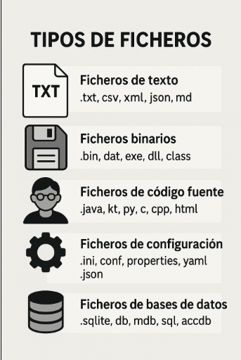

# Ficheros

Un **fichero** es una unidad de almacenamiento de datos en un sistema informático. Se trata de un conjunto de información organizada y almacenada en un dispositivo de almacenamiento (secuencia de bytes), como un disco duro, una memoria USB o un servidor en la nube.
A los datos que se guardan en ficheros se llaman datos persistentes, porque persisten más allá de la ejecución de la aplicación que los trata.

**Características de un fichero**{.azul}

- **Nombre**: Cada fichero tiene un nombre único dentro de su directorio.
- **Extensión**: Muchos ficheros tienen una extensión que indica su tipo (por ejemplo, .txt para texto, .jpg para imágenes, .pdf para documentos, .dat para binarios...).
- **Ubicación**: Se encuentran organizados en carpetas o directorios dentro del sistema de archivos.
- **Contenido**: Puede ser texto, imágenes, vídeos, código fuente, bases de datos, etc.
- **Permisos de acceso**: Se pueden configurar para permitir o restringir la lectura, escritura o ejecución a determinados usuarios o programas.

        +--------------------+
        |   📄 fichero.txt   |
        +--------------------+
        | Nombre: fichero    |
        | Extensión: .txt    |
        | Tamaño: 2 KB       |
        | Ubicación: /docs   |
        | Contenido:         |
        | "Hola mundo..."    |
        +--------------------+

**Tipos de ficheros**{.azul}  

- **Ficheros de texto**: Contienen datos en formato legible por humanos (.txt, .csv, .json, .xml).
- **Ficheros binarios**: Almacenan información en un formato no legible directamente (.exe, .jpg, .mp3, .dat).
- **Ficheros de código fuente**: Contienen instrucciones escritas en lenguajes de programación (.java, .kt, .py).
- **Ficheros de configuración**: Almacenan parámetros de configuración de programas (.ini, .conf, .properties).
- **Ficheros de bases de datos**: Se utilizan para almacenar grandes volúmenes de datos estructurados (.db, .sql).

**Principales usos de la persistencia de datos en ficheros**{.azul}

El uso de ficheros para la persistencia de datos es una alternativa sencilla y eficiente cuando no se requiere una base de datos completa:

- Guardar ajustes de una aplicación en archivos de configuración (.properties, .ini, .json).
- Mantener un historial de eventos o errores en un sistema (.log).
- Guardar información de usuario o estado de la aplicación sin necesidad de una base de datos (.csv, .json).
- Comunicación entre programas mediante archivos JSON o XML.
- Aplicaciones que funcionan sin internet o sin una base de datos centralizada.

