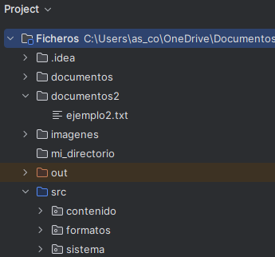

# 🔹Lectura y escritura de ficheros

!!!warning "Ejemplos"
    Los ejemplos de esta parte se incluirán en el paquete **contenido**, dentro de nuestro proyecto **Ficheros**.  
    También será neceario crear las carpetas **documentos** y **documentos2** para guardar los archivos generados.

    
    

## 🔹Ficheros de texto y binarios

En el desarrollo de software, los ficheros de texto y los ficheros binarios son los dos tipos de archivos más comunes y utilizados para almacenar y gestionar información.

- **Ficheros de texto**: contienen únicamente caracteres. Su contenido se puede leer y escribir con cualquier editor de texto, como .txt, .csv, .json, .xml, etc.

- **Ficheros binarios**: son ficheros que contienen cualquier tipo de información (texto, imágenes, vídeos, ficheros…) codificada como bytes. En general, requiere de programas especiales para mostrar la información que contienen.

**📄Lectura y escritura de un archivo de texto**{.azul} 

| Tipo de fichero           | Lectura                             | Escritura                            | Comentario                                               |
|---------------------------|--------------------------------------|---------------------------------------|----------------------------------------------------------|
| Texto (líneas)         | `Files.readAllLines(Path)`          | `Files.write(Path, List<String>)`     | Carga todo en memoria                                    |
|                           | `Files.newBufferedReader(Path)`     | `Files.newBufferedWriter(Path)`       | Más eficiente para archivos grandes                      |
|                           | `Files.readString(Path)` (Java 11+) | `Files.writeString(Path, String)`     | Lectura/escritura completa como bloque                  |

🖥️ **Ejemplo_Lect_esc_ficheroTexto.kt**: lectura y escritura en ficheros de texto (UTF-8)

        import java.nio.file.Files
        import java.nio.file.Paths
        import java.nio.charset.StandardCharsets

        fun main() {
                val ruta = Paths.get("documentos/texto.txt")

                //Escritura en fichero de texto
                val lineasParaGuardar = listOf(
                        "Primera línea",
                        "Segunda línea",
                        "¡Hola desde Kotlin!"
                )
                Files.write(ruta, lineasParaGuardar, StandardCharsets.UTF_8)
                println("Fichero de texto escrito.")

                //Lectura del fichero de texto

                //readAllLines
                val lineasLeidas = Files.readAllLines(ruta)
                println("Contenido leído con readAllLines:")
                for (lineas in lineasLeidas) {
                        println(lineas)
                }

                //readString
                val contenido = Files.readString(ruta)
                println("Contenido leído con readString:")
                println(contenido)

                //newBufferedReader
                Files.newBufferedReader(ruta).use { reader ->
                        println("Contenido leído con newBufferedReader:")
                        reader.lineSequence().forEach { println(it) }
                }
        }

**🧩 Lectura y escritura de un archivo binario**{.azul} 

| Tipo de fichero           | Lectura                             | Escritura                            | Comentario                                               |
|---------------------------|--------------------------------------|---------------------------------------|----------------------------------------------------------|
| Binario | `Files.readAllBytes(Path)`          | `Files.write(Path, ByteArray)`        | Lee y escribe bytes puros                               |
|                           | `Files.newInputStream(Path)`        | `Files.newOutputStream(Path)`         | Flujo de bytes directo                                  |

🖥️ **Ejemplo_Lect_esc_ficheroBinario.kt**: lectura y escritura en ficheros binario

        import java.nio.file.Files
        import java.nio.file.Paths

        fun main() {
                val ruta = Paths.get("documentos/datos.bin")

                //Escritura en fichero binario
                val datos = byteArrayOf(1, 2, 3, 4, 5)
                Files.write(ruta, datos)
                println("Archivo binario creado: ${ruta.toAbsolutePath()}")

                val bytes = Files.readAllBytes(ruta)

                println("Contenido leído (byte a byte):")
                for (b in bytes) {
                        print("$b ")
                }
         }

## 🔹Ficheros de imagen

Los ficheros de imagen contienen datos que representan gráficamente una imagen visual (fotografías, ilustraciones, iconos, etc.). A diferencia de los ficheros de texto o binarios crudos, estos archivos tienen estructura interna que depende del formato (como .png, .jpg, .bmp, etc.).

📦 Formatos más comunes

- **.jpg**:	Comprimido con pérdida, ideal para fotos
- **.png**:	Comprimido sin pérdida, soporta transparencia
- **.bmp**:	Sin compresión, ocupa más espacio
- **.gif**:	Admite animaciones simples, limitada a 256 colores
  
En la plataforma Java (y por tanto en Kotlin), **el manejo de imágenes** se hace generalmente usando:

- **ImageIO**: para leer y escribir imágenes
- **BufferedImage**: para acceder y modificar píxeles

| Tipo de fichero           | Lectura                             | Escritura                            | Comentario                                               |
|---------------------------|--------------------------------------|---------------------------------------|----------------------------------------------------------|
| Imagen                 | `ImageIO.read(Path/File)`           | `ImageIO.write(BufferedImage, ...)`   | Usa `javax.imageio.ImageIO`                             |

🖥️ **Ejemplo_generar_imagen.kt:** genera una imagen de ejemplo.

    import java.awt.Color
    import java.awt.image.BufferedImage
    import java.io.File
    import javax.imageio.ImageIO

    fun main() {
        val ancho = 200
        val alto = 100
        val imagen = BufferedImage(ancho, alto, BufferedImage.TYPE_INT_RGB)

        // Rellenar la imagen con colores
        for (x in 0 until ancho) {
            for (y in 0 until alto) {
                val rojo = (x * 255) / ancho
                val verde = (y * 255) / alto
                val azul = 128
                val color = Color(rojo, verde, azul)
                imagen.setRGB(x, y, color.rgb)
            }
        }

        // Guardar la imagen
        val archivo = File("documentos/imagen_generada.png")
        ImageIO.write(imagen, "png", archivo)
        println("✅ Imagen generada correctamente: ${archivo.absolutePath}")
    }

🖥️ **Ejemplo_invertircolores_imagen.kt:** invierte los colores de la imagen generada en el ejemplo atenerior.

    import java.awt.Color
    import java.awt.image.BufferedImage
    import java.io.File
    import javax.imageio.ImageIO

    fun main() {
        val archivoEntrada = File("documentos/imagen_generada.png")
        val archivoSalida = File("documentos/imagen_salida.png")

        // Leer imagen original
        val imagen: BufferedImage = ImageIO.read(archivoEntrada)

        // Recorrer todos los píxeles
        for (x in 0 until imagen.width) {
            for (y in 0 until imagen.height) {
                val colorOriginal = Color(imagen.getRGB(x, y))
                val colorInvertido = Color(
                    255 - colorOriginal.red,
                    255 - colorOriginal.green,
                    255 - colorOriginal.blue
                )
                imagen.setRGB(x, y, colorInvertido.rgb)
            }
        }

        // Guardar imagen modificada
        ImageIO.write(imagen, "png", archivoSalida)
        println("✅ Imagen guardada como ${archivoSalida.name}")
    }

🖥️ **Ejemplo_img_penyagolosa.kt:** Invierte los colores de una imagen.  

Copia la imagen penyagolosa.png en la capreta **documentos**

imagen a copiar (penyagolosa.png)|imagen con los colores invertidos
---------------|---------------------------------
||

    import java.awt.Color
    import java.awt.image.BufferedImage
    import java.nio.file.Files
    import java.nio.file.Path
    import java.nio.file.StandardCopyOption
    import javax.imageio.ImageIO

    fun main() {
        val originalPath = Path.of("documentos/penyagolosa.png")
        val copiaPath = Path.of("documentos/penyagolosa_copia.png")
        val modificadaPath = Path.of("documentos/penyagolosa_modificada.png")

        // 1. Comprobar si la imagen existe
        if (!Files.exists(originalPath)) {
            println("No se encuentra la imagen original: $originalPath")
            return
        }

        // 2. Copiar la imagen con java.nio
        Files.copy(originalPath, copiaPath, StandardCopyOption.REPLACE_EXISTING)
        println("Imagen copiada a: $copiaPath")

        // 3. Leer la imagen como BufferedImage
        val imagen: BufferedImage = ImageIO.read(copiaPath.toFile())

        // 4. Invertir colores
        for (x in 0 until imagen.width) {
            for (y in 0 until imagen.height) {
                val color = Color(imagen.getRGB(x, y))
                val invertido = Color(255 - color.red, 255 - color.green, 255 - color.blue)
                imagen.setRGB(x, y, invertido.rgb)
            }
        }

        // 5. Guardar la imagen modificada
        ImageIO.write(imagen, "png", modificadaPath.toFile())
        println("Imagen modificada guardada como: $modificadaPath")
    }

## 🔹Ficheros binarios estructurados

Aunque **java.nio.file** es la API moderna para trabajar con rutas y archivos, las clases **DataOutputStream** y **DataInputStream** de **java.io** siguen siendo la opción más adecuada para escribir y leer **binario estructurado**.
Son más simples, seguras, portables y claras para representar estructuras secuenciales como registros.

En contextos donde se requiera rendimiento avanzado o acceso aleatorio, puede usarse **FileChannel** y **ByteBuffer**, aunque su complejidad las hace menos recomendables.

**Clases y método de  DataInputStream y DataOutputStream**{.verde}

| Clase               | Método                          | Tipo de dato           | Descripción                                               |
|--------------------|----------------------------------|------------------------|-----------------------------------------------------------|
| DataOutputStream   | `writeInt(int)`                  | Entero (4 bytes)       | Escribe un entero con signo                               |
|                    | `writeDouble(double)`            | Decimal (8 bytes)      | Escribe un número en coma flotante                        |
|                    | `writeFloat(float)`              | Decimal (4 bytes)      | Escribe un número float                                   |
|                    | `writeLong(long)`                | Entero largo (8 bytes) | Escribe un long                                           |
|                    | `writeBoolean(boolean)`          | Booleano (1 byte)      | Escribe un valor verdadero/falso                          |
|                    | `writeChar(char)`                | Carácter (2 bytes)     | Escribe un carácter Unicode                               |
|                    | `writeUTF(String)`               | Cadena UTF-8           | Escribe una cadena precedida por su longitud en 2 bytes   |
|                    | `writeByte(int)`                 | Byte (1 byte)          | Escribe un solo byte                                      |
|                    | `writeShort(int)`                | Entero corto (2 bytes) | Escribe un short                                          |
| DataInputStream    | `readInt()`                      | Entero                 | Lee un entero con signo                                   |
|                    | `readDouble()`                   | Decimal                | Lee un número double                                      |
|                    | `readFloat()`                    | Decimal                | Lee un número float                                       |
|                    | `readLong()`                     | Entero largo           | Lee un long                                               |
|                    | `readBoolean()`                  | Booleano               | Lee un valor verdadero/falso                              |
|                    | `readChar()`                     | Carácter               | Lee un carácter Unicode                                   |
|                    | `readUTF()`                      | Cadena UTF-8           | Lee una cadena UTF-8                                      |
|                    | `readByte()`                     | Byte                   | Lee un byte                                               |
|                    | `readShort()`                    | Entero corto           | Lee un short                                              |

🖥️ **Ejemplo_binario_estructurado.kt**: Lectura y escritura en ficheros binarios (con tipos primitivos).

        import java.io.DataInputStream
        import java.io.DataOutputStream
        import java.io.FileInputStream
        import java.io.FileOutputStream
        import java.nio.file.Files
        import java.nio.file.Paths

        fun main() {
            val ruta = Paths.get("documentos/binario.dat")
            Files.createDirectories(ruta.parent)

            // Escritura binaria
            val out= DataOutputStream(Files.newOutputStream(ruta)).use { out -> //devuelve OutputStream
            out.writeInt(42)         // int (4 bytes)
            out.writeDouble(3.1416)  // double (8 bytes)
            out.writeUTF("K")       // char (2 bytes)
            }

            println("✅ Fichero binario escrito con DataOutputStream (sin lambda).")

            // Lectura binaria
            val fis = FileInputStream(ruta.toFile())
            val input = DataInputStream(fis)
            val entero = input.readInt()
            val decimal = input.readDouble()
            val caracter = input.readUTF()
            input.close()
            fis.close()

            println("📄 Contenido leído:")
            println("  Int: $entero")
            println("  Double: $decimal")
            println("  Char: $caracter")
        }

## 🔹Ficheros de acceso aleatorio

Hasta el momento todos los accesos que hemos hecho a los archivos, tanto binarios como de texto, han sido secuenciales. Esto significa que siempre empezamos por el principio del archivo hasta que llegamos a la información que queremos, o en la mayor parte de los casos hasta el final de archivo.

Pero, ¿y si queremos únicamente una determinada información? Afortunadamente hay otra forma de acceder, otro tipo de acceso. Se llama acceso **directo o aleatorio**, porque permitirá ir directamente a una posición determinada del archivo.

Cuando se necesita mayor control, eficiencia y rendimiento en el acceso a ficheros, especialmente en operaciones binarias o de acceso aleatorio, el enfoque tradicional con la clase **RandomAccessFile** de **Java.io** puede quedarse corto. Para estos casos, Java ofrece una solución moderna a través del paquete **java.nio.file** combinado con **FileChannel** y **ByteBuffer**. 

Las clases **FileChannel**, **ByteBuffer** y **StandardOpenOption** forman parte de la API **java.nio** y se utilizan juntas para realizar lectura y escritura de archivos **binarios** y en el **acceso aleatorio a ficheros**.

**FileChannel**{.azul}

| Tipo de fichero           | Lectura                             | Escritura                            | Comentario                                               |
|---------------------------|--------------------------------------|---------------------------------------|----------------------------------------------------------|
| Acceso aleatorio       | `FileChannel.position(offset)`      | `FileChannel.position(offset)`        | Permite saltar a cualquier posición del fichero         |

**Métodos habituales de FileChannel para el acceso aleatorio a ficheros**{.verde}

| Método                   | Función principal                                         |
|--------------------------|-----------------------------------------------------------|
| position()             |  Devuelve la posición actual del puntero en el archivo     |
| position(long)         |  Establece una posición exacta para lectura/escritura      |
| truncate(long)         | Recorta o amplía el tamaño del archivo                    |
| size()                 |  Devuelve el tamaño total actual del archivo  

**ByteBuffer**{.azul}

ByteBuffer se utiliza en archivos de acceso aleatorio porque permite leer y escribir bloques binarios de datos en posiciones específicas del archivo de forma eficiente y controlada.

**Métodos de creación**{.verde}

| Método                           | Descripción                                                                 |
|----------------------------------|-----------------------------------------------------------------------------|
| allocate(capacidad)| Crea un buffer con capacidad fija en memoria (no compartida).              |
| wrap(byteArray)    | Crea un buffer que envuelve un array de bytes existente (memoria compartida). |
| wrap(byteArray, offset, length) | Crea un buffer desde una porción del array existente.            |

---

**Métodos de escritura (`put`)**{.verde}

| Método                        | Descripción                                      |
|-------------------------------|--------------------------------------------------|
| put(byte)                   | Escribe un byte en la posición actual.          |
| putInt(int)                 | Escribe un valor `int`.                         |
| putDouble(double)           | Escribe un valor `double`.                      |
| putFloat(float)             | Escribe un valor `float`.                       |
| putChar(char)               | Escribe un carácter (`char`, 2 bytes).          |
| putShort(short)             | Escribe un valor `short`.                       |
| putLong(long)               | Escribe un valor `long`.                        |
| put(byte[], offset, length)` | Escribe una porción de un array de bytes.       |

---

**Métodos de lectura (`get`)**{.verde}

| Método                        | Descripción                                      |
|-------------------------------|--------------------------------------------------|
| get()                       | Lee un byte desde la posición actual.           |
| getInt()                    | Lee un valor `int`.                             |
| getDouble()                 | Lee un valor `double`.                          |
| getFloat()                  | Lee un valor `float`.                           |
| getChar()                   | Lee un carácter (`char`).                       |
| getShort()                  | Lee un valor `short`.                           |
| getLong()                   | Lee un valor `long`.                            |
| get(byte[], offset, length)` | Lee una porción del buffer a un array.          |

---

**Métodos de control del buffer**{.verde}

| Método           | Descripción                                                                 |
|------------------|-----------------------------------------------------------------------------|
| position()     | Devuelve la posición actual del cursor.                                     |
| position(int)  | Establece la posición del cursor.                                           |
| limit()        | Devuelve el límite del buffer.                                              |
| limit(int)     | Establece un nuevo límite.                                                  |
| capacity()     | Devuelve la capacidad total del buffer.                                     |
| clear()        | Limpia el buffer: posición a 0, límite al máximo (sin borrar contenido).    |
| flip()         | Prepara el buffer para lectura después de escribir.                         |
| rewind()       | Posición a 0 para releer desde el inicio.                                   |
| remaining    | Indica cuántos elementos quedan por procesar.                               |
| hasRemaining() | `true` si aún queda contenido por leer o escribir.   

**StandardOpenOption**{.azul}

Se utiliza para indicar cómo debe abrirse o crearse un archivo al trabajar con **FileChannel** o Files.newOutputStream, Files.newByteChannel, etc.

Se utiliza para indicar si el archivo se va a: **Leer (READ)**, **Escribir (WRITE)**, **Crear (CREATE)**, **sobrescribir (TRUNCATE_EXISTING)**, **Añadir al final (APPEND)**.

        val canal = FileChannel.open(
            Paths.get("archivo.txt"),
            StandardOpenOption.WRITE,
            StandardOpenOption.CREATE
            )

      

🖥️ **Ejemplo_acceso_posicion.kt**: realiza una operación básica de lectura y escritura de archivo de texto usando **FileChannel** y **ByteBuffer**. 

        // Importamos las clases necesarias
        import java.nio.ByteBuffer                      // Para gestionar buffers de bytes
        import java.nio.channels.FileChannel            // Para acceder al archivo como canal
        import java.nio.file.Paths                      // Para crear la ruta del archivo
        import java.nio.file.StandardOpenOption.*       // Para usar opciones como READ, WRITE, CREATE

        fun main() {
            // Creamos una ruta al archivo datos.txt
            val path = Paths.get("documentos/datos.txt")

            // Abrimos el canal con permisos de lectura, escritura y creación
            FileChannel.open(path, READ, WRITE, CREATE).use { canal ->

                // Creamos un buffer con el texto a escribir convertido a bytes
                val buffer = ByteBuffer.wrap("Hola desde Kotlin\n".toByteArray())

                // Establecemos la posición del canal al principio del archivo
                canal.position(0)

                // Escribimos el contenido del buffer en el archivo
                canal.write(buffer)

                // Creamos un nuevo buffer vacío para leer hasta 1024 bytes
                val bufferLectura = ByteBuffer.allocate(1024)

                // Volvemos al principio del archivo para leer desde el inicio
                canal.position(0)

                // Leemos desde el archivo al buffer
                canal.read(bufferLectura)

                // Cambiamos el buffer de modo escritura a modo lectura
                bufferLectura.flip()

                // Convertimos el contenido leído a cadena y lo mostramos
                println(String(bufferLectura.array(), 0, bufferLectura.limit()))
            } // El canal se cierra automáticamente gracias a `use`
        }

🖥️ **Ejemplo_acceso_aleatorio.kt** : acceso directo a posiciones en un archivo con **FileChannel** y **ByteBuffer**.

        import java.nio.ByteBuffer
        import java.nio.channels.FileChannel
        import java.nio.file.Paths
        import java.nio.file.StandardOpenOption.*

        fun main() {
            val path = Paths.get("documentos/datos.txt")

            // Abrimos el canal con permisos de lectura y escritura
            FileChannel.open(path, READ, WRITE, CREATE).use { canal ->

                // Escribimos "Inicio\n" en la posición 0 del archivo
                canal.position(0)
                val inicio = ByteBuffer.wrap("Inicio\n".toByteArray())
                canal.write(inicio)

                // Escribimos "Texto en posición 20\n" en la posición 20 del archivo
                canal.position(20)
                val texto = ByteBuffer.wrap("Texto en posición 20\n".toByteArray())
                canal.write(texto)

                // Leemos el contenido completo desde el inicio (posición 0)
                val bufferLectura = ByteBuffer.allocate(1024)
                canal.position(0)
                canal.read(bufferLectura)

                // Preparamos el buffer para lectura e imprimimos el contenido
                bufferLectura.flip()
                val contenido = String(bufferLectura.array(), 0, bufferLectura.limit())
                println("Contenido leído del archivo:\n$contenido")
            }
        }

