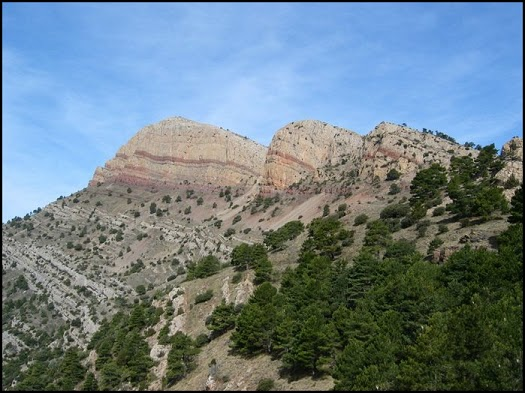
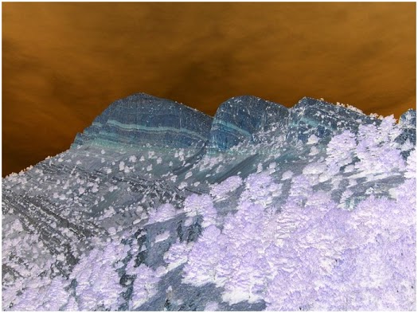

---
hide:
  - toc
---

# 🔹 Ficheros de imagen

Los ficheros de imagen contienen datos que representan gráficamente una imagen visual (fotografías, ilustraciones, iconos, etc.). A diferencia de los ficheros de texto o binarios crudos, estos archivos tienen estructura interna que depende del formato (como .png, .jpg, .bmp, etc.).

📦 Formatos más comunes

- **.jpg**:	Comprimido con pérdida, ideal para fotos
- **.png**:	Comprimido sin pérdida, soporta transparencia
- **.bmp**:	Sin compresión, ocupa más espacio
- **.gif**:	Admite animaciones simples, limitada a 256 colores
  
En la plataforma Java (y por tanto en Kotlin), **el manejo de imágenes** se hace generalmente usando:

- **ImageIO**: para leer y escribir imágenes
- **BufferedImage**: para acceder y modificar píxeles

| Tipo de fichero           | Lectura                             | Escritura                            | Comentario                                               |
|---------------------------|--------------------------------------|---------------------------------------|----------------------------------------------------------|
| Imagen                 | `ImageIO.read(Path/File)`           | `ImageIO.write(BufferedImage, ...)`   | Usa `javax.imageio.ImageIO`                             |

🖥️ **Ejemplo_generar_imagen.kt:** genera una imagen de ejemplo.

Este ejemplo muestra cómo crear una imagen desde cero en Kotlin, asignando un color a cada píxel y guardando después el resultado en un fichero PNG.

- Primero se definen el ancho y el alto de la imagen.
- Después se crea un objeto `BufferedImage`, que actúa como una imagen en memoria sobre la que se puede trabajar píxel a píxel.
- A continuación se recorren todas las coordenadas `(x, y)` con dos bucles anidados para calcular un color distinto en cada posición.
- Los valores de rojo y verde cambian según la posición del píxel, mientras que el azul se mantiene fijo, generando así un degradado de color.
- Finalmente, `ImageIO.write(...)` guarda la imagen en formato `.png` dentro de la carpeta `documentos`.

La finalidad del ejercicio es comprender que una imagen digital puede construirse manipulando directamente sus píxeles y que `BufferedImage` e `ImageIO` son las clases básicas para trabajar con imágenes en Java y Kotlin.

    import java.awt.Color
    import java.awt.image.BufferedImage
    import java.io.File
    import javax.imageio.ImageIO

    fun main() {
        val ancho = 200
        val alto = 100
        val imagen = BufferedImage(ancho, alto, BufferedImage.TYPE_INT_RGB)

        // Rellenar la imagen con colores
        for (x in 0 until ancho) {
            for (y in 0 until alto) {
                val rojo = (x * 255) / ancho
                val verde = (y * 255) / alto
                val azul = 128
                val color = Color(rojo, verde, azul)
                imagen.setRGB(x, y, color.rgb)
            }
        }

        // Guardar la imagen
        val archivo = File("documentos/imagen_generada.png")
        ImageIO.write(imagen, "png", archivo)
        println("✅ Imagen generada correctamente: ${archivo.absolutePath}")
    }

🖥️ **Ejemplo_invertircolores_imagen.kt:** invierte los colores de la imagen generada en el ejemplo anterior.

Este ejemplo parte de una imagen ya existente, la recorre píxel a píxel y genera una nueva versión con los colores invertidos.

- Primero se definen el archivo de entrada y el archivo de salida.
- Después se carga la imagen original con `ImageIO.read(...)` en un objeto `BufferedImage`.
- A continuación se recorren todos los píxeles de la imagen con dos bucles anidados.
- Para cada píxel se obtiene su color original y se calcula el color inverso restando cada componente RGB a `255`.
- Finalmente, la imagen modificada se guarda en un nuevo fichero con `ImageIO.write(...)`.

La finalidad del ejercicio es entender cómo se puede transformar una imagen manipulando directamente los valores de color de cada píxel.

    import java.awt.Color
    import java.awt.image.BufferedImage
    import java.io.File
    import javax.imageio.ImageIO

    fun main() {
        val archivoEntrada = File("documentos/imagen_generada.png")
        val archivoSalida = File("documentos/imagen_salida.png")

        // Leer imagen original
        val imagen: BufferedImage = ImageIO.read(archivoEntrada)

        // Recorrer todos los píxeles
        for (x in 0 until imagen.width) {
            for (y in 0 until imagen.height) {
                val colorOriginal = Color(imagen.getRGB(x, y))
                val colorInvertido = Color(
                    255 - colorOriginal.red,
                    255 - colorOriginal.green,
                    255 - colorOriginal.blue
                )
                imagen.setRGB(x, y, colorInvertido.rgb)
            }
        }

        // Guardar imagen modificada
        ImageIO.write(imagen, "png", archivoSalida)
        println("✅ Imagen guardada como ${archivoSalida.name}")
    }

🖥️ **Ejemplo_img_penyagolosa.kt:** Invierte los colores de una imagen.  

Este ejemplo aplica el trabajo con imágenes a un caso más real: partir de un archivo existente, hacer una copia de seguridad y generar otra versión con los colores invertidos.

- Primero se definen tres rutas: la imagen original, la copia y la imagen modificada.
- Después se comprueba si el archivo original existe antes de continuar, para evitar errores al intentar leer una imagen que no está en la carpeta `documentos`.
- A continuación se realiza una copia del fichero con `Files.copy(...)`, de modo que la imagen original no se modifica directamente.
- Luego se carga la copia en un `BufferedImage` mediante `ImageIO.read(...)`.
- Una vez cargada, se recorren todos sus píxeles para calcular el color invertido de cada uno, cambiando los valores RGB.
- Finalmente, la imagen transformada se guarda como un nuevo archivo PNG.

La finalidad del ejercicio es combinar operaciones sobre ficheros e imágenes: comprobar existencia, copiar archivos y modificar píxeles para obtener una nueva imagen a partir de otra ya existente.

Copia la imagen penyagolosa.png en la carpeta **documentos**

imagen a copiar (penyagolosa.png)|imagen con los colores invertidos
---------------|--------------------------------
||

    import java.awt.Color
    import java.awt.image.BufferedImage
    import java.nio.file.Files
    import java.nio.file.Path
    import java.nio.file.StandardCopyOption
    import javax.imageio.ImageIO

    fun main() {
        val originalPath = Path.of("documentos/penyagolosa.png")
        val copiaPath = Path.of("documentos/penyagolosa_copia.png")
        val modificadaPath = Path.of("documentos/penyagolosa_modificada.png")

        // 1. Comprobar si la imagen existe
        if (!Files.exists(originalPath)) {
            println("No se encuentra la imagen original: $originalPath")
            return
        }

        // 2. Copiar la imagen con java.nio
        Files.copy(originalPath, copiaPath, StandardCopyOption.REPLACE_EXISTING)
        println("Imagen copiada a: $copiaPath")

        // 3. Leer la imagen como BufferedImage
        val imagen: BufferedImage = ImageIO.read(copiaPath.toFile())

        // 4. Invertir colores
        for (x in 0 until imagen.width) {
            for (y in 0 until imagen.height) {
                val color = Color(imagen.getRGB(x, y))
                val invertido = Color(255 - color.red, 255 - color.green, 255 - color.blue)
                imagen.setRGB(x, y, invertido.rgb)
            }
        }

        // 5. Guardar la imagen modificada
        ImageIO.write(imagen, "png", modificadaPath.toFile())
        println("Imagen modificada guardada como: $modificadaPath")
    }

!!!question "🧠 Comprueba tu comprensión"
    Si quieres conservar la imagen original y generar una versión modificada con los colores invertidos, ¿qué pasos deberías seguir y por qué no conviene sobrescribir directamente el archivo original?

    ??? success "Ver respuesta"
        1. Comprobar que la imagen original existe.
        2. Crear una copia de seguridad del fichero (por ejemplo, con `Files.copy(...)`).
        3. Leer la copia con `ImageIO.read(...)` y convertirla en `BufferedImage`.
        4. Recorrer los píxeles y aplicar la transformación de color.
        5. Guardar el resultado en un archivo nuevo con `ImageIO.write(...)`.

        No conviene sobrescribir directamente el original porque perderías la versión inicial y no podrías recuperar fácilmente el estado anterior en caso de error o de querer comparar resultados.

