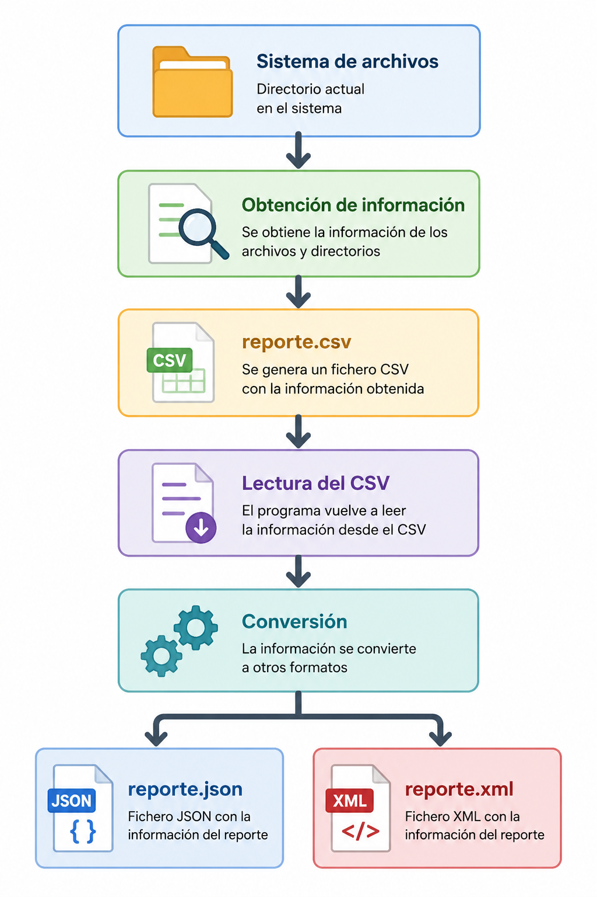

# 📝 Ejercicio 3: Proyecto Integrador (Parte 3) - Formatos de intercambio

## 📋 Enunciado

En este ejercicio vamos a completar el **Explorador Interactivo** que has desarrollado en los temas anteriores. Ahora añadiremos dos capacidades habituales en aplicaciones reales: **cargar configuración externa** y **exportar información** del sistema de ficheros en varios formatos.

!!!info "Código Base"
    Utiliza como punto de partida el código desarrollado en el Ejercicio 2. Si lo prefieres, puedes comenzar directamente desde la plantilla oficial del proyecto, que incluye la estructura del programa y los retos a completar.

    📥 **[Descargar Código Base Oficial (Solucion_T2_Plantilla_T3.kt)](../recursos/Solucion_T2_Plantilla_T3.kt)**

La aplicación debe incorporar las siguientes **novedades**:

!!!Tip "📋 Menú final:"
    - 1- Crear un directorio
    - 2- Eliminar un directorio o fichero
    - 3- Ver contenido recursivo de un directorio
    - 4- Crear un archivo de texto
    - 5- Leer un archivo de texto
    - 6- Encriptar/Ocultar archivo (Texto a Binario)
    - 7- Copiar un archivo a otra ruta
    - **8- Exportar CSV y convertir a JSON y XML**
    - 0- Salir


## Objetivo

En esta tercera y última parte del proyecto ampliarás el explorador de archivos desarrollado anteriormente incorporando dos nuevas funcionalidades:

- Cargar la configuración inicial desde un fichero externo en formato **JSON**.
- Exportar la información del directorio actual a un fichero **CSV** y, posteriormente, convertir dicho fichero a los formatos **JSON** y **XML**.

De esta forma practicarás un flujo habitual en muchas aplicaciones reales:


{width=350 style="display:block; margin-left:0; margin-right:auto;"}

  

# Material proporcionado

Junto con este enunciado se proporcionan los siguientes archivos:

- [config.json](../T3_Formatos_diferentes/config.json)
- [carpeta_prueba.zip](../T3_Formatos_diferentes/carpeta_prueba.zip)

Antes de comenzar la práctica debes incorporar los archivos proporcionados a tu proyecto de la **Parte 2**.

  - **Paso 1.** Copia el fichero [config.json](../T3_Formatos_diferentes/config.json) en la raíz del proyecto, al mismo nivel que `build.gradle.kts`.

    La estructura deberá quedar similar a la siguiente:

    
        MiProyecto
        │
        ├── build.gradle.kts
        ├── settings.gradle.kts
        ├── config.json
        │
        └── src

     Este fichero contendrá la configuración inicial de la aplicación.

      Ejemplo:

      ```json
      {
          "directorio_inicial": "src/main/resources/carpeta_prueba",
          "mostrar_archivos_ocultos": false
      }
      ```   
    
  - **Paso 2.** Descomprimir el archivo `carpeta_prueba.zip` y copiar la carpeta con sus archivos dentro de la carpeta `resources`:

    
        src/main/resources
    

    La estructura resultante del proyecto deberá ser la siguiente:

        
        Proyecto
        │
        ├── config.json
        │
        └── src
            └── main
                ├── kotlin
                └── resources
                    └── carpeta_prueba
                        ├── notas.md
                        ├── imagen.jpg
                        ├── factura.pdf
                        ├── documento.txt
                        ├── datos.csv
                        ├── .oculto.txt
                        └── exportar
        

    ---

## 🛠️ Requisitos técnicos de las nuevas opciones

- **Configuración inicial:** Al arrancar, el programa debe buscar un fichero [config.json](../T3_Formatos_diferentes/config.json) en la raíz del proyecto. Si existe, utilizará los valores de `directorio_inicial` y `mostrar_archivos_ocultos`. Si no existe, deberá usar `System.getProperty("user.home")` como directorio inicial y no mostrar archivos ocultos.
- **Opción 8 (Generar CSV):** Debe analizar **solo el contenido del directorio actual**, sin recorrer subdirectorios, y generar un fichero `reporte.csv` con esta información: nombre, tipo y tamaño en bytes, y guardarlo en la carpeta `exportar`.
    - Convertir a JSON y XML: Después de generar `reporte.csv`, el programa deberá leer ese CSV y, a partir de sus datos, crear `reporte.json` y `reporte.xml` y guardarlos en la carpeta `exportar`.
- **Restricción importante:** Una vez creado `reporte.csv`, no está permitido volver a recorrer el directorio para generar `reporte.json` y `reporte.xml`. Ambos archivos deben obtenerse **exclusivamente** desde la información almacenada en el CSV.
- **Modularidad:** El código debe estar organizado en funciones o clases separadas para cargar la configuración, obtener la información del directorio, generar el CSV, leer el CSV, generar el JSON y generar el XML. Es recomendable utilizar una clase para representar la información de cada archivo.
- **Dependencias:** Puedes utilizar librerías externas para JSON o XML si lo consideras oportuno, pero deben gestionarse mediante **Gradle**.
- **Gestión de errores:** Todas las operaciones deben estar protegidas adecuadamente. Si falta `config.json`, si una ruta no existe o si ocurre un error durante la exportación, el programa no debe cerrarse de forma abrupta.

---

## Antes de entregar

Comprueba si cumple el cheklis siguiente:

- [ ] El programa sigue funcionando igual que en la Parte 2.
- [ ] Lee correctamente config.json.
- [ ] Si config.json no existe continúa funcionando.
- [ ] Respeta la configuración de archivos ocultos.
- [ ] Genera reporte.csv.
- [ ] Lee correctamente el CSV generado.
- [ ] Genera reporte.json.
- [ ] Genera reporte.xml.
- [ ] El código está modularizado.
- [ ] Se utilizan data class cuando corresponde.

📤 Ejemplo de salida esperada

**Salida por consola**

    HOME: src\main\resources\carpeta_prueba

    --------------------------------
    Nombre: datos.csv
    Tipo: Archivo
    Tamaño: 51 bytes
    Creado: 2026-07-28T08:48:45.055565Z
    Modificado: 2026-07-28T08:50:52.4224377Z
    Legible: true
    Escribible: true
    --------------------------------
    Nombre: documento.txt
    Tipo: Archivo
    Tamaño: 180 bytes
    Creado: 2026-07-27T19:21:05.4714133Z
    Modificado: 2026-07-28T08:44:40.185279Z
    Legible: true
    Escribible: true
    --------------------------------
    Nombre: exportar
    Tipo: Directorio
    Tamaño: 4096 bytes
    Creado: 2026-07-28T08:42:09.0645828Z
    Modificado: 2026-07-28T09:45:27.8279419Z
    Legible: true
    Escribible: true
    --------------------------------
    Nombre: imagen.jpg
    Tipo: Archivo
    Tamaño: 0 bytes
    Creado: 2026-07-28T08:48:09.9378597Z
    Modificado: 2026-07-28T08:48:09.9378597Z
    Legible: true
    Escribible: true

    Información del sistema de archivos
    Tipo: NTFS
    Espacio total: 1022076719104 bytes
    Espacio libre: 768379420672 bytes

    ===== MENÚ =====
    1. Crear directorio
    2. Eliminar directorio o fichero
    3. Ver contenido recursivo
    4. Crear archivo de texto
    5. Leer archivo de texto
    6. Encriptar archivo
    7. Copiar archivo
    8. Exportar reporte del directorio actual
    0. Salir
    Selecciona una opción:

    8
    Reportes generados correctamente en la carpeta exportar.

**reporte.csv**

    Nombre,Tipo,Tamaño
    datos.csv,Archivo,51
    documento.txt,Archivo,180
    exportar,Directorio,4096
    imagen.jpg,Archivo,0


**reporte.json**

    [ {
      "nombre" : "datos.csv",
      "tipo" : "Archivo",
      "tamanyo" : 51
    }, {
      "nombre" : "documento.txt",
      "tipo" : "Archivo",
      "tamanyo" : 180
    }, {
      "nombre" : "exportar",
      "tipo" : "Directorio",
      "tamanyo" : 4096
    }, {
      "nombre" : "imagen.jpg",
      "tipo" : "Archivo",
      "tamanyo" : 0
    } ]

**reporte.xml**

    <Reporte>
      <archivo>
        <archivo>
          <nombre>datos.csv</nombre>
          <tipo>Archivo</tipo>
          <tamanyo>51</tamanyo>
        </archivo>
        <archivo>
          <nombre>documento.txt</nombre>
          <tipo>Archivo</tipo>
          <tamanyo>180</tamanyo>
        </archivo>
        <archivo>
          <nombre>exportar</nombre>
          <tipo>Directorio</tipo>
          <tamanyo>4096</tamanyo>
        </archivo>
        <archivo>
          <nombre>imagen.jpg</nombre>
          <tipo>Archivo</tipo>
          <tamanyo>0</tamanyo>
        </archivo>
      </archivo>
    </Reporte>


## ✅ Rúbrica de evaluación

La calificación del proyecto se obtendrá sumando la puntuación obtenida en cada uno de los siguientes apartados.

| Reto | Aspectos evaluados | Puntuación máxima |
|-------|--------------------|:-----------------:|
| **Reto 1. Modelo de datos** | Se han creado correctamente las `data class` necesarias para representar la configuración, la información de los archivos y la estructura del XML. | **1,0** |
| **Reto 2. Configuración del programa** | Se implementa correctamente la lectura de `config.json` y el programa utiliza una configuración por defecto cuando el fichero no existe. | **1,0** |
| **Reto 3. Inicialización del programa** | El directorio inicial y la visualización de archivos ocultos se configuran correctamente a partir del fichero de configuración. | **0,5** |
| **Reto 4. Menú principal** | Se incorpora correctamente la nueva opción para generar el reporte y se integra con el resto del programa. | **0,5** |
| **Reto 5. Visualización de archivos** | La función `mostrarHome()` respeta correctamente la configuración para mostrar u ocultar archivos ocultos. | **1,0** |
| **Reto 6. Coordinación del proceso** | La función principal del reporte coordina correctamente todas las operaciones necesarias para generar los distintos formatos. | **1,5** |
| **Reto 7. Obtención de la información** | Se obtiene correctamente la información del directorio y se almacena utilizando las estructuras de datos adecuadas. | **1,0** |
| **Reto 8. Lectura del CSV** | Se reconstruye correctamente la información almacenada en el fichero CSV. | **0,5** |
| **Reto 9. Exportación a CSV** | Se genera correctamente el fichero `reporte.csv` con la cabecera y todos los datos requeridos. | **1,0** |
| **Reto 10. Exportación a JSON** | Se genera correctamente el fichero `reporte.json` utilizando la información obtenida del CSV. | **1,0** |
| **Reto 11. Exportación a XML** | Se genera correctamente el fichero `reporte.xml` utilizando la información obtenida del CSV. | **1,0** |
| | **TOTAL** | **10,0** |


