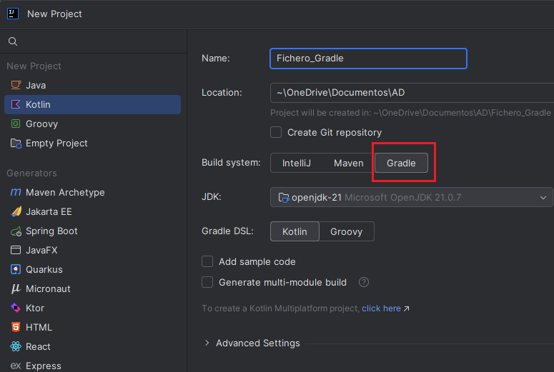
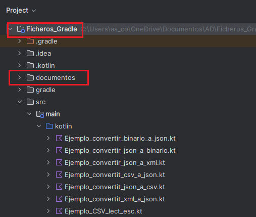

# Ficheros de intercambio

En el desarrollo de aplicaciones, es habitual trabajar con datos almacenados o transmitidos en distintos formatos de ficheros. La conversión entre estos formatos permite intercambiar información entre sistemas heterogéneos, integrarse con APIs, facilitar la persistencia de datos o adaptarse a requisitos específicos. 

**¿Cuándo utilizar cada uno de ellos?**

- **JSON** y **XML**: para APIs REST, configuración, exportación de datos.
- **CSV**: para importar/exportar datos desde hojas de cálculo.

Estos formatos no solo permiten guardar la información de forma más organizada y legible, sino que requieren utilizar **librerías específicas** para leer y escribir.  

En los siguientes apartados veremos cómo trabajar con cada uno de estos formatos, qué librerías se utilizan en Kotlin para manipularlos, y cómo adaptar nuestras clases y funciones para poder persistir y recuperar objetos fácilmente desde cada tipo de fichero.

## 🔹Data Class

Aunque este tipo de ficheros están formados por texto, los programas no deberían trabajar directamente con texto, sino con datos estructurados.

Por este motivo, toda la lectura y escritura de ficheros de intercambio se realizará **mediante objetos**, y no manipulando directamente cadenas de texto.
Cuando leemos un fichero CSV, JSON o XML leemos texto pero, el objetivo final es obtener información con significado. Para representar correctamente esa información dentro del programa, utilizaremos **data class**, que nos permiten modelar los datos de forma clara y segura.

Define qué información tiene un objeto y de qué tipo es cada dato: El data class de una línea CSV se repreentaría así:

   
| CSV | Data Class |
|--------|---------|
| nombre;nota Lucía;28 | data class Alumno( &nbsp;&nbsp;&nbsp;val nombre: String, &nbsp;&nbsp;&nbsp;val nota: Int ) |

!!!warning "Ejemplos"
    Para probar y organizar los ejemplos propuestos en esta parte del temario, crearemos un proyecto llamado **Ficheros_Gradle**, en el que incluiremos **Gradle** como herramienta de construcción. Los ejemplos los iremos creando directamente en la carpeta **src/main/Kotlin**.   
    Crearemo también la carpeta **documentos**, donde iremos dejando los ficheros geneados en los distintos ejemplos.
    
    |

## 🔹Dependencias Gradle

En este apartado vamos a desarrollar una aplicación en Kotlin que gestione la lectura y escritura de datos utilizando distintos formatos de archivo estructurado: CSV, JSON y XML.

Para facilitar **el uso de librerías externas** que nos ayuden a trabajar con estos formatos, vamos a utilizar **Gradle** como herramienta de construcción del proyecto. Gradle nos permitirá:

- Gestionar las dependencias necesarias.
- Automatizar el proceso de compilación y ejecución.
- Organizar el proyecto de forma profesional y escalable.

**Dependencias que utilizaremos**:

| Formato | Librería             | Propósito principal                                                              |
|---------|----------------------|----------------------------------------------------------------------------------|
| CSV     | OpenCSV, Kotlin-CSV  | Lectura y escritura de archivos separados por comas o punto y coma              |
| JSON    | kotlinx.serialization| Conversión entre objetos Kotlin y texto JSON (ligero, multiplataforma, oficial) |
| JSON    | Jackson              | Conversión entre objetos Java/Kotlin y JSON (muy usado en backend Java)         |
| XML     | javax.xml (DOM API)  | Construcción y manipulación manual de documentos XML (bajo nivel, detallado)    |
| XML     | Jackson              | Conversión directa entre objetos y XML (usando anotaciones, más sencillo)       |

En el fichero **build.gradle.kts** se incluirán los plugins y dependencias necesarias:

        plugins {
            kotlin("jvm") version "2.0.20"
            kotlin("plugin.serialization") version "2.0.20"
            application
        }

        repositories {
            mavenCentral()
        }

        dependencies {
            // Kotlin estándar
            implementation(kotlin("stdlib"))

            // Serialización JSON
            implementation("org.jetbrains.kotlinx:kotlinx-serialization-json:1.6.3")

            // OpenCSV para CSV
            implementation("com.opencsv:opencsv:5.9")

            //Kotlin-CSV
            implementation("com.github.doyaaaaaken:kotlin-csv-jvm:1.9.1")

            // librería JDOM2
            implementation("org.jdom:jdom2:2.0.6")

            // librerias jackson
            implementation("com.fasterxml.jackson.module:jackson-module-kotlin:2.17.0")
            implementation("com.fasterxml.jackson.dataformat:jackson-dataformat-xml:2.17.0")

        }

## 🔹Ficheros CSV  

El formato CSV es un archivo de texto donde los valores están separados por comas u otro delimitador (como punto y coma), muy usado para intercambiar datos entre hojas de cálculo, sistemas contables, etc.

La lectura y escrituara de un archivo CSV se puede hacer de tres formas:

1. **Sin utilizar librerías** y mediante la lectura línea a línea + split().
2. Con la librería **OpenCSV**.
3. Con la librería **Kotlin-CSV**.

En este bloque de contenidos vamos a trabajar con distintos programas de ejemplo y en todos estos casos, los datos representan siempre el mismo tipo de información: alumnos.

!!!Tip "Alumnos.csv"
    nombre:nota
    Lucía;9  
    Carlos;8  
    Elena;10  
    
    
La **data class Alumno** correspondiente será:

        data class Alumno(
            val nombre: String,
            val nota: Int
        )

📌 Esta clase la crearemos fuera fuera de los programas de ejemplo para poder reutilizarla desde cualquier otro main. 

🖥️ **1- Sin librerías: lectura línea a línea + split()**{.azul}

**Ejemplo_CSV_lect_esc.kt**

        import java.nio.file.Files
        import java.nio.file.Paths
        import java.nio.file.StandardOpenOption

       
        fun main() {
            val ruta = Paths.get("documentos/alumnos.csv")

            // 1. Crear contenido CSV (con cabecera)
            val lineas = listOf(
                "nombre;nota",     // cabecera
                "Lucía;9",
                "Carlos;8",
                "Elena;10"
            )

            // 2. Escribir el archivo
            Files.write(
                ruta,
                lineas,
                StandardOpenOption.CREATE,
                StandardOpenOption.TRUNCATE_EXISTING
            )

            println("Archivo CSV creado: ${ruta.toAbsolutePath()}")

            // 3. Leer el archivo y convertir a objetos Alumno
            val lineasLeidas = Files.readAllLines(ruta)
            val alumnos = mutableListOf<Alumno>()

            for (i in lineasLeidas.indices) {

                // Saltamos la cabecera (línea 0)
                if (i == 0) continue

                val linea = lineasLeidas[i]
                val partes = linea.split(";")

                if (partes.size == 2) {
                    val nombre = partes[0]
                    val nota = partes[1].toInt()

                    val alumno = Alumno(nombre, nota)
                    alumnos.add(alumno)
                } else {
                    println("Línea mal formada: $linea")
                }
            }

            // 4. Usar los objetos
            println("\nListado de alumnos:")
            for (alumno in alumnos) {
                println("Alumno: ${alumno.nombre}, Nota: ${alumno.nota}")
            }
        }

🖥️ **2- Con OpenCSV**{.azul}

!!!Note "Nota"
    **OpenCSV** fue desarrollado antes de que **java.nio.file.Path** se introdujera en Java 7, y sus métodos aún usan la API antigua **(java.io.*)**, como FileReader y FileWriter.

**Lectura con OpenCSV**{.verde}

| Clase / Método          | ¿Qué hace?                                                              | Ejemplo básico                                         |
| ----------------------- | ----------------------------------------------------------------------- | ------------------------------------------------------ |
| `CSVReader(FileReader)` | Crea un lector de archivos CSV.                                         | `val reader = CSVReader(FileReader("archivo.csv"))`    |
| `readAll()`             | Lee todo el contenido como `List<Array<String>>`.                       | `val filas = reader.readAll()`                         |
| `readNext()`            | Lee una fila como `Array<String>`.                                      | `val fila = reader.readNext()`                         |
| `close()`               | Cierra el lector.                                                       | `reader.close()`                                       |
| `CSVReaderBuilder(...)` | Permite configurar el lector: separador, comillas, salto de línea, etc. | `CSVReaderBuilder(FileReader(...)).withSeparator(';')` |
| `withSkipLines(n)`      | Omite las primeras `n` líneas (útil para saltar cabeceras).             | `withSkipLines(1)`                                     |
| `build()`               | Construye el lector configurado.                                        | `build()`                                              |

**Escritura con OpenCSV**{.verde}

| Clase / Método                  | ¿Qué hace?                                                          | Ejemplo básico                                         |
| ------------------------------- | ------------------------------------------------------------------- | ------------------------------------------------------ |
| `CSVWriter(FileWriter)`         | Crea un escritor CSV básico.                                        | `val writer = CSVWriter(FileWriter("archivo.csv"))`    |
| `writeNext(Array<String>)`      | Escribe una línea al CSV.                                           | `writer.writeNext(arrayOf("Ana", "30"))`               |
| `writeAll(List<Array<String>>)` | Escribe múltiples filas al CSV.                                     | `writer.writeAll(listaFilas)`                          |
| `flush()`                       | Fuerza la escritura del buffer.                                     | `writer.flush()`                                       |
| `close()`                       | Cierra el escritor.                                                 | `writer.close()`                                       |
| `CSVWriterBuilder(...)`         | Permite configurar el escritor: delimitador, comillas, escape, etc. | `CSVWriterBuilder(FileWriter(...)).withSeparator(';')` |
| `withQuoteChar(c)`              | Define el carácter de comillas (por defecto es `"`).                | `withQuoteChar(CSVWriter.NO_QUOTE_CHARACTER)`          |
| `withEscapeChar(c)`             | Define el carácter de escape (por defecto `\`).                     | `withEscapeChar('\\')`                                 |
| `withLineEnd(e)`                | Define el carácter de fin de línea.                                 | `withLineEnd("\n")`                                    |
| `build()`                       | Construye el escritor configurado.                                  | `build()`                                              |

!!!Tip ""
    **CSVReader** y **CSVWriter** son clases Java, pensadas originalmente para Java, aunque se pueden usar desde Kotlin.

**Ejempo_OpenCSV_lect_esc.kt**

        import com.opencsv.CSVReader
        import com.opencsv.CSVWriter
        import java.io.FileReader
        import java.io.FileWriter
        import java.nio.file.Paths

        fun main() {
            val ruta = Paths.get("documentos/alumnos.csv").toString()

            // 1. Escribir el archivo CSV (con cabecera)
            CSVWriter(FileWriter(ruta)).use { writer ->
                writer.writeNext(arrayOf("nombre", "nota"))   //cabecera
                writer.writeNext(arrayOf("Lucía", "9"))
                writer.writeNext(arrayOf("Carlos", "8"))
                writer.writeNext(arrayOf("Elena", "10"))
            }

            println("Archivo CSV creado: $ruta")

            // 2. Leer el archivo CSV y convertir a objetos Alumno
            val alumnos = mutableListOf<Alumno>()

            CSVReader(FileReader(ruta)).use { reader ->
                val filas = reader.readAll()

                for (i in filas.indices) {

                    // Saltamos la cabecera
                    if (i == 0) continue

                    val fila = filas[i]

                    if (fila.size == 2) {
                        val nombre = fila[0]
                        val nota = fila[1].toInt()

                        alumnos.add(Alumno(nombre, nota))
                    } else {
                        println("Línea mal formada: ${fila.joinToString(";")}")
                    }
                }
            }

            // 3. Usar los objetos
            println("\nListado de alumnos:")
            for (alumno in alumnos) {
                println("Alumno: ${alumno.nombre}, Nota: ${alumno.nota}")
            }
        }

!!!Note "Nota"
    El archivo CSV generado sin librerías es un archivo de texto plano con el separador **;**, pero sin comillas y sin escape. En cambio, el fichero CSV generado con OpenCSV sigue el estantar CSV (RFC 4180) que incluye encerrar los campos entre comillas dobles, si el campo contiene el separador (como **;** o **,**).

🖥️ **3- Con Kotlin-CSV**{.azul}

!!!Note "Nota"
    la librería **kotlin-csv** también utiliza **java.io.File** para muchas de sus operaciones principales, aunque de una forma un poco más moderna y flexible que **OpenCSV**.

Tradicionalmente, en entornos Java se ha utilizado la librería OpenCSV para leer y escribir este tipo de archivos, debido a su potencia y versatilidad, sin embargo, cuando desarrollamos en Kotlin, existen alternativas más modernas y adaptadas al lenguaje. Una de ellas es kotlin-csv, una librería ligera y expresiva diseñada específicamente para aprovechar las ventajas de Kotlin, como las expresiones lambda, la sintaxis DSL y el trabajo con secuencias (sequences) y corrutinas.   

!!!Tip ""
    **csvWriter** y **csvReader** no son clases, sino funciones DSL propias de Kotlin

| Tipo        | Método                        | Ejemplo mínimo |
|-------------|-------------------------------|----------------|
| **Lectura** | `readAll(File)`               | `val filas = csvReader().readAll(File("alumnos.csv"))` |
|             | `readAllWithHeader(File)`     | `val datos = csvReader().readAllWithHeader(File("alumnos.csv"))` |
|             | `open { readAllAsSequence() }`| `csvReader().open("alumnos.csv") { readAllAsSequence().forEach { println(it) } }` |
| **Escritura**| `writeAll(data, File)`       | `csvWriter().writeAll(listOf(listOf("Lucía", "9")), File("salida.csv"))` |
|             | `writeRow(row, File)`         | `csvWriter().writeRow(listOf("Carlos", "8"), File("salida.csv"))` |
|             | `writeAllWithHeader(data, File)` | `csvWriter().writeAllWithHeader(listOf(mapOf("nombre" to "Elena", "nota" to "10")), File("salida.csv"))` |
| **Configuración** | `delimiter`, `quoteChar`, etc. | `csvReader { delimiter = ';' }` |

**Ejempo_KotlinCSV_lect_esc.kt**

        import com.github.doyaaaaaken.kotlincsv.dsl.csvReader
        import com.github.doyaaaaaken.kotlincsv.dsl.csvWriter
        import java.io.File
        import java.nio.file.Paths

        fun main() {
            val ruta = Paths.get("documentos/alumnos.csv").toString()

            // Escribir con cabecera
            csvWriter().open(ruta) {
                writeRow(listOf("nombre", "nota"))  //cabecera
                writeRow(listOf("Lucía", "9"))
                writeRow(listOf("Carlos", "8"))
                writeRow(listOf("Elena", "10"))
            }

            // Leer con cabecera (como Map)
            val filas: List<Map<String, String>> = csvReader().readAllWithHeader(File(ruta))

            val alumnos = filas.mapNotNull { fila ->
                val nombre = fila["nombre"]
                val notaStr = fila["nota"]
                if (nombre != null && notaStr != null) Alumno(nombre, notaStr.toInt()) else null
            }

            println("Listado de alumnos:")
            alumnos.forEach { println("Alumno: ${it.nombre}, Nota: ${it.nota}") }
        }

## 🔹Ficheros JSON

En muchas aplicaciones modernas, los datos deben almacenarse o intercambiarse en formato JSON (JavaScript Object Notation), un formato ligero y legible ampliamente utilizado en APIs, configuraciones, bases de datos NoSQL y almacenamiento persistente.

**Estructura**{.azul}

La estructura de los ficheros **JSON** (JavaScript Object Notation) se basa en una sintaxis sencilla y legible para representar datos estructurados. **JSON** está formado por **pares clave-valor** y/o listas ordenadas de valores.  
**Ejemplo**: Información sobre un alumno.

        
            "alumno": {
                "nombre": "María",
                "edad": 20,
                "activo": true,
                "notas": [8.5, 9.2, 7.8],
                "direccion": {
                "calle": "Av. del Sol",
                "ciudad": "Valencia",
                "codigoPostal": 46001}
                }
        

**Elementos principales**{.azul}

- **Objeto:**	Conjunto de pares clave-valor, delimitado por {}: "alumno"
- **Array:**	Lista ordenada de valores, delimitada por []: "notas"
- **Clave:**	Siempre entre comillas dobles: "nombre"
- **Valor:**	Puede ser: string, número, booleano, null, objeto o array:	"María", "Valencia", 20, true, etc.

**Librerías**{.azul}

En **Kotlin**, existen varias librerías que permiten trabajar con ficheros JSON de forma sencilla:

| Librería             | Lenguaje base | Uso recomendado                          | Multiplataforma | Notas destacadas                                  |
|----------------------|----------------|-----------|------------------|--------------------------------------------------|
| `kotlinx.serialization` | Kotlin         | Kotlin puro y Kotlin Multiplatform       | ✅ Sí             | Ligera, rápida y con soporte oficial de JetBrains |
| `Jackson`            | Java           | Proyectos Java/Kotlin con Spring Boot     | ❌ No             | Muy flexible y poderosa                          |
| `Gson`               | Java           | Aplicaciones Android o proyectos simples  | ❌ No             | Fácil de usar, pero más lenta y menos segura     |
| `org.json`           | Java           | Scripts rápidos o aprendizaje             | ❌ No             | Acceso directo a claves sin clases de datos      |

Cuando trabajamos con ficheros **JSON en Kotlin**, existen dos formas de acceder a los datos, tratarlos como texto plano o estructuras genéricas, o convertirlos directamente en objetos Kotlin. Aunque la primera opción es posible y útil en ciertos casos, trabajar sin conversión implica mayor esfuerzo manual, riesgo de errores en los nombres de claves y ausencia de validación de tipos. Las librerías **kotlinx.serialization** y **Jackson** nos permiten convertir los ficheros JSON a objetos y viceversa.

Esto proporciona importantes **ventajas**:  

✔️ Validación automática de la estructura del JSON.  
✔️ Conversión directa entre JSON y objetos Kotlin.  
✔️ Código más limpio y mantenible.  
✔️ Mayor seguridad de tipos, detectando errores en tiempo de compilación.  

### 🔹 kotlinx.serialization

**kotlinx.serialization** es la librería oficial de serialización de Kotlin, desarrollada por JetBrains, que permite convertir objetos Kotlin a y desde diferentes formatos como JSON, ProtoBuf, CBOR, XML (experimental), entre otros.

Como ya vimos en el apartado anterior, **la serialización** es el proceso de convertir los datos utilizados por una aplicación a un formato que pueda transferirse por red o almacenarse en una base de datos o archivo. A su vez, la deserialización es el proceso inverso: leer datos de una fuente externa y convertirlos en un objeto de tiempo de ejecución.

!!!Note "Nota"
    Todas las bibliotecas de serialización de Kotlin pertenecen al grupo **org.jetbrains.kotlinx:grupo**. Sus nombres empiezan con _kotlinx-serialization-_ y tienen sufijos que reflejan el formato de serialización: **org.jetbrains.kotlinx:kotlinx-serialization-json**

**Clases y funciones clave de kotlinx.serialization.json**{.verde}

| Clase / Función                | Tipo       | Descripción                                                                 |
|-------------------------------|------------|-----------------------------------------------------------------------------|
| `Json`                        | Clase      | Punto de entrada principal para serializar y deserializar en JSON          |
| `JsonObject`                  | Clase      | Representa un objeto JSON `{}` como un `Map<String, JsonElement>`          |
| `JsonArray`                   | Clase      | Representa un array JSON `[]`, como una lista de `JsonElement`             |
| `JsonElement`                 | Clase      | Superclase abstracta para cualquier valor JSON                             |
| `JsonPrimitive`               | Clase      | Representa valores primitivos JSON (string, número, booleano, null)        |
| `JsonNull`                    | Objeto     | Representa el valor `null` en JSON                                         |
| `JsonLiteral`                 | Clase      | Subtipo de `JsonPrimitive` que representa valores literales (string/num)   |
| `JsonObjectBuilder`           | Clase DSL  | Permite construir objetos JSON usando `buildJsonObject { ... }`           |
| `JsonArrayBuilder`            | Clase DSL  | Permite construir arrays JSON usando `buildJsonArray { ... }`             |
| `buildJsonObject { ... }`     | Función    | Crea un `JsonObject` de forma declarativa                                 |
| `buildJsonArray { ... }`      | Función    | Crea un `JsonArray` de forma declarativa                                  |
| `parseToJsonElement(...)`     | Función    | Convierte un `String` en `JsonElement` (analiza el JSON sin clase)        |
| `encodeToJsonElement(...)`    | Función    | Convierte un objeto Kotlin en `JsonElement` usando un `Json`              |
| `decodeFromJsonElement(...)`  | Función    | Convierte un `JsonElement` a un objeto Kotlin                             |
| `jsonPrimitive`               | Propiedad  | Accede al valor primitivo dentro de un `JsonElement`                      |
| `jsonObject`                  | Propiedad  | Convierte un `JsonElement` a `JsonObject` (si es compatible)              |
| `jsonArray`                   | Propiedad  | Convierte un `JsonElement` a `JsonArray` (si es compatible)               |

**Métodos principales de kotlinx.serialization**{.verde}

Son funciones generales que no están dentro del paquete .json, pero que se usan muy a menudo en la serialización en Kotlin.

| Método de kotlinx.serialization         | ¿Qué hace?                                                   | Ejemplo básico                                                   |
|--------------------------------------------------------------|---------------------------------------------------------------|------------------------------------------------------------------|
| `Json.encodeToString(objeto)`          | Convierte un objeto Kotlin a una cadena JSON.                | `Json.encodeToString(persona)`                                  |
| `Json.encodeToString(serializer, obj)` | Igual que el anterior pero especificando el serializador.    | `Json.encodeToString(Persona.serializer(), persona)`            |
| `Json.decodeFromString(json)`          | Convierte una cadena JSON a un objeto Kotlin.                | `Json.decodeFromString<Persona>(json)`                          |
| `Json.decodeFromString(serializer, s)` | Igual que el anterior pero con el serializador explícito.    | `Json.decodeFromString(Persona.serializer(), json)`             |
| `Json.encodeToJsonElement(objeto)`     | Convierte un objeto a un árbol `JsonElement`.                | `val elem = Json.encodeToJsonElement(persona)`                  |
| `Json.decodeFromJsonElement(elem)`     | Convierte un `JsonElement` a objeto Kotlin.                  | `val persona = Json.decodeFromJsonElement<Persona>(elem)`       |
| `Json.parseToJsonElement(string)`      | Parsea una cadena JSON a un árbol `JsonElement` sin mapear.  | `val elem = Json.parseToJsonElement(json)`                      |

**Requisitos para usar kotlinx.serialization en Gradle (JSON)**{.azul}

- Activar el plugin de Kotlin serialization en **build.gradle.kts**

        plugins {
            kotlin("jvm") version "2.0.20"
            kotlin("plugin.serialization") version "2.0.20"
            application
        }

        dependencies {
            implementation("org.jetbrains.kotlinx:kotlinx-serialization-json:1.6.3")
        }

       

⚠️ Asegúrate de usar una versión compatible con tu Kotlin. Por ejemplo, 1.6.3 funciona bien con Kotlin 2.0.20.        

- Anota tus clases con **@Serializable**
  
        import kotlinx.serialization.Serializable

        @Serializable
        data class Objeto(val clave1: String, val clave2: Int)

!!!Note "Nota"
    En Kotlin, las **data class** están diseñadas para modelar datos puros. La palabra clave **data** no es obligatoria para la serialización, pero se usa por buena práctica y para obtener funcionalidades adicionales que son muy útiles, especialmente cuando trabajas con objetos de datos, como toString(), equals(), hashCode(), copy()..     
    

- Utiliza el objeto Json para **serializar/deserializar**      

Para serializar una instancia de esta clase llamamos a **Json.encodeToString()** y para
deserializar llamamos a **Json.decodeFromString()**.

        import kotlinx.serialization.json.Json
        import kotlinx.serialization.encodeToString
        import kotlinx.serialization.decodeFromString

        fun main() {
            val obj = Objeto("María", 22)

            val json = Json.encodeToString(obj)
            println("JSON: $json")

            val obj = Json.decodeFromString<Objeto>(json)
            println("Objeto: $obj")
        }

 También puedes serializar **colecciones de objetos**, como listas, en una sola llamada:

        val dataList = listOf(Objeto("María", 22), Objeto("Carlos", 30), Objeto("Ana", 18))
        val jsonList = Json.encodeToString(dataList)

El resultado sería:

    [
        {"nombre":"Lucía","edad":28},
        {"nombre":"Carlos","edad":30},
        {"nombre":"Elena","edad":18}
    ]

**Ejemplo de lectura y escritura de un archivo json**{.azul}

**Estructura del proyecto:**

        Ficheros_Gradle/            
        ├── documentos/
        |       └──persona.json
        └── src/
            └── main/
                └── kotlin/
                    └── Ejemplos/
                            └──Ejemplo_JSON_KSerialization.kt 
                            └──Persona.kt

1- El fichero json que vamos a generar será el que tenga el siguiente contenido. Es un objeto JSON que contiene dos atributos, nombre y edad, representando una persona.:

        {
        "nombre": "Lucía",
        "edad": 28
        }

2- Crea la **Data Class** **Persona.kt** con la misma estructura del archivo fuera del programa de ejemplo para poder reutilizarla desde cualquier otro main.  
Anota la clase como **serializable**.   
   

        import kotlinx.serialization.Serializable

        @Serializable
        data class Persona(val nombre: String, val edad: Int)

🖥️ **Ejemplo_JSON_KSerialization.kt**

        import kotlinx.serialization.encodeToString
        import kotlinx.serialization.json.*
        import java.nio.file.Files
        import java.nio.file.Paths
        import java.io.IOException
        import java.nio.file.Files.readString

        fun escribirJSON() {

            val ruta = Paths.get("documentos/persona.json")
            val persona = Persona("Lucía", 28)
            try {

                // Convertir a String con formato bonito
                val jsonString = Json { prettyPrint = true }.encodeToString(persona)

                // Crear carpeta si no existe
                Files.createDirectories(ruta.parent)

                // Escribir JSON en archivo
                Files.writeString(ruta, jsonString)

                println("Archivo JSON creado en: ${ruta.toAbsolutePath()}")
                println("Contenido:\n$jsonString")

            } catch (e: IOException) {
                println("⚠️ Error de entrada/salida: ${e.message}")
            } catch (e: Exception) {
                println("⚠️ Error inesperado: ${e.message}")
            }
        }

        fun leerJSON(){
            val rutaEntrada = Paths.get("documentos/persona.json")

            // --- Lectura segura ---
            try {
                if (!Files.exists(rutaEntrada)) {
                    println("El archivo no existe: $rutaEntrada")
                    return
                }

                val contenidoJson = readString(rutaEntrada)
                val persona = Json.decodeFromString<Persona>(contenidoJson)
                println("Lectura correcta: $persona")

            } catch (e: IOException) {
                println("Error de E/S: ${e.message}")
            }
        }

        fun main() {
            escribirJSON()
            leerJSON()

        }

<!--
**JSON sin depender de una clase de datos**{.azul}

🖥️ **Ejemplo_JSONObject.kt**

Cuando queremos construir el JSON "a mano", sin depender de la serialización automática de la clase, utilizaremos el método **buildJsonObject**, la cual permite no tener una clase serializable y modificar campos dinámicamente.

       import kotlinx.serialization.json.*
        import java.io.IOException
        import java.nio.file.Files
        import java.nio.file.Paths

        fun escribirObjeto() {
            val ruta = Paths.get("documentos/persona_nueva.json")

            try {
                // Construir el JSON manualmente
                val jsonObject = buildJsonObject {
                    put("nombre", "Mario")
                    put("edad", 35)
                }

                // Convertirlo a String con formato bonito
                val jsonString = Json { prettyPrint = true }.encodeToString(JsonObject.serializer(), jsonObject)

                // Crear carpeta si no existe
                Files.createDirectories(ruta.parent)

                // Escribir JSON en el archivo
                Files.writeString(ruta, jsonString)

                println("Archivo JSON creado en: ${ruta.toAbsolutePath()}")
                println("Contenido:\n$jsonString")

            } catch (e: IOException) {
                println("Error de entrada/salida: ${e.message}")
            } catch (e: Exception) {
                println("Error inesperado: ${e.message}")
            }
        }

        fun leerObjeto() {
            val ruta = Paths.get("documentos/persona_nueva.json")

            if (!Files.exists(ruta)) {
                println("El archivo no existe.")
                return
            }

            try {
                val contenido = Files.readString(ruta)
                val json = Json { ignoreUnknownKeys = true }
                val jsonElement = json.parseToJsonElement(contenido)
                val jsonObject = jsonElement.jsonObject

                // Acceso a los campos manualmente
                val nombre = jsonObject["nombre"]?.jsonPrimitive?.content
                val edad = jsonObject["edad"]?.jsonPrimitive?.int

                println("Nombre leído manualmente: $nombre")
                println("Edad leída manualmente: $edad")

            } catch (e: Exception) {
                println("Error al leer o procesar el archivo: ${e.message}")
            }
        }

        fun main(){

            escribirObjeto()
            leerObjeto()
        }

-->

### 🔹Jackson (JSON)

**Jackson** es la librería más usada en Java para JSON. Muchos frameworks Java lo usan por defecto (Spring Boot, Micronaut, Quarkus, etc.). Conocerlo permite trabajar con APIs externas, backends y entornos mixtos (Java + Kotlin). 

Mientras que **kotlinx.serialization** está centrado en JSON y formatos binarios (CBOR, ProtoBuf...), **Jackson** también soporta XML, YAML, CSV de forma unificada, además, si necesitas convertir entre formatos (XML ↔ JSON), Jackson es ideal, por lo que es importante cononcer ambas librerías para entender los proyectos Kotlin puros y modernos (kotlinx.serialization) y también los proyectos reales empresariales con Jackson.

**Clases esenciales para trabajar con JSON usando Jackson**{.verde}

Clase / interfaz|	Para qué sirve
----------------|------------------
ObjectMapper|	La clase principal para leer y escribir JSON
File (de java.io)|	Representa el archivo físico JSON
Tu data class en Kotlin|	Define la estructura del objeto a leer o escribir

| Método Jackson                        | ¿Qué hace?                                                     | Ejemplo básico                                                   |
|--------------------------------------|-----------------------------------------------------------------|------------------------------------------------------------------|
| `readValue(String, Class)`           | Convierte una cadena JSON a un objeto Kotlin o Java.           | `mapper.readValue(json, Persona::class.java)`                   |
| `readValue(File, Class)`             | Convierte un archivo JSON a un objeto.                         | `mapper.readValue(File("persona.json"), Persona::class.java)`   |
| `readTree(String)`                   | Lee un JSON como árbol (`JsonNode`) sin mapear a clase.        | `val node = mapper.readTree(json)`                              |
| `writeValue(File, Object)`           | Escribe un objeto como JSON en un archivo.                     | `mapper.writeValue(File("salida.json"), persona)`               |
| `writeValueAsString(Object)`        | Convierte un objeto en una cadena JSON.                        | `val json = mapper.writeValueAsString(persona)`                 |
| `writeValueAsBytes(Object)`         | Convierte un objeto en un array de bytes JSON.                 | `val bytes = mapper.writeValueAsBytes(persona)`                 |
| `writerWithDefaultPrettyPrinter()`  | Devuelve un escritor que formatea (indentado) el JSON.         | `mapper.writerWithDefaultPrettyPrinter().writeValue(...)`       |

**Anotaciones en Jackson**{.verde}

Las anotaciones en Jackson (como @JsonIgnoreProperties, @JsonProperty, etc.) no siempre son necesarias, pero se usan para resolver problemas comunes al serializar o deserializar objetos. 

Caso|	¿Anotación necesaria?
----|-------------------------
JSON coincide exactamente con la data class|	❌ No
JSON tiene campos extra	|✅ Sí (@JsonIgnoreProperties)
Nombres distintos en JSON|	✅ Sí (@JsonProperty)
Quieres ocultar campos|	✅ Sí (@JsonIgnore)

Anotación|	¿Para qué sirve?
---------|--------------------
@JsonProperty("x")|	Mapear nombres distintos entre JSON y la clase
@JsonIgnore|	Excluir una propiedad al serializar/deserializar
@JsonIgnoreProperties(ignoreUnknown = true)|	Evitar errores por campos JSON no mapeados
@JsonInclude(...)|	Excluir valores nulos o vacíos en el JSON

**Ejemplo de lectura y escritura con Jackson**{.azul}

Dependencia Gradle:

        dependencies {
            implementation("com.fasterxml.jackson.module:jackson-module-kotlin:2.17.0")
        }

       
!!!Note "Nota"
    ⚠️ Con la librería Jackson no es obligatorio usar la anotación **@Serializable**.
    Jackson puede trabajar directamente con clases normales de Kotlin.

    En este caso, seguiremos utilizando la **data class Persona**, que ya está anotada con **@Serializable** porque se usa también en ejemplos con **kotlinx.serialization**.  
    👉 Esta anotación no afecta a Jackson ni provoca errores, por lo que la misma clase se puede reutilizar sin problemas en ambos casos.

         import kotlinx.serialization.Serializable

            @Serializable
            data class Persona(val nombre: String, val edad: Int)
            

🖥️ **Ejemplo_JSON_jackson.kt**

        
        import com.fasterxml.jackson.module.kotlin.jacksonObjectMapper
        import com.fasterxml.jackson.module.kotlin.readValue
        import java.io.File

        fun escribirJson() {

            val mapper = jacksonObjectMapper()

            val persona = Persona("Mario", 35)
            val archivo = File("documentos/persona.json")

            mapper.writerWithDefaultPrettyPrinter().writeValue(archivo, persona)

            println("JSON generado correctamente en: ${archivo.absolutePath}")
        }
        fun leerJson() {

            val mapper = jacksonObjectMapper()
            val archivo = File("documentos/persona.json")

            val persona = mapper.readValue<Persona>(archivo)
            println("Lectura correcta: ${persona.nombre} tiene ${persona.edad} años.")
        }

        fun main() {
            escribirJson()
            leerJson()
        }

**Ejemplo de lectura y escritura de un array (lista) de elementos con Jackson**{.azul}        

!!!Note "Fichero JSON compuesto por una lista de elementos"
    Si el fichero **JSON** contiene un *array* (`[...]`), es decir, una **lista de objetos**, entonces debemos indicar explícitamente que queremos leer un `List<Objeto>`.  
   
        [ 
            {
            "nombre" : "Lucía",
            "edad" : 28
            }, {
            "nombre" : "Pepe",
            "edad" : 30
            }, {
            "nombre" : "Ana",
            "edad" : 50
            }, {
            "nombre" : "Juan",
            "edad" : 12
            } 
        ]

🖥️ **Ejemplo_listaJSON_jackson.kt**

        import com.fasterxml.jackson.module.kotlin.jacksonObjectMapper
        import com.fasterxml.jackson.module.kotlin.readValue
        import java.io.File

        fun escribirListaJson() {

            val mapper = jacksonObjectMapper()

            val personas = listOf(
                Persona("Lucía", 28),
                Persona("Pepe", 30),
                Persona("Ana", 50),
                Persona("Juan", 12)
            )
            val archivo = File("documentos/lista_personas.json")

            mapper.writerWithDefaultPrettyPrinter().writeValue(archivo, personas)

            println("JSON generado correctamente en: ${archivo.absolutePath}")
        }

        fun leerListaJson() {

            val mapper = jacksonObjectMapper()
            val archivo = File("documentos/lista_personas.json")

            val lista=mapper.readValue<List<Persona>>(archivo)

            for (p in lista) {
                println("${p.nombre} tiene ${p.edad} años.")
            }

        }

        fun main() {
            escribirListaJson()
            leerListaJson()
        }

## 🔹Ficheros XML

Un fichero **XML** (eXtensible Markup Language) es un formato de texto estructurado diseñado para almacenar y transportar datos de forma legible tanto para humanos como para máquinas.

Tiene una estructura jerárquica basada en etiquetas, similar al HTML, pero orientada al contenido de datos, no a la presentación. **XML** permite guardar objetos o estructuras de datos en un archivo de texto legible.

**Estructura**{.azul}

   <?xml version="1.0" encoding="UTF-8"?>
    <raiz>                             <!-- Elemento raíz obligatorio -->
        <elemento>
            <subelemento>valor</subelemento>
        </elemento>
        <otroElemento atributo="valor" />
    </raiz>

La mejor forma de trabajar con XML en **Kotlin** es utlizar la librería **DOM** (Document Object Model) o **JDOM2**, que permiten crear, leer y modificar fácilmente estructuras XML.

- DOM	-> Estándar Java, sin dependencias.	Requiere muchas líneas de código para hacer algo relativamente simple. 
- JDOM2 ->	API más amigable para desarrolladores.	Requiere añadir una librería externa.

### 🔹JDOM2

**JDOM2** es una librería ligera y fácil de usar para trabajar con **XML** de forma manual y controlada, ideal cuando no necesitas solo convertir directamente a objetos, sino manipular el contenido de manera estructurada.

Clase|	¿Para qué sirve?
-----|-------------------
SAXBuilder|	Analiza (parsea) un archivo XML y devuelve un Document.
Document|	Representa todo el documento XML.
Element|	Representa una etiqueta (nodo) del XML.
Attribute|	Representa un atributo dentro de una etiqueta.
XMLOutputter|	Convierte el árbol de elementos en texto XML.

**Métodos comunes de JDOM2 para manipular XML**{.verde}

| Método                             | Clase            | Descripción                                                                 |
|------------------------------------|------------------|-----------------------------------------------------------------------------|
| `Element(String name)`             | `Element`        | Crea un nuevo elemento XML con el nombre especificado                      |
| `addContent(Element child)`        | `Element`        | Añade un elemento hijo al elemento actual                                  |
| `addContent(String text)`          | `Element`        | Añade texto al contenido del elemento                                      |
| `setText(String text)`             | `Element`        | Establece el texto del elemento                                            |
| `getText()`                        | `Element`        | Obtiene el texto del elemento                                              |
| `getChild(String name)`            | `Element`        | Obtiene el primer hijo con ese nombre                                      |
| `getChildren(String name)`         | `Element`        | Obtiene todos los hijos con ese nombre                                     |
| `getChildren()`                    | `Element`        | Obtiene todos los hijos del elemento                                       |
| `setAttribute(String, String)`     | `Element`        | Establece un atributo del elemento                                         |
| `getAttributeValue(String)`        | `Element`        | Obtiene el valor de un atributo                                            |
| `Document(Element root)`           | `Document`       | Crea un documento XML con el elemento raíz dado                            |
| `getRootElement()`                 | `Document`       | Obtiene el elemento raíz del documento                                     |
| `SAXBuilder().build(File)`         | `SAXBuilder`     | Carga un documento XML desde un archivo                                    |
| `XMLOutputter().output(Document, OutputStream)` | `XMLOutputter` | Escribe el documento XML en una salida (archivo, consola, etc.)            |
| `setFormat(Format.prettyFormat())` | `XMLOutputter`   | Establece un formato bonito con sangrías                                   |

<!--
**Ejemplo de lectura y escritura de un archivo xml con JDOM2**{.azul}:

- Dependencias en **build.gradle.kts**

        dependencies {
            implementation("org.jdom:jdom2:2.0.6")
        }

- Guarda el siguiente fichero **alumnos.xml** en la carpeta **documentos**:

        <?xml version="1.0" encoding="UTF-8"?>
        <alumnos>
            <alumno>
                <nombre>Ana</nombre>
                <nota>9</nota>
            </alumno>
            <alumno>
                <nombre>Pedro</nombre>
                <nota>7</nota>
            </alumno>
        </alumnos>

🖥️ **Ejemplo_XML_Dom.kt**: Lectura de alumnos.xml

        import org.jdom2.input.SAXBuilder
        import org.jdom2.Document
        import org.jdom2.Element
        import org.jdom2.output.Format
        import org.jdom2.output.XMLOutputter
        import java.io.File

        fun lecturaXML_Dom() {
            val archivo = File("documentos/alumnos.xml")
            val builder = SAXBuilder()
            val documento = builder.build(archivo)
            val raiz = documento.rootElement
            val listaAlumnos = raiz.getChildren("alumno")

            for (alumno in listaAlumnos) {
                val nombre = alumno.getChildText("nombre")
                val nota = alumno.getChildText("nota")
                println("Alumno: $nombre, Nota: $nota")
            }
        }

        fun escrituraXML_Dom() {
            // Crear elementos
            val raiz = Element("alumnos.xml")

            val alumno1 = Element("alumno")
            alumno1.addContent(Element("nombre").setText("Lucía"))
            alumno1.addContent(Element("nota").setText("8"))

            val alumno2 = Element("alumno")
            alumno2.addContent(Element("nombre").setText("Carlos"))
            alumno2.addContent(Element("nota").setText("6"))

            // Añadir alumnos a la raíz
            raiz.addContent(alumno1)
            raiz.addContent(alumno2)

            // Crear documento y escribirlo
            val documento = Document(raiz)
            val salida = XMLOutputter()
            salida.format = Format.getPrettyFormat()
            salida.output(documento, File("documentos/alumnos_nuevo.xml").outputStream())

            println("Archivo XML creado con éxito.")
        }

        fun main(){
            lecturaXML_Dom()
            escrituraXML_Dom()
        }

-->

<!-- **Ejemplo que convierte el archivo alumnos.xml en un objeto y viceversa**{.azul}:-->

JDOM2 no realiza serialización automática de objetos Kotlin, se necesita mapear manualmente entre objetos (data class) y elementos XML. A continuación lo veremos con un ejemplo:

**Ejemplo de lectura y escritura de un archivo xml con JDOM2**{.azul}:

Vamos a generar el siguiente archivo XML utilizando dos ejemplos, uno se encargará de crear el documento XML, y otro de leer su contenido desde el fichero generado.

        <?xml version="1.0" encoding="UTF-8"?>
        <alumnos>
        <alumno>
            <nombre>Lucía</nombre>
            <nota>8</nota>
        </alumno>
        <alumno>
            <nombre>Carlos</nombre>
            <nota>6</nota>
        </alumno>
        <alumno>
            <nombre>Elena</nombre>
            <nota>10</nota>
        </alumno>
        </alumnos>

- Dependencias en **build.gradle.kts**

        dependencies {
            implementation("org.jdom:jdom2:2.0.6")
        }

- Reutilizamos la **clase Alumno** creada en los ejemplos anteriores:

        data class Alumno(val nombre: String, val nota: Int)

🖥️ **Ejemplo_Objeto_a_XML.kt**: Leemos el objeto Alumno y lo convertimos en fichero xml (alumnos.xml).

        import org.jdom2.Document
        import org.jdom2.Element
        import org.jdom2.output.Format
        import org.jdom2.output.XMLOutputter
        import java.io.File

        fun main() {
            // Lista de alumnos
            val alumnos = listOf(
                Alumno("Lucía", 8),
                Alumno("Carlos", 6),
                Alumno("Elena", 10)
            )

            // Crear elemento raíz <alumnos>
            val raiz = Element("alumnos")

            // Añadir cada alumno como <alumno>
            for (alumno in alumnos) {
                val alumnoElement = Element("alumno")
                alumnoElement.addContent(Element("nombre").setText(alumno.nombre))
                alumnoElement.addContent(Element("nota").setText(alumno.nota.toString()))
                raiz.addContent(alumnoElement)
            }

            // Crear el documento XML
            val documento = Document(raiz)

            // Escribir en archivo con formato bonito
            val salida = XMLOutputter()
            salida.format = Format.getPrettyFormat()
            salida.output(documento, File("documentos/alumnos.xml").outputStream())

            println("Archivo XML creado con éxito.")
        }

🖥️ **Ejemplo_XML_a_Objeto.kt**: Leemos el archivo alumnos.xml y lo convertimos a objeto.

        import org.jdom2.input.SAXBuilder
        import java.io.File

        fun main() {

            //Crea una lista mutable de tipo Alumno.
            val alumnos = mutableListOf<Alumno>() 

            val archivo = File("documentos/alumnos.xml")
            val builder = SAXBuilder()
            val documento = builder.build(archivo)
            val raiz = documento.rootElement

            val listaAlumnos = raiz.getChildren("alumno")

            //Por cada nodo <alumno> del XML, crea un objeto Alumno con sus atributos.
            for (elemento in listaAlumnos) {
                val nombre = elemento.getChildText("nombre")
                val nota = elemento.getChildText("nota").toIntOrNull() ?: 0
                alumnos.add(Alumno(nombre, nota)) 
            }

            // Mostrar los objetos
            alumnos.forEach { println(it) }
        }

### 🔹Jackson (XML)

JDOM2 no realiza serialización automática de objetos Kotlin, pero se puede recurrir a librerías como **Jackson** o **kotlinx.serialization**.

A diferencia de la librería **kotlinx.serialization-josn**, para ficheros **JSON**, que es es la librería oficial de serialización de Kotlin, la librería **kotlinx.serialization-xml**, para ficheros **XML**, no es oficial (aún experimental) y está mantenidad por terceros, por lo que no es una buena elección.

Utilizaremos, por tanto, la librería **Jackson** para realizar la serialización automática de objetos Kotlin, la cual también permite soporte completo para XML y JSON, es decier, puede serializar y deserializar ambos formatos usando las mismas clases.

**Métodos comunes de Jackson para XML (XmlMapper)**{.verde}

| Método                                       | Clase        | Descripción                                                                 |
|----------------------------------------------|--------------|-----------------------------------------------------------------------------|
| `readValue(File, Class<T>)`                  | `XmlMapper`  | Lee un archivo XML y lo convierte en un objeto Kotlin/Java                 |
| `readValue(String, Class<T>)`                | `XmlMapper`  | Lee un String XML y lo convierte en un objeto                              |
| `writeValue(File, Object)`                   | `XmlMapper`  | Escribe un objeto como XML en un archivo                                   |
| `writeValueAsString(Object)`                 | `XmlMapper`  | Convierte un objeto en una cadena XML                                      |
| `writeValueAsBytes(Object)`                  | `XmlMapper`  | Convierte un objeto en un array de bytes XML                               |
| `registerModule(Module)`                     | `ObjectMapper` / `XmlMapper` | Registra un módulo como `KotlinModule` o `JavaTimeModule`        |
| `enable(SerializationFeature)`               | `XmlMapper`  | Activa una opción de serialización (por ejemplo, indentado)                |
| `disable(DeserializationFeature)`            | `XmlMapper`  | Desactiva una opción de deserialización                                    |
| `configure(MapperFeature, boolean)`          | `XmlMapper`  | Configura opciones generales del mapeo                                     |
| `setDefaultPrettyPrinter(...)`               | `XmlMapper`  | Establece un formateador personalizado                                     |

**Ejemplo de lectura y escritura del fichero alumnos.xml  con Jackson XML**{.azul}

- Dependencias en **build.gradle.kts**:

        dependencies {
            implementation("com.fasterxml.jackson.module:jackson-module-kotlin:2.17.0")
            implementation("com.fasterxml.jackson.dataformat:jackson-dataformat-xml:2.17.0")
        }

Siguiendo con el ejemplo **alumnos.xml**:

        <?xml version="1.0" encoding="UTF-8"?>
        <alumnos>
        <alumno>
            <nombre>Lucía</nombre>
            <nota>8</nota>
        </alumno>
        <alumno>
            <nombre>Carlos</nombre>
            <nota>6</nota>
        </alumno>
        <alumno>
            <nombre>Elena</nombre>
            <nota>10</nota>
        </alumno>
        </alumnos>

#### Clase Contenedora

En XML siempre hay un único elemento raíz. Jackson necesita una clase que represente ese nodo raíz.
En nuestro ejemplo ese elemento raíz es: `<alumnos>`

Creamos la clase contenedora **ListaAlumnos**, que actúa como puente entre el XML y Kotlin. Esta clase da nombre al nodo raiz `<alumnos>` y explica como mapear los elementos repetidos `<alumno>`.

    data class ListaAlumnos(
                @JacksonXmlElementWrapper(useWrapping = false) // No añade un <alumnoList>, usa directamente <alumno>
                @JacksonXmlProperty(localName = "alumno") // Cada elemento se llama <alumno>
                val alumno: List<Alumno> = emptyList()
            )

 🖥️ **Ejemplo_XML_Jackson.kt**

        import com.fasterxml.jackson.dataformat.xml.annotation.JacksonXmlElementWrapper
        import com.fasterxml.jackson.dataformat.xml.annotation.JacksonXmlProperty
        import com.fasterxml.jackson.dataformat.xml.XmlMapper
        import com.fasterxml.jackson.module.kotlin.KotlinModule
        import com.fasterxml.jackson.module.kotlin.readValue
        import com.fasterxml.jackson.module.kotlin.registerKotlinModule
        import java.io.File

        fun escribirXml() {
            val xmlMapper = XmlMapper().registerModule(KotlinModule.Builder().build())

            val lista = ListaAlumnos(
                listOf(
                    Alumno("Lucía", 8),
                    Alumno("Carlos", 6),
                    Alumno("María", 10)
                )
            )

            val archivo = File("documentos/alumnos.xml")
            xmlMapper.writerWithDefaultPrettyPrinter().writeValue(archivo, lista)

            println("XML escrito correctamente en: ${archivo.absolutePath}")
        }
        

        fun leerXml() {
            val xmlMapper = XmlMapper().registerKotlinModule()

            val archivo = File("documentos/alumnos.xml")

            //val lista = xmlMapper.readValue(archivo, ListaAlumnos::class.java)
            val lista=xmlMapper.readValue<ListaAlumnos>(archivo)

            println("Lectura correcta:")

            lista.alumno.forEach {
                println("${it.nombre} tiene un ${it.nota}")
            }
        }

       

        fun main() {   
            escribirXml()
            leerXml()
        }

