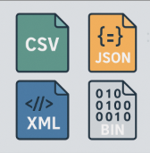

## Introducción

<!---->

En el desarrollo de software, especialmente en aplicaciones que gestionan información o se comunican entre sistemas, es fundamental contar con formatos estándar para el intercambio de datos.   
Entre los más utilizados destacan **JSON** (JavaScript Object Notation), **XML** (eXtensible Markup Language) y **CSV** (Comma-Separated Values).

Estos formatos permiten que los datos puedan ser almacenados, transmitidos y compartidos entre diferentes aplicaciones, plataformas o lenguajes de programación de forma estructurada y comprensible. Su uso se ha convertido en una práctica habitual en ámbitos como:

- La comunicación entre aplicaciones web (por ejemplo, mediante APIs REST).
- La exportación e importación de datos entre sistemas distintos.
- El almacenamiento estructurado de información, en ocasiones como alternativa ligera a una base de datos.

A diferencia de los **ficheros de texto plano**, que se leen línea a línea como cadenas sin estructura interna definida, o de los **ficheros binarios**, que contienen datos codificados que requieren conocer su formato exacto para ser interpretados, estos formatos poseen una estructura interna estandarizada y legible, lo que requiere un enfoque diferente para acceder a su contenido. El acceso y procesamiento de estos ficheros se basa en parsear (analizar) su contenido utilizando **librerías específicas**.

Cada formato tiene características que lo hacen adecuado para determinados contextos:

- **CSV**: simple, muy legible y eficiente para representar datos tabulares (como hojas de cálculo).

- **JSON**: ligero, fácil de leer y escribir, ideal para estructuras de datos jerárquicas y ampliamente usado en servicios web modernos.

- **XML**: muy estructurado y extensible, adecuado cuando se necesita validar datos o integrar con sistemas complejos y estándares empresariales.

Antes de abordar la conversión entre formatos como JSON, XML o CSV, es esencial comprender el concepto de **serialización de objetos**. En programación, la serialización es el proceso mediante el cual un objeto en memoria —con sus propiedades y valores— se transforma en una representación textual o binaria que puede ser almacenada en un fichero o transmitida a través de una red.

La mayoría de las operaciones de lectura o escritura en estos formatos no trabajan directamente con texto, sino con objetos. Por ejemplo, al guardar información en JSON, no escribimos el fichero línea a línea, sino que serializamos un objeto Kotlin (o Java, Python, etc.) a ese formato. Del mismo modo, al leer un archivo XML o CSV, deserializamos su contenido para reconstruir objetos que podamos usar en la aplicación.

Comprender cómo funciona la serialización y qué herramientas proporciona el lenguaje para ello (como kotlinx.serialization, Jackson o Gson en Kotlin/Java) es clave para que la conversión entre formatos no sea un proceso manual y tedioso, sino automático, controlado y estructurado.

 

Llicenciat sota la  [Llicència Creative Commons Reconeixement NoComercial
CompartirIgual 2.5](http://creativecommons.org/licenses/by-nc-sa/2.5/)

