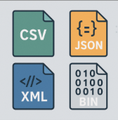

# 🔹 Introducción

<!---->

En el desarrollo de software, especialmente en aplicaciones que gestionan información o se comunican entre sistemas, es fundamental contar con formatos estándar para el intercambio de datos.   
Entre los más utilizados destacan **JSON** (JavaScript Object Notation), **XML** (eXtensible Markup Language) y **CSV** (Comma-Separated Values).

Estos formatos permiten que los datos puedan ser almacenados, transmitidos y compartidos entre diferentes aplicaciones, plataformas o lenguajes de programación de forma estructurada y comprensible. Su uso se ha convertido en una práctica habitual en ámbitos como:

- La comunicación entre aplicaciones web (por ejemplo, mediante APIs REST).
- La exportación e importación de datos entre sistemas distintos.
- El almacenamiento estructurado de información, en ocasiones como alternativa ligera a una base de datos.

A diferencia de los **ficheros de texto plano**, que se leen línea a línea como cadenas sin estructura interna definida, o de los **ficheros binarios**, que contienen datos codificados que requieren conocer su formato exacto para ser interpretados, estos formatos poseen una estructura interna estandarizada y legible, lo que requiere un enfoque diferente para acceder a su contenido. El acceso y procesamiento de estos ficheros se basa en parsear (analizar) su contenido utilizando **librerías específicas**.

Cada formato tiene características que lo hacen adecuado para determinados contextos:

- **CSV**: simple, muy legible y eficiente para representar datos tabulares (como hojas de cálculo).

- **JSON**: ligero, fácil de leer y escribir, ideal para estructuras de datos jerárquicas y ampliamente usado en servicios web modernos.

- **XML**: muy estructurado y extensible, adecuado cuando se necesita validar datos o integrar con sistemas complejos y estándares empresariales.

Antes de abordar la conversión entre formatos como JSON, XML o CSV, es esencial comprender el concepto de **serialización de objetos**: el proceso mediante el cual un objeto en memoria se transforma en una representación que puede almacenarse o transmitirse, y su proceso inverso, la **deserialización**.

Este concepto se desarrolla en detalle en el siguiente apartado.

---

!!!question "🧠 Comprueba tu comprensión"
    1. Si necesitas exportar una gran cantidad de datos tabulares simples (como el inventario de una tienda sin datos anidados) para que los lea otra persona o sistema, ¿qué formato suele ser el más rápido, ligero y compatible?
    2. Si necesitas comunicar el *backend* y el *frontend* de una API web moderna, ¿qué formato es el estándar actual más utilizado?

    ??? success "Ver respuestas"
        1. **CSV**. Al no tener etiquetas redundantes ni requerir estructuras jerárquicas, ocupa muy poco espacio y se puede abrir directamente en Excel o LibreOffice.
        2. **JSON**. Es el estándar dominante en servicios web, siendo ligero y fácil de parsear en la mayoría de lenguajes.

 

