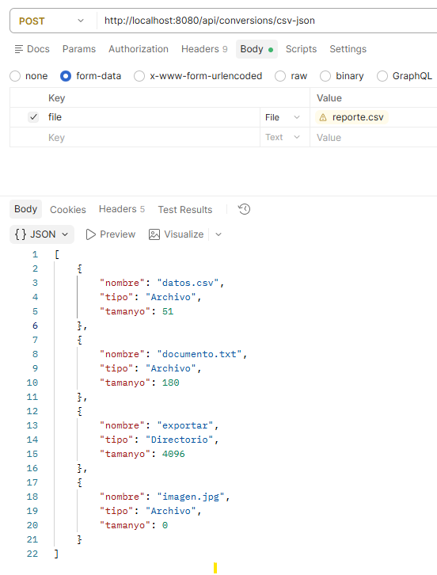

# Convertir el reporte CSV a una respuesta JSON

En el [ejemplo anterior](gestion_ficheros.md) aprendimos a recibir un fichero mediante `MultipartFile` y guardarlo. Ahora leeremos directamente el CSV recibido para devolver sus datos como JSON.

Reutilizaremos el **`reporte.csv` del [ejercicio 3](../T3_Formatos_diferentes/ejercicios.md)** y su información de archivos:

```text
reporte.csv → MultipartFile → List<ArchivoInfo> → respuesta JSON
```

Continúa en el mismo proyecto. Añadiremos un modelo, un servicio y un controlador de conversión, conservando las operaciones de creación, lectura, listado y subida.

## 1. El fichero de entrada

Utiliza el archivo `exportar/reporte.csv` generado por la opción 8 del ejercicio 3. Si todavía no lo tienes, crea un fichero llamado `reporte.csv` en UTF-8 con este contenido de prueba:

```csv
Nombre,Tipo,Tamaño
datos.csv,Archivo,51
documento.txt,Archivo,180
exportar,Directorio,4096
imagen.jpg,Archivo,0
```

La cabecera y el separador **coma** coinciden con el ejemplo del ejercicio 3. Cada fila representa un archivo o directorio, con su nombre, tipo y tamaño en bytes. Los valores del ejemplo son datos de prueba; los de tu reporte dependerán de tu carpeta.

!!! info "Alcance de este lector sencillo"
    Para centrarnos en Spring, usaremos filas sin comas, comillas ni saltos de línea dentro de los campos. `split(",")` no interpreta campos CSV entrecomillados. Si tu solución del ejercicio 3 ya utiliza una librería que admite esos casos, conserva su lector y adapta únicamente la entrada al flujo recibido.

## 2. Reutilizar el modelo de información de archivos

En el paquete `model`, crea `ArchivoInfo.kt`:

```kotlin
package com.example.ficherosapi.model

data class ArchivoInfo( // (1)!
    val nombre: String,
    val tipo: String,
    val tamanyo: Long // (2)!
)
```

1. Representa una fila del CSV: el nombre, el tipo y el tamaño de un archivo o directorio. Los nombres de sus propiedades serán los campos del JSON.
2. Guarda el tamaño en bytes como un número entero de tipo `Long`. La columna `Tamaño` del CSV se asignará a esta propiedad, llamada `tamanyo` como en el JSON del ejercicio 3.

Si ya tienes una clase equivalente en tu solución, puedes reutilizarla ajustando su paquete y los nombres de los tipos en los ejemplos. No es necesario crear dos clases para representar la misma información.

## 3. Adaptar la lectura del CSV a un flujo recibido

En el ejercicio 3, la función de lectura abría un fichero mediante una ruta. Aquí recibirá un lector creado a partir de `file.inputStream`. La transformación de las filas en objetos sigue siendo la misma.

Crea `service/ConversionService.kt`:

```kotlin
package com.example.ficherosapi.service

import com.example.ficherosapi.model.ArchivoInfo
import org.springframework.stereotype.Service
import org.springframework.web.multipart.MultipartFile

@Service
class ConversionService {

    fun csvToFiles(file: MultipartFile): List<ArchivoInfo> {
        val archivos = mutableListOf<ArchivoInfo>() // (1)!

        file.inputStream.bufferedReader(Charsets.UTF_8).use { reader -> // (2)!
            reader.readLine() // (3)!

            reader.forEachLine { linea ->
                if (linea.isNotBlank()) { // (4)!
                    val columnas = linea.split(",") // (5)!
                    val archivo = ArchivoInfo( // (6)!
                        nombre = columnas[0].trim(),
                        tipo = columnas[1].trim(),
                        tamanyo = columnas[2].trim().toLong() // (7)!
                    )
                    archivos.add(archivo) // (8)!
                }
            }
        }

        return archivos // (9)!
    }
}
```

1. Crea una lista vacía y modificable, en la que iremos añadiendo los objetos obtenidos del CSV.
2. Abre los bytes recibidos como texto UTF-8. `bufferedReader` permite leer por líneas y `use` cierra el lector al terminar, también si se produce un error. No necesitamos guardar antes el CSV en el servidor.
3. Lee y descarta la primera línea, que contiene `Nombre,Tipo,Tamaño`. Así no la tratamos como un archivo más.
4. Dentro del recorrido de las líneas restantes, ignora las que están vacías o contienen solo espacios.
5. Separa la fila por comas. En este formato sencillo esperamos tres columnas, accesibles mediante los índices `0`, `1` y `2`.
6. Crea un objeto con los datos de la fila. `trim()` elimina los espacios al principio y al final de cada campo.
7. Convierte el tamaño, que llega como texto, en un número `Long`. Por ejemplo, `"51"` pasa a ser `51L`. Si no es un entero válido para este tipo, la conversión falla.
8. Añade el objeto a la lista que estamos construyendo.
9. Devuelve la lista de objetos Kotlin al controlador. El servicio todavía no ha generado JSON: Spring hará esa conversión al preparar la respuesta HTTP.

Por ejemplo, la fila `datos.csv,Archivo,51` se convierte en `ArchivoInfo("datos.csv", "Archivo", 51L)`.

Esta lectura es la operación que ya hacíamos en el ejercicio 3. Cambia el origen: antes abríamos una ruta y ahora abrimos `file.inputStream`. Cuando entiendas el recorrido, puedes reutilizar tu función de lectura en lugar de este lector sencillo.

!!! info "Primera versión con datos correctos"
    Usa el CSV de prueba o un reporte con el mismo formato: cabecera, tres columnas por fila y tamaño numérico. En este paso no comprobamos datos incorrectos ni personalizamos errores. Un CSV con otro formato puede hacer fallar la petición.

!!! info "Los datos proceden exclusivamente del CSV"
    El servicio no vuelve a recorrer el directorio. Respeta así la regla del ejercicio 3: una vez generado el CSV, la información del JSON debe obtenerse de ese CSV.

## 4. Crear el controlador de conversión

Crea `controller/ConversionController.kt`:

```kotlin
package com.example.ficherosapi.controller

import com.example.ficherosapi.model.ArchivoInfo
import com.example.ficherosapi.service.ConversionService
import org.springframework.web.bind.annotation.PostMapping
import org.springframework.web.bind.annotation.RequestParam
import org.springframework.web.bind.annotation.RestController
import org.springframework.web.multipart.MultipartFile

@RestController // (1)!
class ConversionController(
    private val conversionService: ConversionService // (2)!
) {

    @PostMapping("/api/conversions/csv-json") // (3)!
    fun csvToJson(
        @RequestParam("file") file: MultipartFile // (4)!
    ): List<ArchivoInfo> {
        return conversionService.csvToFiles(file) // (5)!
    }
}
```

1. Indica que esta clase atiende peticiones web y devuelve datos en el cuerpo de la respuesta.
2. Spring proporciona el servicio mediante el constructor, igual que hacía con `FileService`.
3. Asocia la petición `POST /api/conversions/csv-json` con este método.
4. Recoge el archivo del campo de formulario llamado `file`. Reutilizamos `@RequestParam` y `MultipartFile` del ejemplo de subida.
5. Pide al servicio que lea el CSV y devuelve su lista de `ArchivoInfo`. Spring transforma esa lista en JSON para enviarla al cliente; no se crea un fichero `reporte.json`.

El recorrido completo es:

```text
Petición con reporte.csv
  → ConversionController.csvToJson()
  → ConversionService.csvToFiles()
  → lista de ArchivoInfo
  → Spring convierte la lista en JSON
  → el cliente recibe la respuesta
```

## 5. Probar la conversión

Arranca la aplicación y abre PowerShell en la carpeta que contiene `reporte.csv` (por ejemplo, `exportar` en tu proyecto del ejercicio 3):

```powershell
curl.exe -F "file=@reporte.csv" http://localhost:8080/api/conversions/csv-json
```

### Probar con Postman

También puedes probar la conversión desde Postman:

1. Crea una petición **POST** a `http://localhost:8080/api/conversions/csv-json`.
2. Abre **Body** y selecciona **form-data**.
3. Añade una fila con la clave `file`.
4. Cambia el tipo de la fila de **Text** a **File** y selecciona `reporte.csv`.
5. Pulsa **Send**.

El campo debe llamarse exactamente `file`, porque el controlador utiliza `@RequestParam("file")`. No añadas manualmente `Content-Type`: Postman genera la cabecera `multipart/form-data` al seleccionar **form-data**.

La respuesta aparecerá en **Body** con formato JSON. Con el CSV de prueba debe contener objetos como:

```json
[
  { "nombre": "datos.csv", "tipo": "Archivo", "tamanyo": 51 },
  { "nombre": "documento.txt", "tipo": "Archivo", "tamanyo": 180 }
]
```



Postman envía el CSV directamente al endpoint de conversión. No es necesario subirlo antes a `/api/files/upload` y el servidor no lo guarda automáticamente en `data`.

La petición de PowerShell también envía el CSV directamente al controlador de conversión, que lo lee sin guardarlo en `data`.

Con el contenido de prueba del apartado 1 recibirás estos datos JSON, aunque el espaciado puede ser diferente:

```json
[
  { "nombre": "datos.csv", "tipo": "Archivo", "tamanyo": 51 },
  { "nombre": "documento.txt", "tipo": "Archivo", "tamanyo": 180 },
  { "nombre": "exportar", "tipo": "Directorio", "tamanyo": 4096 },
  { "nombre": "imagen.jpg", "tipo": "Archivo", "tamanyo": 0 }
]
```

Antes de continuar, cambia `51` por `52` en el CSV y repite la petición. El primer objeto de la respuesta debe tener `"tamanyo": 52`, sin modificar Kotlin ni reiniciar Spring.

Si no obtienes la respuesta esperada, comprueba que has reiniciado la aplicación tras añadir las clases, que PowerShell está en la carpeta del CSV y que las filas tienen tres columnas separadas por comas.


!!! question "Preguntas de comprobación"
    Intenta responder antes de desplegar las soluciones:

    1. ¿Qué recibe el controlador?
    2. ¿Qué devuelve el servicio?
    3. ¿Quién convierte la lista a JSON?
    4. ¿Se ha creado un fichero `reporte.json`?

??? success "Respuestas"
    1. El CSV enviado por el cliente, representado por un `MultipartFile`.
    2. Una lista de objetos `ArchivoInfo`.
    3. Spring, al preparar la respuesta del controlador.
    4. No. Hemos enviado JSON como respuesta; guardarlo exige una operación de escritura adicional.


