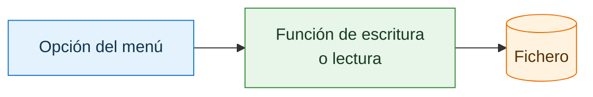
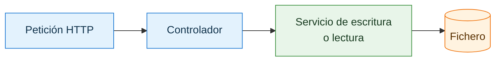
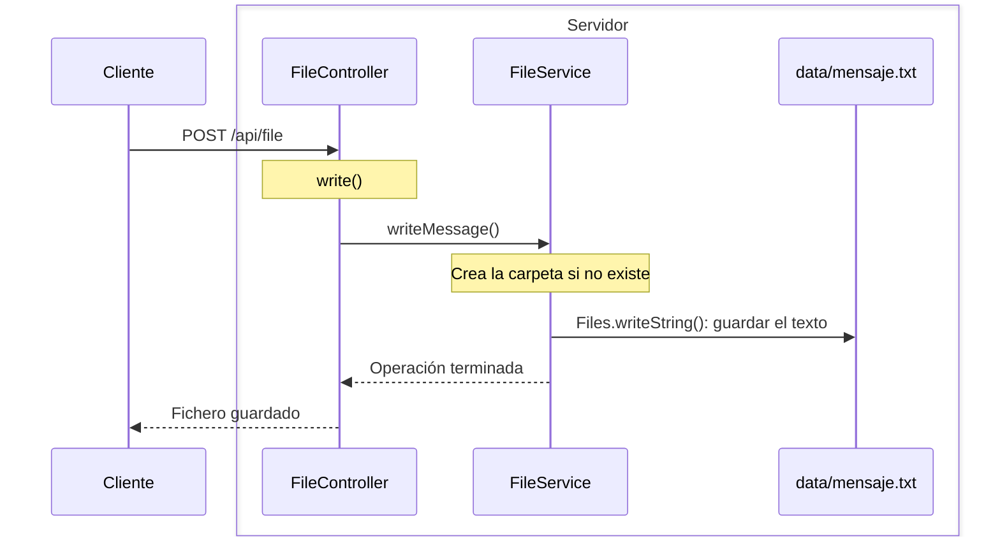
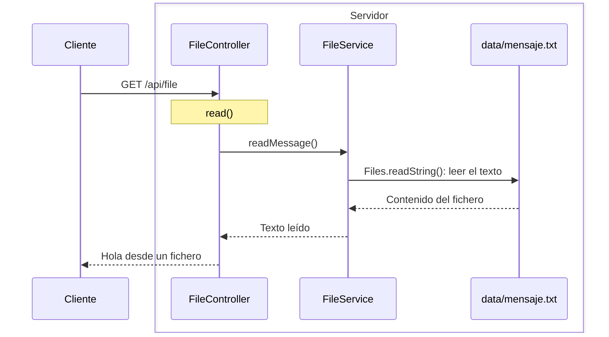

# Primera aplicación con ficheros

Este ejemplo reproduce, de forma simplificada, las **opciones 4 (escritura) y 5 (lectura) del ejercicio 2 del tema 2: Manejo de ficheros**. El objetivo es ver cómo una API encapsula esas operaciones: el cliente solicita escribir o leer un fichero y la aplicación realiza el trabajo y devuelve el resultado.

En aquel ejercicio se pedía crear una aplicación de consola con un menú que incluyera estas dos opciones:

!!! quote "Opciones del ejercicio original"
    - **Opción 4 — Crear texto:** pedir al usuario el nombre del archivo y permitirle escribir líneas de texto por consola. Guardar las líneas en el fichero hasta que el usuario escriba la palabra `FIN`. Utilizar `Files.write` o un `BufferedWriter`.
    - **Opción 5 — Leer texto:** pedir el nombre de un fichero y mostrar su contenido por consola. Realizar la lectura de forma eficiente mediante `Files.newBufferedReader()`.

Las operaciones con el fichero son las mismas que hacíamos desde consola. Lo que cambia es cómo las solicitamos: antes elegíamos una opción del menú; ahora enviamos una petición HTTP. En esta primera versión utilizamos un nombre de fichero y un texto fijos para centrarnos en ese cambio.

!!! info "Una adaptación simplificada del ejercicio 2"
    Aquí escribiremos siempre `Hola desde un fichero` en `data/mensaje.txt`. Todavía no pediremos el nombre ni el texto al cliente, por lo que no necesitaremos `readln()` ni la palabra `FIN`. Más adelante podremos recibir esos datos en la petición.

## Del menú de consola a una petición HTTP

| Acción | Consola | Primera aplicación con Spring |
|---|---|---|
| Crear un archivo de texto | Elegir la opción 4 del menú | Enviar `POST /api/file` |
| Leer un archivo de texto | Elegir la opción 5 del menú | Enviar `GET /api/file` |
| Indicar el nombre y el contenido | Escribir por teclado con `readln()` hasta `FIN` | En este primer ejemplo, utilizar valores fijos |
| Comunicar el resultado | Mostrarlo con `println()` | Devolverlo como respuesta HTTP |
| Acceder al fichero | Utilizar las clases de gestión de ficheros de Java | Seguir utilizando `Path` y `Files` dentro de un servicio |

**Aplicación de consola**



**Con Spring: aplicación web**



Para comenzar utilizaremos únicamente cuatro anotaciones de Spring:

| Anotación | Para qué sirve |
|---|---|
| `@Service` | Identifica la clase que realiza el trabajo |
| `@RestController` | Identifica la clase que recibe las peticiones |
| `@PostMapping` | Atiende una petición para escribir |
| `@GetMapping` | Atiende una petición para leer |

## Las capas de nuestra aplicación

En la [introducción](intro.md#el-patron-mvc-modelo-vista-y-controlador) utilizamos MVC para distinguir **qué responsabilidad tiene cada parte**: el modelo reúne los datos y las operaciones, el controlador atiende las peticiones y la vista presenta la información. En nuestra API nos centraremos en las dos primeras y devolveremos datos al cliente.

Ahora vamos a concretar **dónde escribiremos el código que realiza esas tareas**. Para ello lo organizaremos en capas: partes del programa que agrupan tareas relacionadas. Una capa puede contener varias clases.

### Del modelo a las clases de nuestro proyecto

En el [gráfico de la introducción](intro.md#el-recorrido-de-una-peticion-en-nuestra-api-rest), el controlador pedía al **modelo** que consultara los ficheros. Ese nombre representaba una responsabilidad general, no una única clase llamada `Modelo` que tengamos que programar.

Al escribir la aplicación, separaremos esa responsabilidad en piezas más pequeñas:

- **Clases de datos:** representan la información con la que trabajamos, por ejemplo el nombre y el contenido de un fichero.
- **Servicios:** contienen las operaciones de la aplicación, por ejemplo guardar un texto o recuperar su contenido. Un servicio es una clase de nuestro programa a la que el controlador pide que realice un trabajo.
- **Acceso al almacenamiento:** es el código que lee o escribe los datos. En nuestros primeros ejemplos estará dentro del servicio y utilizará `Files` y `Path`.

Así, donde antes decíamos «el controlador solicita una operación al modelo», en nuestro código diremos «el controlador llama al servicio, que trabaja con los datos y accede a los ficheros».

El **controlador** conserva su función de recibir la petición y devolver la respuesta. La **vista** sigue siendo la parte encargada de presentar información; añadir un servicio no cambia esa responsabilidad. Por eso MVC y las capas no tienen una correspondencia de tres elementos: **el servicio desarrolla parte del trabajo que antes agrupábamos bajo el modelo**.

### Cómo repartiremos el trabajo

En nuestros ejemplos distinguiremos estas piezas:

| Parte | Responsabilidad | Ejemplo |
|---|---|---|
| Controlador | Recibir peticiones y devolver respuestas | `FileController` |
| Servicio | Aplicar las reglas de la aplicación | `FileService` |
| Almacenamiento | Conservar los datos que el servicio lee o escribe | Ficheros del servidor, accesibles mediante `Files` y `Path` |

Por ejemplo, cuando el cliente pide leer un fichero:

1. `FileController` recoge la petición y llama a `FileService`.
2. `FileService` utiliza `Files` y `Path` para leer el fichero del servidor.
3. El servicio devuelve el contenido al controlador, que lo entrega como respuesta al cliente.

Esto permite reutilizar la operación de lectura sin mezclarla con los detalles de HTTP. **El controlador y el servicio son clases de nuestra aplicación y se ejecutan en el servidor**.

Por ahora tendremos dos capas de código principales: controladores y servicios. Los ficheros son el almacenamiento que utiliza ese código. En aplicaciones más grandes, el acceso al almacenamiento puede separarse en otra capa.

En la primera aplicación ya creamos una clase de datos en el paquete `model`: `SaludoResponse`. Esa clase define los datos que enviamos al cliente, pero **el paquete `model` no representa por sí solo todo el Modelo de MVC**.

En esta primera versión con ficheros trabajaremos con texto (`String`), por lo que no necesitaremos crear una nueva clase de datos.

## 1. Crear el servicio

Crea el paquete `service` dentro de `com.example.ficherosapi`. En ese paquete crea el fichero `FileService.kt`:

```kotlin
package com.example.ficherosapi.service

import org.springframework.stereotype.Service
import java.nio.file.Files
import java.nio.file.Path

@Service // (1)!
class FileService {

    private val file: Path = Path.of("data", "mensaje.txt") // (2)!

    fun writeMessage() {
        Files.createDirectories(file.parent) // (3)!
        Files.writeString(file, "Hola desde un fichero") // (4)!
    }

    fun readMessage(): String {
        return Files.readString(file) // (5)!
    }
}
```

1. Spring detecta esta clase, crea un objeto de `FileService` y podrá entregárselo al controlador.
2. Representa el fichero `data/mensaje.txt`. La carpeta `data` se creará en la raíz del proyecto.
3. Crea la carpeta `data` si todavía no existe.
4. Escribe el texto en el fichero. Si ya existe, sustituye su contenido.
5. Lee todo el contenido y lo devuelve como un `String`.

El servicio contiene las operaciones con el sistema de ficheros. Todavía no sabe nada de navegadores, URLs o peticiones HTTP.

### Relación con las funciones del ejercicio 2

`writeMessage()` realiza el trabajo de escritura de la **opción 4**. En el ejercicio utilizábamos `Files.write` o un `BufferedWriter`; aquí usamos `Files.writeString` para guardar un único texto fijo.

`readMessage()` realiza el trabajo de lectura de la **opción 5**, pero devuelve el contenido con `return` para que el controlador pueda enviarlo al cliente. El ejercicio 2 pide `Files.newBufferedReader()`; aquí utilizamos `Files.readString()` para simplificar la lectura de este fichero pequeño. Esta simplificación no modifica los requisitos del ejercicio 2.

Al adaptar una función de consola, hay que separar la interacción con el usuario de la operación sobre el fichero:

| Parte de la función original | Dónde queda en esta aplicación |
|---|---|
| Pedir datos con `readln()` | Se omite por ahora: la ruta y el texto son fijos |
| Escribir o leer mediante `Files` | En los métodos de `FileService` |
| Mostrar el resultado con `println()` | El controlador devuelve una respuesta al cliente |

Un `println()` dentro del servicio solo escribiría en la consola del servidor; no enviaría ese texto al cliente.

## 2. Crear el controlador

Crea el paquete `controller` dentro de `com.example.ficherosapi`. En ese paquete crea `FileController.kt`:

```kotlin
package com.example.ficherosapi.controller

import com.example.ficherosapi.service.FileService
import org.springframework.web.bind.annotation.GetMapping
import org.springframework.web.bind.annotation.PostMapping
import org.springframework.web.bind.annotation.RestController

@RestController // (1)!
class FileController(
    private val fileService: FileService // (2)!
) {

    @PostMapping("/api/file") // (3)!
    fun write(): String {
        fileService.writeMessage() // (4)!
        return "Fichero guardado"
    }

    @GetMapping("/api/file") // (5)!
    fun read(): String {
        return fileService.readMessage() // (6)!
    }
}
```

1. Indica que esta clase recibe peticiones web y devuelve sus resultados en la respuesta.
2. Spring proporciona el servicio que creó anteriormente. No necesitamos escribir `FileService()`.
3. Relaciona una petición `POST /api/file` con la función `write`.
4. El controlador no escribe directamente el fichero: se lo pide al servicio.
5. Relaciona una petición `GET /api/file` con la función `read`.
6. El controlador devuelve al cliente el texto que ha leído el servicio.

## 3. Observar el recorrido

Seguiremos la petición desde el cliente hasta el fichero y, después, la respuesta de vuelta. El controlador, el servicio y el fichero están en el **servidor**.

### Escribir: `POST /api/file`

El cliente solicita la escritura. El servicio guarda el texto fijo `Hola desde un fichero` y el controlador devuelve una confirmación.



### Leer: `GET /api/file`

El cliente solicita la lectura. El servicio recupera el contenido y el controlador lo devuelve como texto.



Las flechas continuas muestran las solicitudes; las discontinuas, el retorno al terminar la operación. En la lectura, la respuesta contiene el texto actual del fichero: si lo modificamos, recibiremos el nuevo contenido.

En el ejercicio 2, el menú decidía qué función ejecutar. Aquí, `@PostMapping` y `@GetMapping` relacionan cada petición con un método del controlador. Ambos utilizan la misma URL, pero el método HTTP permite distinguir la escritura de la lectura.

## 4. Probar la aplicación

Ejecuta `FicherosApiApplication.kt`. Primero crea el fichero desde PowerShell:

```powershell
Invoke-RestMethod -Method Post http://localhost:8080/api/file
```

La respuesta será:

```text
Fichero guardado
```

Comprueba que se ha creado `data/mensaje.txt` en la raíz del proyecto. Después visita esta dirección en el navegador:

```text
http://localhost:8080/api/file
```

También puedes leerlo desde PowerShell:

```powershell
Invoke-RestMethod http://localhost:8080/api/file
```

La respuesta contendrá el texto guardado:

```text
Hola desde un fichero
```

### Comprobar la equivalencia con el menú

1. La petición `POST` ha realizado la escritura, como la opción 4 del ejercicio 2, usando el nombre y el texto fijos del servicio.
2. La petición `GET` ha recuperado el contenido, como la opción 5, y lo ha devuelto al cliente.
3. Modifica `data/mensaje.txt` con un editor y repite solo la petición `GET`: debes recibir el contenido modificado. Si repites `POST`, se sustituirá por el texto fijo del servicio.

!!! info "¿Dónde está el fichero?"
    El fichero se guarda en el ordenador donde se ejecuta la aplicación Spring. En estas pruebas el cliente y el servidor están en tu propio ordenador. Abrir la URL en el navegador solicita una lectura al servidor.

En la [siguiente página](texto_y_listado.md) ampliaremos esta misma aplicación para recibir el nombre y el texto del cliente, conservar la lectura, añadir un listado. El tratamiento de errores quedará como ampliación opcional.
