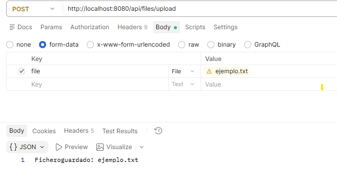
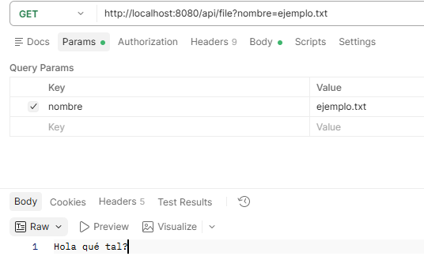
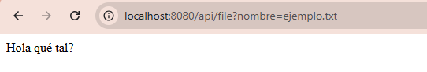
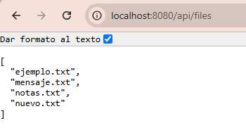

# Subir un fichero existente

En el [ejemplo anterior](texto_y_listado.md), el cliente enviaba un nombre y un texto para crear un fichero. Ahora podrá elegir un archivo que ya tenga en su ordenador y enviarlo completo.

### ¿Qué cambia respecto al apartado anterior?

| | Crear un fichero a partir de texto | Subir un fichero existente |
|---|---|---|
| Qué prepara el cliente | Un JSON con `nombre` y `contenido` | Un archivo que ya está guardado en su ordenador |
| Qué envía | El nombre y el texto escritos en el JSON | Los bytes del archivo seleccionado |
| Qué hace el servidor | Escribe ese texto en un fichero | Guarda una copia del archivo recibido |
| Ejemplo | Enviar `"contenido": "Hola"` para crear `mensaje.txt` | Seleccionar `ejemplo.txt` y enviar su contenido completo |

**La novedad es transferir un archivo del ordenador del cliente al servidor.** No tenemos que copiar su texto en un JSON. El archivo original permanece en el ordenador del cliente y la aplicación guarda una copia en la carpeta `data` del servidor.

Por ejemplo, en Postman pasaríamos de escribir el JSON en **Body → raw → JSON** a seleccionar un archivo en **Body → form-data**, en un campo de tipo **File** llamado `file`.

La subida también sirve para imágenes o PDF porque copia bytes. Para empezar probaremos con un archivo de texto, de modo que podamos comprobar su contenido con la operación de lectura que ya tenemos.

Continuamos en el mismo proyecto. **Conserva el modelo, los métodos de escritura, lectura y listado.** Añadiremos un método al servicio y otro al controlador.


## 1. El nuevo concepto: MultipartFile

En esta operación, el cliente envía el archivo utilizando el formato `multipart/form-data`: un formulario HTTP que puede incluir archivos. Spring representa el archivo recibido mediante `MultipartFile`.

- `originalFilename` permite consultar el nombre original.
- `isEmpty` indica si no tiene contenido.
- `inputStream` permite leer los bytes recibidos.

!!! info "Recibir y guardar son dos pasos"
    El archivo llega en la petición. Para conservarlo, copiaremos su contenido a la carpeta `data` del servidor.

Ya conocemos `@RequestParam` por el nombre del fichero que queríamos leer. Ahora `@RequestParam("file")` obtendrá la parte del formulario llamada `file` y la entregará como un `MultipartFile`.

## 2. Añadir la subida al servicio

En `service/FileService.kt`, añade estos imports:

```kotlin
import org.springframework.web.multipart.MultipartFile
import java.nio.file.StandardCopyOption
```

Añade el siguiente método **dentro de la clase `FileService`**, sin borrar sus otros métodos:

```kotlin
fun save(file: MultipartFile): String {
    require(!file.isEmpty) { "El fichero está vacío" } // (1)!

    val name = file.originalFilename ?: "" // (2)!
    val destination = resolveName(name) // (3)!

    file.inputStream.use { input -> // (4)!
        Files.copy( // (5)!
            input,
            destination,
            StandardCopyOption.REPLACE_EXISTING // (6)!
        )
    }

    return "Fichero guardado: $name" // (7)!
}
```

1. Comprueba que el archivo recibido tiene contenido. Si está vacío, `require` lanza una excepción y no se realiza la copia.
2. Obtiene el nombre enviado por el cliente. El operador `?:` utiliza una cadena vacía si el nombre es `null`; la comprobación siguiente rechazará ese nombre vacío.
3. Reutiliza `resolveName`, creado en la página anterior, para comprobar el nombre y construir la ruta de destino dentro de `data`.
4. Abre el flujo de bytes del archivo recibido. `use` lo cierra automáticamente al terminar, también si se produce un error.
5. Copia los bytes de `input` al fichero indicado por `destination`. No convierte el contenido a texto, por lo que también permite guardar archivos binarios.
6. Si ya existe un fichero con el mismo nombre en el destino, sustituye su contenido por el archivo recibido.
7. Devuelve una confirmación al controlador, que la enviará al cliente como respuesta HTTP.


## 3. Añadir la operación al controlador

En `controller/FileController.kt`, añade este import:

```kotlin
import org.springframework.web.multipart.MultipartFile
```

Las anotaciones `PostMapping` y `RequestParam` ya están importadas. Añade este método **dentro de `FileController`**:

```kotlin
@PostMapping("/api/files/upload") // (1)!
fun upload(@RequestParam("file") file: MultipartFile): String { // (2)!
    return fileService.save(file) // (3)!
}
```

1. Asocia las peticiones `POST /api/files/upload` con este método. El cliente debe enviar la petición para que se ejecute.
2. Recoge el archivo del campo de formulario llamado `file` y lo representa como un `MultipartFile`. El nombre del campo en Postman o en la petición debe coincidir con `"file"`.
3. Entrega el archivo al servicio para que lo guarde y devuelve su mensaje al cliente. El controlador no realiza la copia directamente.

No añadimos anotaciones nuevas: `@PostMapping` y `@RequestParam` ya aparecían en el ejemplo anterior. La novedad es el tipo `MultipartFile`, que representa el archivo recibido.

La aplicación dispone ahora de estas operaciones:

| Petición | Operación |
|---|---|
| `POST /api/file` | Crear o sustituir un texto enviando JSON |
| `GET /api/file?nombre=notas.txt` | Leer un fichero de texto |
| `GET /api/files` | Listar los nombres de los ficheros |
| `POST /api/files/upload` | Subir un archivo existente |

## 4. Probar la subida y comprobar las operaciones anteriores

Arranca la aplicación. Abre PowerShell en una carpeta que contenga un archivo de texto UTF-8 llamado `ejemplo.txt`, con contenido, y ejecuta:

```powershell
curl.exe -F "file=@ejemplo.txt" http://localhost:8080/api/files/upload
```

- `-F` crea una petición de formulario.
- `file` coincide con el nombre de `@RequestParam("file")`.
- `@ejemplo.txt` indica que se envía el contenido del archivo.

La respuesta será:

```text
Fichero guardado: ejemplo.txt
```

Comprueba que el fichero aparece en `data`. Después utiliza las operaciones que ya teníamos:

```powershell
Invoke-RestMethod http://localhost:8080/api/files
Invoke-RestMethod "http://localhost:8080/api/file?nombre=ejemplo.txt"
```

El listado incluirá `ejemplo.txt` y la segunda petición devolverá su texto. También puedes volver a crear `notas.txt` con el JSON de la página anterior: ambas formas de guardar ficheros siguen disponibles.

### Probar con Postman

Las instrucciones básicas de uso de Postman se explican en [Primera aplicación con ficheros](ficheros.md#comprobarlo-con-postman). Aquí las aplicaremos a la subida mediante `multipart/form-data`. Mantén la aplicación ejecutándose en IntelliJ y utiliza `http://localhost:8080` como dirección del servidor.

#### Subir `ejemplo.txt`

1. Crea una petición **POST** a `http://localhost:8080/api/files/upload`.
2. Abre **Body** y selecciona **form-data**.
3. Añade una fila con la clave `file`.
4. Cambia el tipo de esa fila de **Text** a **File** y pulsa **Select Files**.
5. Selecciona el archivo `ejemplo.txt` y pulsa **Send**.

La respuesta debe ser:

```text
Fichero guardado: ejemplo.txt
```



No añadas manualmente `Content-Type: application/json`: en una petición `multipart/form-data`, Postman genera la cabecera y el separador necesarios.

#### Leer el archivo subido

1. Crea una petición **GET** a `http://localhost:8080/api/file`.
2. En **Params**, añade `nombre` como clave y `ejemplo.txt` como valor.
3. Deja el cuerpo en **none** y pulsa **Send**.



Postman debe mostrar el texto guardado en `ejemplo.txt`. También puedes abrir la URL completa en el navegador, porque esta operación utiliza `GET`.



#### Listar los archivos

Crea una petición **GET** a `http://localhost:8080/api/files`, sin cuerpo, y pulsa **Send**. La respuesta JSON debe incluir `ejemplo.txt` junto con los demás ficheros de la carpeta `data`.




!!! question "Comprueba que lo entiendes"
    ¿Qué diferencia hay entre enviar un JSON con `nombre` y `contenido` para crear texto y subir un archivo `ejemplo.txt` que ya existe en el ordenador del cliente?

??? success "Respuesta"
    El JSON contiene el nombre y el texto que el servicio escribirá. En la subida enviamos los bytes de un archivo que ya existe y el servicio los copia al destino.

En la [siguiente página](conversion.md) reutilizaremos `MultipartFile` para recibir un CSV y convertir sus datos a una respuesta JSON.
