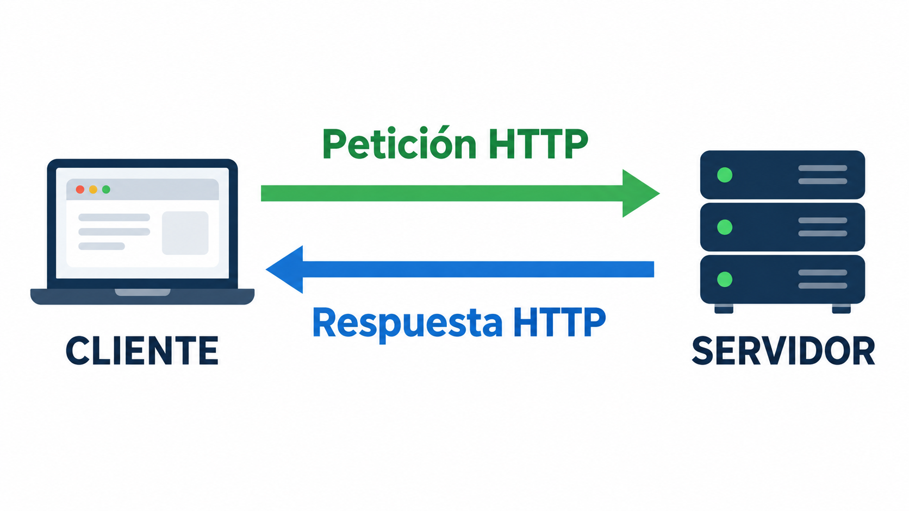
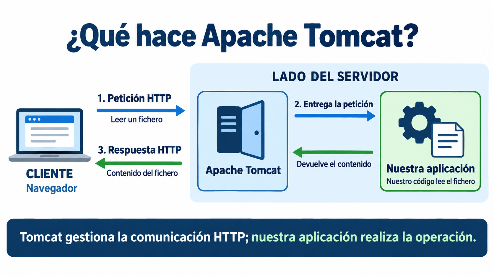
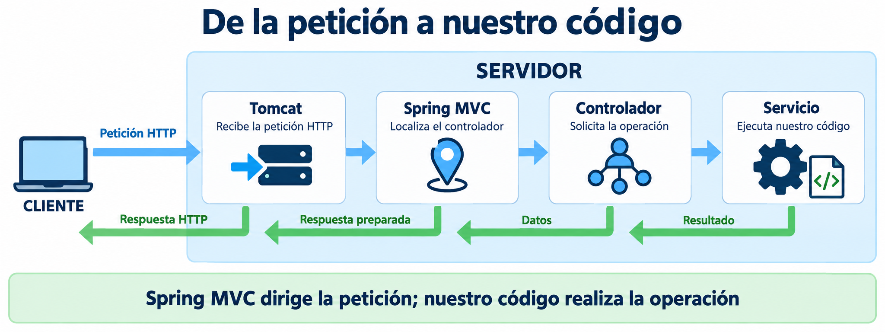
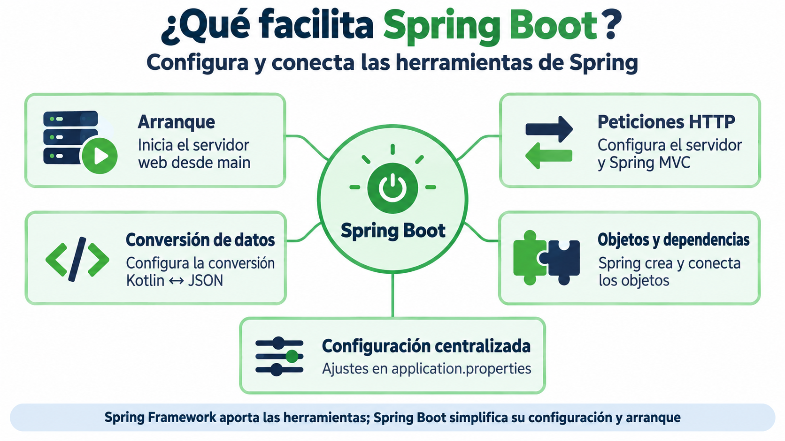
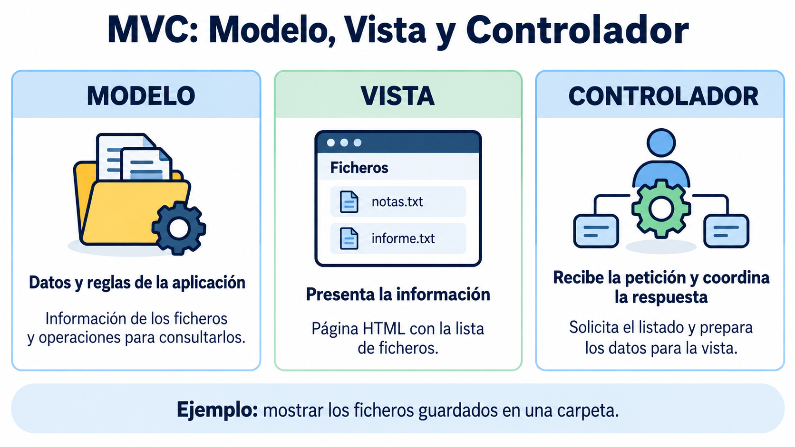
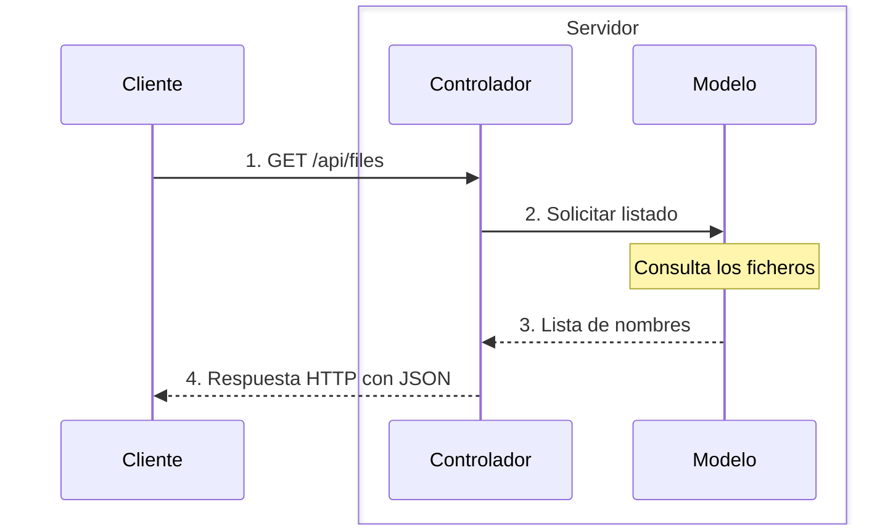

---
hide:
  - toc
---

# Introducción a Spring Boot

Hasta ahora nuestros programas se ejecutaban desde una función `main`, leían datos del teclado y trabajaban con ficheros del ordenador. En esta unidad convertiremos esas operaciones en una **aplicación web**.

El objetivo no es aprender todo Spring, sino entender lo necesario para publicar nuestras operaciones con ficheros mediante una API REST.

## ¿Qué es una aplicación web?

En una aplicación web intervienen normalmente dos programas:

1. El **cliente** envía una petición. Puede ser un navegador, una aplicación móvil o una herramienta como Postman.
2. El **servidor** recibe la petición, ejecuta una operación y devuelve una respuesta.

{width=600}


## ¿Qué es Apache Tomcat?

**Apache Tomcat es un servidor web y un contenedor de servlets**: proporciona el entorno para ejecutar componentes web de aplicaciones Java, también escritos en Kotlin. En este tema basta con entender que es el programa que recibe las peticiones HTTP y permite que lleguen a nuestra aplicación.

Su trabajo en nuestros ejemplos se puede resumir así:

1. **Recibe la petición HTTP** enviada por el navegador u otro cliente.
2. **La entrega a la aplicación**, cuyo código realiza la operación solicitada.
3. **Envía la respuesta HTTP** al cliente con el resultado preparado por la aplicación.

Por ejemplo, cuando pedimos leer un fichero, Tomcat recibe la petición, nuestro código lee el contenido y Tomcat envía la respuesta con ese texto. El código que lee el fichero lo escribimos nosotros.

{width=600}

!!! Note "En resumen"
    **Tomcat** proporciona el entorno web, pero todavía necesitamos organizar el código que atiende cada petición y realiza las operaciones. Para facilitar ese trabajo utilizaremos **Spring**.

 

## ¿Qué es Spring Framework?

**Spring Framework** es un conjunto de herramientas para desarrollar aplicaciones Java y Kotlin. Nos ayuda a organizar la aplicación y a crear y conectar los objetos que necesita.

Para las aplicaciones web, incluye **Spring MVC**, que permite asociar las peticiones HTTP con métodos de clases llamadas **controladores**. Así podremos indicar qué código debe ejecutarse cuando el cliente solicita leer o guardar un fichero.

En nuestro proyecto, Tomcat recibe la petición y Spring MVC la dirige al controlador adecuado. El controlador solicita la operación a nuestro código y prepara el resultado que se devolverá al cliente.

{width=800}

!!! tip "⚙️ Spring Boot simplifica la configuración y el arranque"
    Spring aporta estas herramientas, pero hay que configurar cómo se utilizan y cómo arranca la aplicación. 

## ¿Qué es Spring Boot?

**Spring Boot facilita crear y ejecutar aplicaciones con Spring**, reduciendo la configuración manual. En nuestro proyecto permite iniciar la aplicación y su servidor web integrado desde una función `main`.

Spring Boot prepara y configura las herramientas que permiten:

- iniciar el servidor web integrado, en nuestro caso Tomcat;
- atender peticiones HTTP mediante Tomcat y Spring MVC;
- convertir objetos Kotlin a JSON y viceversa;
- crear y conectar los objetos que necesita la aplicación mediante Spring;
- centralizar los ajustes de la aplicación.


{width=600}

## ¿Qué aporta cada tecnología?


| Elemento | Papel en nuestro proyecto |
|---|---|
| **Apache Tomcat** | Atiende la comunicación HTTP: recibe peticiones y envía respuestas |
| **Spring Framework** | Aporta las herramientas para crear y conectar objetos y, mediante Spring MVC, dirigir las peticiones a los controladores |
| **Spring Boot** | Simplifica la configuración y pone en marcha la aplicación junto con el servidor web integrado |
| **Nuestro código Kotlin** | Define las operaciones de la aplicación, como leer, guardar o convertir ficheros |


Puedes ampliar estos conceptos en la [documentación de Apache Tomcat](https://tomcat.apache.org/tomcat-11.0-doc/) y en la [guía de servidores integrados de Spring Boot](https://docs.spring.io/spring-boot/how-to/webserver.html).

!!! info "Tomcat se ejecuta integrado en nuestra aplicación"
    En el proyecto de este tema, las dependencias web incluyen Tomcat y Spring Boot lo configura y lo arranca al ejecutar `main`. No necesitamos instalarlo ni iniciarlo por separado. Esto se denomina **servidor embebido o integrado**.

    En las pruebas, Tomcat y nuestra aplicación se ejecutan en nuestro ordenador, igual que el navegador. Cliente y servidor tienen funciones distintas, aunque estén en la misma máquina.   

## El patrón MVC: Modelo, Vista y Controlador

Antes de organizar el código, conviene conocer **MVC (Modelo–Vista–Controlador)**. Es un patrón de diseño que separa los datos y las reglas de la aplicación de su presentación y de la gestión de las peticiones.

Imagina una aplicación que muestra los ficheros guardados en una carpeta:

| Componente | Responsabilidad | Ejemplo en la aplicación de ficheros |
|---|---|---|
| **Modelo (Model)** | Representar los datos y las reglas con las que trabaja la aplicación | Los datos de un fichero y las operaciones para consultar o guardar su contenido |
| **Vista (View)** | Presentar la información al usuario | Una página HTML con la lista de ficheros |
| **Controlador (Controller)** | Recibir la petición, coordinar la operación y preparar la respuesta | Atender la solicitud de listar ficheros y obtener los datos que necesita la vista |

{width=800}

!!! info ""
    **El modelo** no es únicamente el fichero o la base de datos: incluye los conceptos y el comportamiento de la aplicación. **La vista** decide cómo mostrar la información. **El controlador** decide qué operación solicitar ante una petición.

### El recorrido de una petición en nuestra API REST

Ahora aplicaremos estas ideas a nuestro ejemplo. Una **API REST** permite que el cliente solicite operaciones mediante peticiones HTTP y reciba datos como respuesta.

Supongamos que el cliente solicita la lista de ficheros mediante `GET /api/files`. De momento nos centraremos en dos responsabilidades: **el controlador recibe la solicitud y el modelo aporta los datos y las operaciones necesarias**.

1. El cliente pide la lista de ficheros.
2. El controlador solicita esa información al modelo.
3. Las operaciones del modelo consultan los ficheros y devuelven sus nombres.
4. El controlador devuelve los datos al cliente. Spring los convierte a **JSON**, un formato de texto para intercambiar datos.



Las flechas continuas indican solicitudes y las discontinuas, los resultados. El controlador y el modelo están en el servidor. Aquí **modelo** representa los datos y las operaciones de la aplicación; más adelante veremos cómo organizarlos en código.

!!! info "¿Y la vista?"
    La vista sirve para presentar la información al usuario. En esta primera aplicación nos centraremos en devolver los datos: el cliente recibirá una lista de nombres. Más adelante podríamos crear una pantalla que los muestre. **Los datos enviados en JSON no son la vista.**

### ¿Cómo se relaciona MVC con Spring Boot?

**Spring MVC** es la parte de Spring Framework que permite atender peticiones web mediante controladores. **Spring Boot** facilita la configuración y el arranque de la aplicación. En los ejemplos de este tema utilizaremos Spring MVC para construir una API REST.

En nuestro ejemplo, Spring MVC dirige la petición al controlador adecuado y prepara la respuesta con los datos que este devuelve. Por ahora basta con entender ese recorrido; aprenderemos las anotaciones necesarias al escribir la primera aplicación.

Por ejemplo, al pedir `GET /api/files`, nuestra API podrá devolver:

```json
["notas.txt", "informe.txt"]
```

Una aplicación cliente podría utilizar esa lista para dibujar una tabla o un menú. En este tema consultaremos las respuestas desde el navegador o PowerShell, sin construir una interfaz gráfica.

En [Primera aplicación con ficheros](ficheros.md#las-capas-de-nuestra-aplicacion) concretaremos cómo repartir estas responsabilidades entre las clases del proyecto.

## Vocabulario mínimo

### Endpoint

Es una operación disponible en una URL concreta. Un endpoint se identifica mediante una ruta y un método HTTP.

| Método | Uso habitual | Ejemplo |
|---|---|---|
| `GET` | Consultar | Obtener la lista de ficheros |
| `POST` | Crear o enviar datos | Subir un fichero |
| `PUT` | Sustituir o actualizar | Cambiar el contenido |
| `DELETE` | Eliminar | Borrar un fichero |

### JSON

Es un formato de texto utilizado para intercambiar datos:

```json
{
  "nombre": "informe.txt",
  "tamano": 128
}
```

### Anotación

Una anotación comienza por `@` y proporciona información a Spring:

```kotlin
@RestController
class SaludoController
```

No ejecutamos manualmente el controlador. Spring detecta la anotación, crea el objeto y lo utiliza cuando llega una petición apropiada.

### Inyección de dependencias

Si un controlador necesita un servicio, lo declara en su constructor:

```kotlin
@RestController
class FileController(
    private val fileService: FileService
)
```

Spring crea ambos objetos y entrega el servicio al controlador. Esto recibe el nombre de **inyección de dependencias**.

## Qué vamos a construir

Construiremos la aplicación paso a paso: primero escribiremos y leeremos un texto fijo; después recibiremos el nombre y el contenido del cliente, añadiremos un listado y, finalmente, la subida de archivos. La escritura y la lectura son las operaciones que ya practicamos en las opciones 4 y 5 del ejercicio 2.

Al terminar estos ejemplos tendremos una API con estas operaciones:

| Método HTTP | Ruta | ¿Qué hace? |
|:---:|---|---|
| **POST** | `/api/file` | **Escribir texto:** guarda el contenido recibido en JSON. |
| **GET** | `/api/file?nombre=notas.txt` | **Leer texto:** devuelve el contenido del fichero indicado. |
| **GET** | `/api/files` | **Listar ficheros:** devuelve sus nombres. |
| **POST** | `/api/files/upload` | **Subir un fichero:** recibe un archivo existente. |
| **POST** | `/api/conversions/csv-json` | **Convertir CSV a JSON:** devuelve el reporte CSV en formato JSON. |

Antes de trabajar con ficheros crearemos una aplicación mínima para comprender cómo se recibe una petición.

## Recursos oficiales

- [Tutorial de Spring Boot con Kotlin](https://spring.io/guides/tutorials/spring-boot-kotlin/)
- [Guía de Spring para subir ficheros](https://spring.io/guides/gs/uploading-files/)
