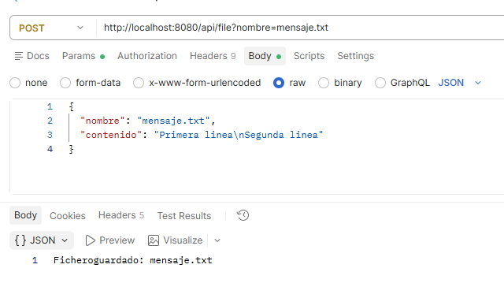
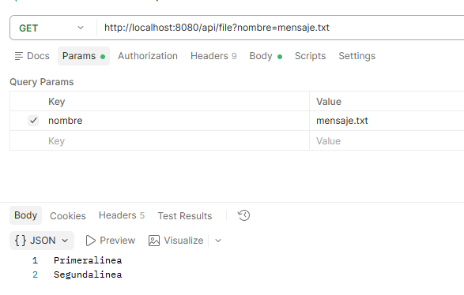
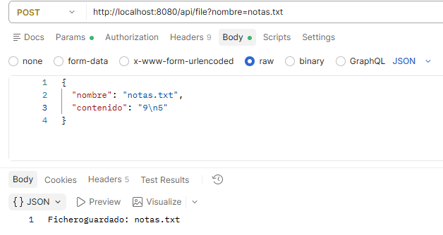
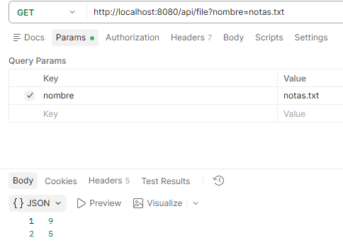
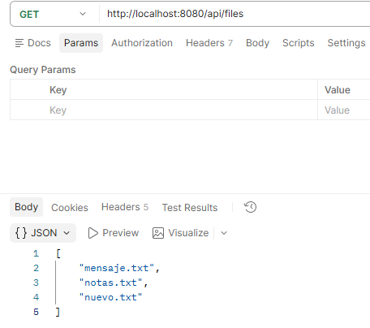

# Crear, leer y listar ficheros de texto

En la [primera aplicación con ficheros](ficheros.md) escribíamos un texto fijo en `data/mensaje.txt`. Ahora el cliente elegirá **el nombre y el contenido**, como en la opción 4 del **ejercicio 2**. Conservaremos la lectura de la opción 5 y añadiremos un listado.


!!! info "Cómo trabajar esta página"
    Continúa en el proyecto del ejemplo anterior. Primero modifica la aplicación para escribir y leer `mensaje.txt` con datos enviados por el cliente; comprueba el resultado antes de añadir el listado.
    ```text
        Cliente → FileController → FileService → carpeta data
    ```


## 1. Recibir los datos que antes pedíamos por teclado

En consola utilizábamos `readln()` para pedir el nombre y las líneas hasta `FIN`. Aquí el cliente enviará todos esos datos juntos en el cuerpo de una petición JSON:

```json
{
  "nombre": "mensaje.txt",
  "contenido": "Primera linea\nSegunda linea"
}
```

`\n` representa un salto de línea. Ya no necesitamos la palabra `FIN`: el cuerpo de la petición contiene el texto completo.

Antes, `mensaje.txt` y el texto estaban escritos dentro del servicio. Ahora viajan en la petición: podremos cambiarlos sin modificar el código Kotlin.

Crea `model/CrearTextoRequest.kt` dentro de `com.example.ficherosapi`:

Esta clase representa los datos que recibimos del cliente: `nombre` y `contenido`. El paquete `model` ya existe desde la aplicación del saludo; añadimos este fichero dentro de él.

```kotlin
package com.example.ficherosapi.model

data class CrearTextoRequest( // (1)!
    val nombre: String,
    val contenido: String
)
```

1. Define los dos datos que esperamos recibir en el JSON: `nombre` y `contenido`. Spring creará un objeto de esta clase cuando procese la petición.

## 2. Ampliar el servicio

Actualiza `service/FileService.kt` conservando el método de la primera aplicación y añadiendo una versión que recibe el nombre y el contenido como parámetros:

```kotlin
package com.example.ficherosapi.service

import org.springframework.stereotype.Service
import java.nio.file.Files
import java.nio.file.Path

@Service
class FileService {

    private val folder: Path = Path.of("data") // (1)!

    init {
        Files.createDirectories(folder) // (2)!
    }

    private fun resolveName(nombre: String): Path {
        require(nombre.isNotBlank() && nombre != "." && nombre != "..") { // (3)!
            "El nombre del fichero no es válido"
        }
        require(nombre.none { it in "/\\:" }) { // (4)!
            "Introduce solo un nombre, sin carpetas"
        }
        return folder.resolve(nombre) // (5)!
    }

    // Mantiene la operación inicial, que escribía un mensaje fijo.
    fun writeMessage() {
        Files.writeString(folder.resolve("mensaje.txt"), "Hola desde un fichero")
    }

    fun writeMessage(nombre: String, contenido: String) {
        Files.writeString(resolveName(nombre), contenido) // (6)!
    }

    fun readMessage(nombre: String): String {
        return Files.readString(resolveName(nombre)) // (7)!
    }
}
```

1. Ahora guardamos la ruta de la **carpeta**, en lugar de fijar la ruta de un único fichero como `data/mensaje.txt`.
2. El bloque `init` se ejecuta al crear el servicio. Crea la carpeta si todavía no existe.
3. `require` comprueba una condición y lanza una excepción si no se cumple. Aquí rechazamos nombres vacíos, formados solo por espacios, `.` y `..`.
4. Rechazamos separadores de carpetas y los dos puntos: esperamos un nombre como `mensaje.txt`, no una ruta proporcionada por el cliente.
5. Une la carpeta con el nombre recibido. Por ejemplo, `data` y `mensaje.txt` forman `data/mensaje.txt`.
6. Escribe el contenido recibido en el fichero elegido. Si ya existe, sustituye su contenido.
7. Lee el fichero elegido y devuelve su contenido como `String`, sin imprimirlo en la consola del servidor.

`resolveName` es una función auxiliar de Kotlin que reutilizamos al escribir y al leer. Para estas prácticas utiliza una carpeta de pruebas con ficheros normales, sin enlaces simbólicos.

El servicio no utiliza `readln()` ni decide cómo enviar una respuesta HTTP.

## 3. Ampliar el controlador

Introducimos dos anotaciones para recibir datos:

| Anotación | Para qué sirve en este ejemplo |
|---|---|
| `@RequestBody` | Convierte el cuerpo JSON en un objeto `CrearTextoRequest` |
| `@RequestParam` | Obtiene el nombre indicado en la URL al leer |

Actualiza `controller/FileController.kt` conservando la operación inicial y añadiendo la recepción de JSON:

```kotlin
package com.example.ficherosapi.controller

import com.example.ficherosapi.model.CrearTextoRequest
import com.example.ficherosapi.service.FileService
import org.springframework.web.bind.annotation.GetMapping
import org.springframework.web.bind.annotation.PostMapping
import org.springframework.web.bind.annotation.RequestBody
import org.springframework.web.bind.annotation.RequestParam
import org.springframework.web.bind.annotation.RestController

@RestController
class FileController(
    private val fileService: FileService
) {

    @PostMapping("/api/file") // (1)!
    fun write(@RequestBody(required = false) datos: CrearTextoRequest?): String { // (2)!
        if (datos == null) {
            fileService.writeMessage()
            return "Fichero guardado: mensaje.txt"
        }
        fileService.writeMessage(datos.nombre, datos.contenido) // (3)!
        return "Fichero guardado: ${datos.nombre}" // (4)!
    }

    @GetMapping("/api/file")
    fun read(@RequestParam(defaultValue = "mensaje.txt") nombre: String): String { // (5)!
        return fileService.readMessage(nombre) // (6)!
    }
}
```

1. Asocia las peticiones `POST /api/file` con este método. La anotación atiende la petición que envía el cliente.
2. `@RequestBody(required = false)` permite aceptar el JSON nuevo y también la petición antigua sin cuerpo. Si no llega JSON, se conserva la escritura fija de la primera aplicación.
3. Entrega el nombre y el contenido al servicio, que realiza la escritura.
4. Devuelve al cliente una confirmación con el nombre del fichero guardado.
5. `@RequestParam` recoge `nombre` de la URL. Si no se indica, `defaultValue` permite seguir leyendo `mensaje.txt`, como en el ejemplo anterior.
6. Pide al servicio la lectura y devuelve su resultado al cliente. El servicio recibe un `String` normal: no necesita saber que procede de una URL.

`GET /api/file` sigue leyendo `mensaje.txt` por defecto. También podemos indicar su nombre mediante `?nombre=mensaje.txt`. `POST /api/file` acepta ahora un cuerpo JSON, pero mantiene la posibilidad de enviarse sin datos para conservar la operación de la primera aplicación.

## 4. Comprobar la escritura y la lectura

Podemos probar la misma API con **Postman** o con **PowerShell**. Elige una de las dos herramientas: no necesitas repetir las pruebas con ambas ni cambiar el código Kotlin.

### Opción A: utilizar Postman


#### Escribir el fichero con POST

1. En el selector situado junto a la URL, elige **POST**.
2. Introduce `http://localhost:8080/api/file` en el campo de la URL.
3. Abre la pestaña **Body**, selecciona **raw** y elige **JSON** como formato.
4. Copia este contenido en el editor del cuerpo de la petición:

```json
{
  "nombre": "mensaje.txt",
  "contenido": "Primera linea\nSegunda linea"
}
```

5. Pulsa **Send** para enviar la petición.



Al seleccionar JSON, Postman añade la cabecera `Content-Type: application/json`, que indica al servidor el formato de los datos. Puedes comprobarla en **Headers**. En este JSON, `\n` representa el salto de línea.

En el panel de respuesta deberías ver el estado **200 OK** y este texto:

```text
Fichero guardado: mensaje.txt
```

Comprueba que `data/mensaje.txt` contiene las dos líneas enviadas. Ese fichero está en el servidor; Postman solo envía el nombre y el contenido.

#### Leer el fichero con GET

1. Crea otra petición HTTP y elige **GET**.
2. Introduce `http://localhost:8080/api/file`.
3. En **Params**, añade una fila con **Key** `nombre` y **Value** `mensaje.txt`. Postman completará la URL con `?nombre=mensaje.txt`.
4. Deja **Body → none**: para esta lectura no enviamos JSON.
5. Pulsa **Send**.

La respuesta debe tener el estado **200 OK** y mostrar:

```text
Primera linea
Segunda linea
```


Puedes guardar las peticiones con **Save** en una colección llamada `Ficheros API`, con los nombres `Escribir texto` y `Leer texto`, para reutilizarlas durante las pruebas.

!!! tip "Si no recibes la respuesta esperada"
    - **No se puede conectar:** comprueba que la aplicación está arrancada y utiliza el puerto `8080`.
    - **404:** revisa la ruta `/api/file`.
    - **405:** comprueba el método seleccionado, `POST` para escribir o `GET` para leer.
    - **400 o 415 al escribir:** revisa que has elegido **Body → raw → JSON** y que el cuerpo contiene `nombre` y `contenido` entre comillas dobles.
    - **Error al leer:** envía primero la escritura y comprueba que utilizas el mismo nombre.

Consulta la [guía oficial de Postman sobre parámetros y cuerpo de la petición](https://learning.postman.com/docs/sending-requests/create-requests/parameters/) si necesitas localizar estas opciones.

### Opción B: utilizar PowerShell

Reinicia la aplicación para cargar los cambios. En PowerShell, prepara el JSON del apartado 1 y envíalo con `POST`, como en el ejemplo anterior, añadiendo ahora el contenido de la petición:

```powershell
$datos = @{
    nombre = "mensaje.txt"
    contenido = "Primera linea`nSegunda linea"
} | ConvertTo-Json

Invoke-RestMethod -Method Post -Uri "http://localhost:8080/api/file" -ContentType "application/json" -Body $datos
```

- `ConvertTo-Json` convierte el nombre y el contenido en JSON.
- En la cadena de PowerShell, `` `n `` introduce el salto de línea; al convertirla a JSON se representa como `\n`.
- `-ContentType` indica que enviamos JSON y `-Body` contiene los datos de la petición.
- El servidor guarda el texto en `data/mensaje.txt`, sustituyendo el contenido del ejemplo anterior.

Debes recibir `Fichero guardado: mensaje.txt`. Comprueba que `data/mensaje.txt` contiene ahora las dos líneas enviadas.

Lee el contenido:

```powershell
Invoke-RestMethod "http://localhost:8080/api/file?nombre=mensaje.txt"
```

```text
Primera linea
Segunda linea
```

Puedes abrir esa misma URL en el navegador para leer. Para escribir usamos Postman o PowerShell porque necesitamos enviar un `POST` con datos; la barra de direcciones del navegador envía un `GET`.

### Comprobar los cambios con cualquiera de las herramientas

!!! question "Comprueba que lo entiendes"
    Cambia `contenido` en el JSON de Postman y pulsa **Send**, o modifica y ejecuta de nuevo el bloque completo de PowerShell. Después repite la lectura. ¿Qué texto esperas recibir?

??? success "Respuesta"
    El nuevo texto. `Files.writeString` sustituye el contenido del fichero existente. No necesitas modificar el código Kotlin ni reiniciar Spring para enviar otros datos.

### Probar otro nombre elegido por el cliente

Para comprobar la equivalencia con la opción 4 del ejercicio 2, cambia el valor de `nombre` de `mensaje.txt` a `notas.txt`. En Postman, modifica el JSON de la petición POST y pulsa **Send**; en PowerShell, modifica y ejecuta el bloque completo de escritura. **`notas.txt` es un nombre de prueba elegido ahora**, no un archivo que debas tener del ejercicio anterior.

La API creará `data/notas.txt` y conservará `data/mensaje.txt`. Para leer el nuevo fichero, utiliza `http://localhost:8080/api/file?nombre=notas.txt`. Así comprobamos que el nombre ya no está fijado en el servicio.

<div class="img-text-row img-equal-height" markdown>
<div markdown>

</div>
<div markdown>

</div>
</div>

## 5. Añadir el listado

El listado es una ampliación de nuestra API: nos permitirá ver los nombres de los ficheros creados en `data`.

Ahora que la escritura y la lectura funcionan, añade este método dentro de `FileService`, antes de la última llave:

```kotlin
fun list(): List<String> {
    return Files.list(folder).use { paths -> // (1)!
        paths
            .filter { Files.isRegularFile(it) } // (2)!
            .map { it.fileName.toString() } // (3)!
            .sorted() // (4)!
            .toList() // (5)!
    }
}
```

1. Obtiene las entradas de `data`. `use` cierra el recurso al terminar, también si se produce un error.
2. Conserva los ficheros normales y descarta las carpetas. `it` representa cada ruta que estamos comprobando.
3. De cada ruta extrae solo el nombre, por ejemplo `mensaje.txt`, y lo convierte a texto.
4. Ordena los nombres alfabéticamente.
5. Reúne el resultado en una lista de cadenas (`List<String>`) que devuelve el método.

Añade también este método dentro de `FileController`:

```kotlin
@GetMapping("/api/files") // (1)!
fun list(): List<String> {
    return fileService.list() // (2)!
}
```

1. Crea la operación `GET /api/files` para listar. La ruta termina en `files`, en plural, para distinguirla de `/api/file`, que lee un fichero.
2. Solicita los nombres al servicio y devuelve la lista. Spring la convierte automáticamente en una respuesta JSON.

No hacen falta imports nuevos.

Reinicia la aplicación para cargar los métodos añadidos y consulta los nombres guardados con la herramienta elegida:

- **Postman:** crea una petición **GET** a `http://localhost:8080/api/files`, sin parámetros y con **Body → none**, y pulsa **Send**. Puedes guardarla como `Listar ficheros`. Espera una respuesta **200 OK** con la lista JSON.
- **PowerShell:** ejecuta esta petición:

```powershell
Invoke-RestMethod http://localhost:8080/api/files
```

También puedes abrir esa URL en el navegador. Si has completado las pruebas con `mensaje.txt` y `notas.txt` y no tienes otros ficheros en `data`, la respuesta JSON será:

```json
["mensaje.txt", "notas.txt"]
```

PowerShell muestra la lista ya interpretada. El listado real dependerá de los ficheros que tengas en `data`.



## 6. Relación con el ejercicio 2

| Ejercicio 2 | Aplicación actual |
|---|---|
| Opción 4: pedir nombre y texto hasta `FIN` | `POST /api/file` con nombre y contenido en JSON |
| Opción 5: pedir nombre y mostrar el texto | `GET /api/file?nombre=mensaje.txt` y devolver el contenido |
| Ampliación de esta API | `GET /api/files` para consultar los nombres guardados |
| Mostrar información por consola | Devolver texto o una lista JSON al cliente |

!!! success "La misma operación con otra entrada"
    Hemos conservado la escritura y la lectura, sustituyendo los valores fijos por datos enviados por el cliente. El servicio continúa trabajando con las clases de ficheros que ya conocemos.

En el [siguiente paso](gestion_ficheros.md) añadiremos la subida de un archivo que ya existe en el ordenador del cliente, manteniendo estas operaciones.
