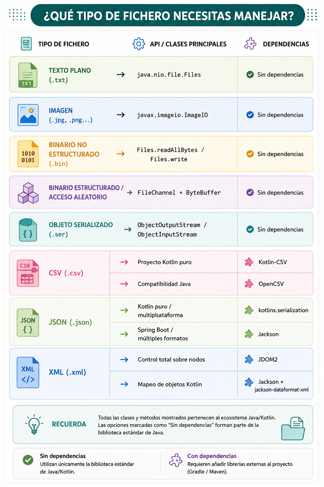

---
hide:
  - toc
---

# 🧭 Guía de elección: ¿qué librería usar?

{width=800}

!!!warning "Recuerda siempre"
    Antes de añadir una dependencia externa, pregúntate:  
    **¿La API estándar de Java es suficiente para lo que necesito?**  
    Si la respuesta es sí, úsala. Menos dependencias = proyecto más simple y portable.
