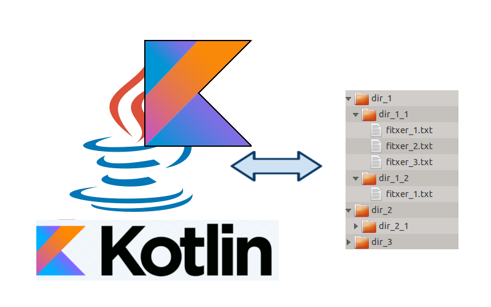

# Ficheros
---

### **¿De qué trata este módulo?**

En este módulo aprenderás a desarrollar aplicaciones que gestionan información almacenada en **ficheros**. Trabajarás con la API moderna de Java (**java.nio**) desde Kotlin, y aprenderás a leer, escribir y convertir ficheros de distintos tipos: texto, binario, imagen, JSON, XML y CSV.

{: .img-muy-pequena .img-izquierda }
---

## 🗺️ Guía de estudio

El módulo está dividido en **3 bloques temáticos**. Sigue el orden indicado: cada bloque parte de los conocimientos del anterior.

**Bloque 1 — Sistema de ficheros ⏱️ ~4h**

Entenderás qué es un fichero, cómo se organiza el sistema de archivos y cómo acceder a él desde Kotlin.

| Orden | Página | Descripción |
|-------|--------|-------------|
| 1 | [Ficheros](T1_Sistema_de_ficheros/ficheros.md) | Qué es un fichero y para qué se usa |
| 2 | [Formas de acceso](T1_Sistema_de_ficheros/Formas_acceso.md) | Acceso secuencial vs. aleatorio |
| 3 | [Acceso al sistema. Java.nio](T1_Sistema_de_ficheros/NIO_AccesoFicheros.md) | Clases Path, Files, FileSystem... |
| 4 | [Ejercicio obligatorio 1](T1_Sistema_de_ficheros/exercicis.md) | Explorador interactivo del directorio personal |

---

**Bloque 2 — Manejo de ficheros ⏱️ ~6h**

Aprenderás a leer y escribir ficheros de texto, binarios, imágenes y a hacer acceso aleatorio.

| Orden | Página | Descripción |
|-------|--------|-------------|
| 1 | [Introducción y clases](T2_Gestion_del_contenido/Lectura_Escritura_ficheros.md) | Tabla resumen de todas las clases |
| 2 | [Texto y binarios](T2_Gestion_del_contenido/texto_binarios.md) | Leer y escribir ficheros .txt y .bin |
| 3 | [Imágenes](T2_Gestion_del_contenido/ficheros_imagen.md) | Leer, copiar y modificar imágenes |
| 4 | [Binarios estructurados](T2_Gestion_del_contenido/binarios_estructurados.md) | Tipos primitivos con DataStream |
| 5 | [Acceso aleatorio](T2_Gestion_del_contenido/acceso_aleatorio.md) | FileChannel y ByteBuffer |
| 6 | [Ejercicio obligatorio 2](T2_Gestion_del_contenido/ejercicios.md) | Gestión completa de ficheros |

---

**Bloque 3 — Ficheros de diferentes formatos ⏱️ ~6h**        

Trabajarás con formatos de intercambio de datos (JSON, XML, CSV) usando librerías externas.

| Orden | Página | Descripción |
|-------|--------|-------------|
| 1 | [Introducción](T3_Formatos_diferentes/intro.md) | JSON, XML, CSV: cuándo usar cada uno |
| 2 | [Serialización de Objetos](T3_Formatos_diferentes/seriaci_dobjectes.md) | Convertir objetos a bytes y viceversa |
| 3 | [Ficheros de intercambio](T3_Formatos_diferentes/ficheros_intercambio.md) | CSV, JSON y XML con librerías |
| 4 | [Conversión entre formatos](T3_Formatos_diferentes/Conversion.md) | De un formato a otro |
| 5 | [Ejercicio obligatorio 3](T3_Formatos_diferentes/ejercicios.md) | Aplicación con múltiples formatos |

---

## 💡 Consejos para el estudio en semipresencial

!!!tip "Cómo aprovechar este material"
    - **Lee primero la teoría** de cada página antes de intentar ejecutar el código.
    - **Ejecuta todos los ejemplos** en IntelliJ: la práctica es esencial para afianzar los conceptos.
    - Antes de pasar a la siguiente página, asegúrate de que entiendes el ejemplo anterior: compara tu salida con la salida esperada que aparece en cada ejemplo.
    - **Los ejercicios obligatorios** son la parte más importante: aplican todo lo aprendido en el bloque.

## 📦 Proyecto base

Todos los ejemplos de código se organizan en un único proyecto **IntelliJ** llamado **Ficheros**, con tres paquetes:
`sistema`, `contenido`.`formatos`.

Los ejemplos del **Bloque 3** usan un proyecto separado llamado **Ficheros_Gradle** que incluye Gradle para gestionar dependencias externas.

---
